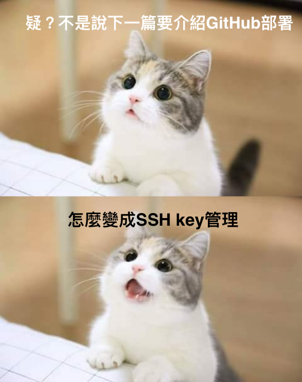

  

Um...在部署前卡到了Github多組帳號權限的問題  
如果你的電腦只有使用1組GitHub帳號，可以點下方連結直接到下一篇  
[只要3秒，使用GitHub一鍵部署你的Hugo部落格](https://bacnotes.github.io/p/github-deploy-hugo "[只要3秒，使用GitHub一鍵部署你的Hugo部落格")


## 為什麼要用一台電腦使用多組GitHub帳號
在**後疫情時代**，遠距工作變成時代趨勢  
工作時勢必會有1組公司用的GitHub帳號(或GitLab或...其他的雲端協作平台)   
但自己在寫side project也會用到1組GitHub帳號   
先演練一下1台電腦可以使用2組GitHub帳號的情境  
聽起來好像很簡單，辦第2組GitHub帳號就好了吧（就跟google帳號一樣？  
但你在GitHub的新帳號開了一個Repo，在編輯器的terminal依序輸入下方指令
```
git init
git add .
git commit -m 'some msg'
git branch -M main
git remote add origin 'your repo'
git push -u origin main
```
就會發現在最後一步跳出這個訊息
>ERROR: Permission to userB/repo.git denied to userA
fatal: 無法讀取遠端版本庫。

要commit的時候，被最初註冊的userA帳號deny

Um...啊！  
  
之前的帳號有設定一組對應的SSH key讓GitHub驗證身份  
應該是SSH key的問題吧？  
有2組帳號，生2組key應該就沒問題了吧！  
欸不對，我的terminal在git push的時候，怎麼知道哪組帳號對應哪個SSH key  
上網查了一下相關文章，發現可以寫一個config來讓不同帳號對應各自的key  

## 管理多組SSH key流程如下
aaa為範例，可自由代入你的帳號
1. 產生SSH key `ssh-keygen -t rsa -C "aaa@example.com"`
2. 決定要儲存的檔名(路徑) 
在Enter file in which to save the key (/Users/XXX/.ssh/id_rsa):  
後方填入 `/Users/aaa/.ssh/id_rsa_aaa`  
*如果沒有新的命名，就會覆蓋原本的id_rsa
3. Enter passphrase(看個人，可以直接enter不設定密碼)    
4. Enter same passphrase again(如果有設定要再輸入一次，沒有就直接enter)  
5. 把對應的公鑰(id_rsa_aaa.pub裡面的文字)新增到GitHub的SSH key，[官方圖文教學](https://docs.github.com/en/authentication/connecting-to-github-with-ssh/adding-a-new-ssh-key-to-your-github-account)  
6. 在.ssh目錄下，touch一個config(不用副檔名)

```
Host gh.aaa
HostName github.com
User aaa
PreferredAuthentications publickey
IdentityFile ~/.ssh/id_rsa_aaa
```

7. 把key加入管理 `ssh-add ~/.ssh/id_rsa_aaa`
8. 嘗試連線看看對應host是否有生效`ssh -T git@gh.aaa`
>Hi aaa! You've successfully authenticated, but GitHub does not provide shell access.

看到上方訊息表示有成功連線囉！  
第2個帳號照著上方步驟寫在同個config檔案即可  
  
```
Host gh.aaa
HostName github.com
User aaa
PreferredAuthentications publickey
IdentityFile ~/.ssh/id_rsa_aaa

Host gh.bbb
HostName github.com
User bbb
PreferredAuthentications publickey
IdentityFile ~/.ssh/id_rsa_bbb
```

注意：經過上面的設定檔後，repo的位置會從預定的
git@github.com:ooo/ooo.git 變成 git@gh.aaa:ooo/ooo.git  
後續在新增repo連結時需注意，不然可能吃不到config設定檔唷  

參考文章:
[[Git] 多個SSH Key與帳號的設定(Mac)](https://dotblogs.com.tw/as15774/2018/04/30/174737 "[[Git] 多個SSH Key與帳號的設定(Mac)")


