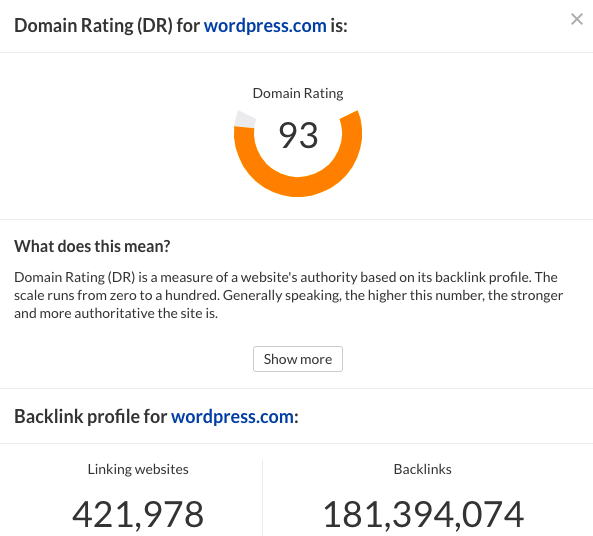

關於部署的工具有很多，身為工程師的你一定聽過GitHub!  


## 為什麼用GitHub部署

- 因為免費(o)
- 因為用起來很親切，簡單又方便(o)
- 因為部署到生效的過程很快速(o)
- 因為部落格後面有GitHub域名很潮(x)

GitHub Pages是GitHub提供的**免費**靜態網頁託管服務  
雖然是免費，不過用起來體驗也很好  
那SEO表現呢?  這時候可以用[ahrefs](https://ahrefs.com/website-authority-checker "ahrefs")快速確認一下  


**GitHub**在網站權重跟外部連結數都有很好的表現   
拿**medium**來當對手的話呢  
  
**GitHub 加十分 🙌**

跟另一個也是很常拿來建立部落格的平台，且SEO客製化程度較高的**wordpress**相比呢
  
**GitHub 再加十分 🙌**

看起來是不錯的選擇唷！那麼來實作看看吧！

## GitHub Pages部署靜態網頁 
GitHub Pages有兩種
- 專案型網址 https://username.github.io/reponame  
（一個帳號可以有很多個repo專案，每個專案都可以有一個靜態網頁）
- 帳號型網址 https://username.github.io  
（一個使用者帳號只會有一個，可以拿來經營個人網站）

專案型網址適合把Hugo這個部落格專案，備份到GitHub上(非部署)，執行步驟如下
1. 新增一個GitHub Repo，Repo名自訂
2. cd到專案資料夾，輸入`git init`
3. `git branch -m main`
4. `git add .` 
5. `git commit -m 'init project'` # git msg 內容可自訂
6. `git remote add origin <自訂repo網址>`  
   #如果電腦只有使用1組GitHub帳號，直接貼repo網址  
   #如果電腦本身有多組GitHub帳號，確認@host名:git網址結構是否有調整正確，可回到[上一篇](https://bacnotes.github.io/p/github-ssh-key/ "上一篇")確認  

這樣一來電腦裡的Hugo專案不見也不用擔心囉～之後還可以git clone下來  

作為部署部落格本身使用，執行步驟如下
1. 新增一個GitHub Repo，Repo名為`username.github.io`(須完全符合)
2. 在專案資料夾路徑下輸入 `hugo`，會生成靜態頁面檔案於public資料夾
2. `cd public` 
3. `git init` 
4. `git branch -m main` 
5. `git add .` 
6. `git config --local user.name aaa` #不需要多組帳號管理可跳過
7. `git config --local user.email aaa@email.com` #不需要多組帳號管理可跳過
8. `git commit -m 'deploy'` # git msg 內容可自訂
9. `git remote add origin <repo網址>`  
   #注意事項同專案型網址
10. `git push -f --set-upstream origin main` # 強制覆蓋之前的紀錄

好的，若依照順序有執行成功，可以開始寫腳本檔案了!

## 自動化部屬腳本deploy.sh
1. 在專案資料夾的**根目錄**建立deploy.sh檔，貼上下方文字  
2. repo網址記得替換成自己的，option依照自己狀況調整即可 
```
hugo 
cd public

git init 
git branch -m main 
git add .

git config --local user.name aaa #不需要多組帳號管理可跳過
git config --local user.email aaa@email.com #不需要多組帳號管理可跳過
git commit -m 'deploy'
git remote add origin <repo網址> # if you have .ssh/config setting, remember to replace with right structure
git push -f -u origin main
cd -

```


參考文章:
[部署Hugo個人網頁至GitHub](https://ianjustin39.github.io/ianlife/build-blog/deploy_hugo_on_github/ "部署Hugo個人網頁至GitHub")


