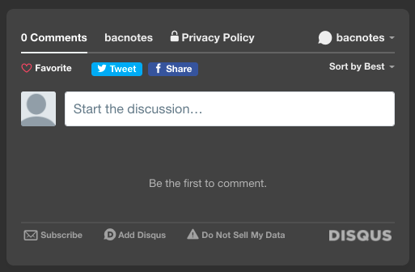
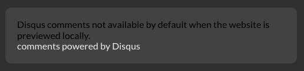

## Hugo config設定參數
如果跟我一樣是第一次自架部落格，看到config設定檔玲瑯滿目的內容可能會有下面的感受  
  
  
Um...可能有點誇大了，其實花點時間研究再搭配其他文章分享也算好上手  
應該吧...  
Hugo官方文件[Hugo configuration](https://gohugo.io/getting-started/configuration/ "Hugo configuration")雖然有寫一些配置  
但不同主題的設定檔還是會有些不同，建議先參考使用主題檔案的說明文件  
我使用主題為hugo-theme-stack by [@CaiJimmy](https://github.com/CaiJimmy "@CaiJimmy")     [Hugo theme Stack文件](https://docs.stack.jimmycai.com/ "Hugo theme Stack")  
以下分享我有調整過的參數給大家     
```
# config.yaml

baseurl: https://bacnotes.github.io/ # 網址
languageCode: zh-tw # 語言代碼 stack主題預設en-us
theme: hugo-theme-stack # hugo主題名
paginate: 5 # 單頁文章篇數
title: # 網站標題

disqusShortname: # disqus的shortname 需要註冊才能取得，可以參考下方段落介紹

googleAnalytics: # GA 追蹤ID

DefaultContentLanguage: # 文章內容語言 我改成zh-tw

hasCJKLanguage = true # 自動檢測是否有中日韓文，讓一些字數統計的功能正常運行

permalinks: #網址資料夾結構
    post: /p/:slug/ # 文章會在p資料夾下
    page: /:slug/ # 分頁網址

params:
    favicon: favicon.ico # 瀏覽器頁籤上的小圖示，放在static資料夾

footer: 
   since: 2021  # 建站時間
   customText:  # 自訂文字

sidebar:
   emoji: # sidebar大頭照右下角的emoji，直接貼上喜歡的emoji即可
   subtitle: # 網站description
   avatar: # sidebar大頭照
         enabled: true # 若寫false，整個avatar圈圈同emoji都會消失
         local: true # 取用本地，assets裡面的檔案
         src: img/773-150x150.jpeg # assets下的圖片路徑

comments: 
        enabled: true # 要啟用討論區需要打開
        provider: disqus

menu:
   social:  
        - identifier: github
          name: GitHub
          url: https://github.com/bacnotes # 你的github網址
          params:
            icon: brand-github

```

若不知道網站favicon該怎麼設定沒關係，可以參考這篇文章  
[favicon設定好簡單，使用線上工具快速生成瀏覽器頁籤上的小圖示](https://bacnotes.github.io/p/favicon-setting/ "favicon設定好簡單，使用線上工具快速生成瀏覽器頁籤上的小圖示")


## 安裝Disqus討論區
官方使用wordpress平台的安裝說明影片  
(介面會更新，安裝時看到的畫面有可能跟影片不同)
<iframe width="640" height="360" src="https://www.youtube.com/embed/a4JBJXyuaFk" title="YouTube video player" frameborder="0" allow="accelerometer; autoplay; clipboard-write; encrypted-media; gyroscope; picture-in-picture" allowfullscreen></iframe>

1. 先到 [Disqus](https://disqus.com/profile/signup/intent/ "Disqus") 註冊帳號
2. 選擇I want to install Disqus on my site
3. 填寫網站名稱 Website Name 讓自己可以辨識，點Customize url取自己的shortname，類別自訂  
(若沒有點Customize url也沒關係，setup完系統會給你一個shortname，可以從[General](https://https-bacnotes-github-io.disqus.com/admin/settings/general/ "General")取得)
4. 選Basic Plan，Subscribe now
5. Hugo目前不在上方選項中，選I don't see platform listed (希望未來會有！)
6. 直接點最下方按鈕configured
7. 填入Website URL，其他可以都不填
8. 選Strict避免廣告連結，或Balanced比較寬鬆的方式
9. 點Complete setup 

註冊只是為了取得`shortname`，後續程式碼模板等等都不需要設定  
因為在當初下載主題的時候已經寫好在layouts/partials/comments裡面的檔案  

把shortname填入到上方config.yaml，並確保comment參數設定正確
```
disqusShortname: your-short-name
comments: 
        enabled: true # 要啟用討論區需要打開，只有shortname是不行的
        provider: disqus
```

就可以在文章下方看到你的討論區出現囉！  
  
*localhost下是不會出現的，部署上線才會出現唷  
  

### 如果想要刪除site，重新取得shortname
可以透過這個連結[How do I remove my site?](https://disqus.com/profile/signup/intent/ "How do I remove my site?")  
單純點editing不會出現刪除介面，要點advanced進階設定才會看到

太好了，這下我們的部落格可以透過Disqus，有效擺脫空虛寂寞的邊緣感了(並沒有


參考文章: [Hugo 加入 Disqus 整合性留言管理系統](https://coreychen71.github.io/posts/2019-05/hugoadddisqus/ "Hugo 加入 Disqus 整合性留言管理系統")


