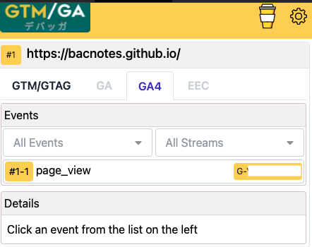
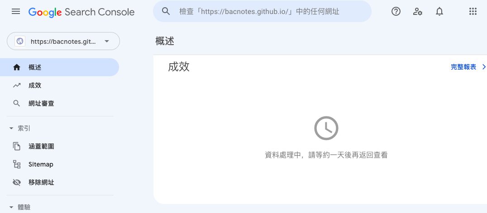

## 什麼是Google Analytics & Google Search Console  

### Google Analytics：分析流量來源與站內行為表現
可以分析進站管道分布，預設管道有直接流量、自然搜尋、社群網站、其他網站連結過來的或是廣告等  
分析到達網頁(landing page)集中在哪些頁面     
知道使用者類型與進站後的使用者行為，像是停留時間，觀看了幾頁，跟離開頁面  
確認是否跟原本規劃的網站體驗流程相似，或是在哪些頁面容易流失客戶  
如果是電商網站的話，還可以設定電子商務觀看電子商務報表(轉換率/收益/客單價等)  
由於我們目前還只是單純的部落格，未來如果有機會的話再來介紹這塊    

### Google Search Console：分析自然搜尋流量與站外排名  
可以從成效報表觀察流量的變化，曝光 > 點擊 > 點閱率 > 排序  
分析有哪些關鍵字跟頁面帶來流量   
分析自然流量的來源是來自哪些地方  
可以定期提交sitemap幫助網址被收錄，或是移除想拿掉的網址（sitemap記得也要同步拿掉)  
確認網站還有哪一些待改進的體驗  

總之有非常多的報表可以看（咳咳  
那接下來我們就直接進到安裝的部分
## 安裝Google Analytics
1. 登入你要使用GA的Google帳號
2. 進到 https://analytics.google.com/
3. 填寫帳戶名稱，資料共用設定這部分可以自行判斷
4. 填寫資源名稱
5. 填寫商家資訊
6. 接受Google Analytics(分析)服務條款合約
7. 選擇平台(我是部落格所以選網頁)
8. 填寫網站串流網址跟名稱
9. 會得到一個評估ID  G-xxxxxxxx
10. 把評估ID貼到config.yaml檔案即可

Um...以前都是UA開頭的代碼，現在已經升級成Google Analytics 4的時代，開頭已經變成G了  
使用[GA4] 即時報表確認資料是否已開始傳入，一般來說會需要等個1天時間跑資料，這邊是後來截圖的 

 

或透過[GTM/GA debugger](https://chrome.google.com/webstore/detail/gtmga-debugger/ilnpmccnfdjdjjikgkefkcegefikecdc "GTM/GA debugger")套件確認是否有反應  

 

ok 看起來成功囉! 記得也檢查一下404頁面有無反應唷！  

## 安裝Google search console
1. 建議使用跟GA一樣的Google帳號
2. 進到 https://search.google.com/search-console/welcome
3. 選取資源類型，若跟我一樣是使用GitHub pages服務選右邊
4. 填寫網址
5. 驗證方法很多，因為剛剛已經安裝好GA，帳號有編輯權，直接點第3種的GA驗證按鈕

ok 進到了資源頁面了！一般來說會需要等個1天時間跑資料

 

### 在網站根目錄下建立robots.txt
使用Hugo的話放在static資料夾下即可
```
User-agent: *
Allow: /
Sitemap: https://bacnotes.github.io/sitemap.xml
```

### 提交sitemap
使用hugo指令生成靜態網頁的時候會自動產出sitemap檔案  
網址是你的網站名/sitemap.xml

然而顯示結果為無法擷取，觀看其他人的文章發現  
[Google Search Console 無法擷取sitemap解決方法](https://kyiplay.com/2020/04/google-search-console-coudnt-fetch-sitemap/ "Google Search Console 無法擷取sitemap解決方法")  
[Sitemap generated by Hugo not recognized by Google Search Console](https://discourse.gohugo.io/t/sitemap-generated-by-hugo-not-recognized-by-google-search-console/18794 "Sitemap generated by Hugo not recognized by Google Search Console")  
需要約一週的時間等待，沒錯就是等  
且許多人反饋判斷是google的問題，因為嘗試提交到其他搜尋引擎是正常的  
我們一週再回來看看是否有成功

