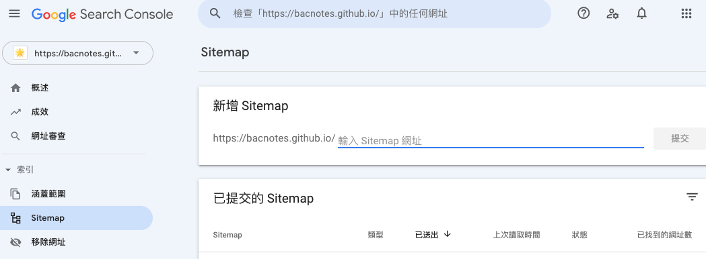
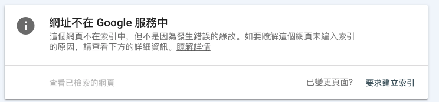
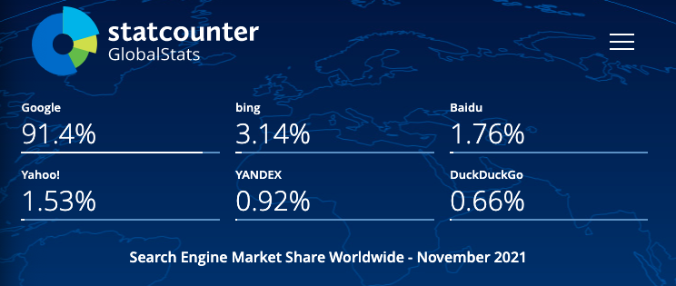

## 什麼是 Google Analytics & Google Search Console

### Google Analytics：分析流量來源與站內行為表現

* 可以看進站管道分布，包含直接流量、自然搜尋、社群網站、其他網站連結導入或是來自廣告等等
* 可以了解到達網頁(landing page)集中在哪些頁面
* 觀看使用者類型與進站後的使用者行為，像是停留時間，觀看了幾頁，跟離開頁面
* 確認是否跟原本規劃的網站體驗流程相似，或是在哪些頁面容易流失客戶
* 電商網站可以設定電子商務觀看電子商務報表(轉換率/收益/客單價等)，由於我們只是單純的部落格，未來如果有機會的話再來介紹

### Google Search Console：分析自然搜尋流量與站外排名

* 可以從成效報表觀察流量的變化，曝光 > 點擊 > 點閱率 > 排序
* 分析有哪些關鍵字跟頁面帶來流量
* 分析自然流量的來源是來自哪些地方
* 定期提交 sitemap 幫助網址被收錄，或是移除想拿掉的網址（sitemap 記得也要同步拿掉)
* 確認網站還有哪一些待改進的體驗

## 安裝 Google Analytics

01. 登入你要使用 GA 的 Google 帳號
02. 進到 https://analytics.google.com/
03. 填寫帳戶名稱，資料共用設定這部分可以自行判斷
04. 填寫資源名稱
05. 填寫商家資訊
06. 接受 Google Analytics(分析)服務條款合約
07. 選擇平台(我是部落格所以選網頁)
08. 填寫網站串流網址跟名稱
09. 會得到一個評估 ID G-xxxxxxxx (舊版為UA開頭)
10. 把評估 ID 貼到 hugo 的 config 設定檔即可

GA4 將跨裝置的使用者行為串接起來，相較過去著重在停留時間、頁數，改以事件為核心的分析主體，對於數據的解讀方便許多

使用 GA4 的即時報表確認資料是否已開始傳入


或透過[GTM/GA debugger](https://chrome.google.com/webstore/detail/gtmga-debugger/ilnpmccnfdjdjjikgkefkcegefikecdc 'GTM/GA debugger')套件確認是否有反應


ok 看起來成功囉！記得也檢查一下 404 頁面有無反應唷！

## 安裝 Google search console

01. 建議使用跟 GA 一樣的 Google 帳號
02. 進到 https://search.google.com/search-console/welcome
03. 選取資源類型，若跟我一樣是使用 GitHub pages 服務選右邊
04. 填寫網址
05. 驗證方法很多，因為剛剛已經安裝好 GA，帳號有編輯權，直接點第 3 種的 GA 驗證按鈕

ok 進到了資源頁面了！一般來說會需要等個 1 天時間跑資料


## 在網站根目錄下建立 robots.txt

把 robots.txt 放在網站下的根目錄，使用hexo放在source資料夾下即可
下方是一個常見的範例，網址填入自己的版本

```
User-agent: *
Allow: /
Sitemap: https://bacnotes.github.io/sitemap.xml
```

＊Google 支援所有格式的標準 Sitemap 通訊協定，但目前不支援在 Sitemap 中使用 `priority` 屬性

## 到 Google Search Console 提交 sitemap

生成靜態網頁的時候會自動產出 sitemap 檔案
網址是<你的網站名>/sitemap.xml e.g. https://bacnotes.github.io/sitemap.xml

提交位置在 Google Search Console 索引區塊的 Sitemap
輸入你的 sitemap 網址即可，一般是 sitemap.xml



## 使用 Google Search Console 的「要求建立索引」

發布文章後，會希望可以盡早被爬蟲爬取建立索引，hexo平台會自動生成sitemap 檔，很方便操作更新sitemap，但公司的行銷人員，可能不一定可以迅速取得工程師的即時協助
這時候可以點 Google Search Console 上方的輸入框，輸入文章網址，按下 enter就可以建立排程請爬蟲來看看這個網址
(也可以點側邊欄成效下方的網址審查，也會 focus 到這個框框)


等待一段時間跑出結果



點下方的「要求建立索引」，就會跟 Google 提交建立索引的要求且進入排程，爬蟲就會依照排程來看你剛剛提交的網址了

## 跟 Google 提交 Sitemap 完之後，其他的搜尋引擎也需要嗎？

我們用[Statcounter](https://gs.statcounter.com/ 'Statcounter')看看目前搜尋引擎各家的市佔率
Statcounter 是一個網站流量分析工具，主要提供網頁瀏覽器跟搜尋引擎的使用分佈的訊息

以下是上個月各家搜尋引擎全球市占率，Google 有 91.4%的市佔率，而其他家(bing, Baidu, Yahoo!)市占率大約都在個位數



由於我們的使用者主要是在台灣，把條件設定成台灣


Google 還是一樣市占率最高，且比剛剛全球數據的市佔率還高，為 9 成 4
看起來我們之後 SEO 還是專心於 Google，畢竟台灣大部分的使用者都使用 Google 搜尋

最後，爬蟲大大快來我家吧


