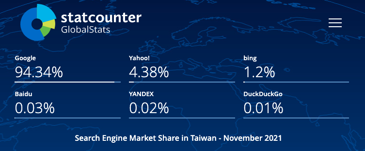

## 什麼是 Google Analytics & Google Search Console

### Google Analytics：分析流量來源與站內行為表現

可以分析進站管道分布，預設管道有直接流量、自然搜尋、社群網站、其他網站連結過來的或是廣告等  
分析到達網頁(landing page)集中在哪些頁面  
知道使用者類型與進站後的使用者行為，像是停留時間，觀看了幾頁，跟離開頁面  
確認是否跟原本規劃的網站體驗流程相似，或是在哪些頁面容易流失客戶  
如果是電商網站的話，還可以設定電子商務觀看電子商務報表(轉換率/收益/客單價等)  
由於我們目前還只是單純的部落格，未來如果有機會的話再來介紹這塊

### Google Search Console：分析自然搜尋流量與站外排名

可以從成效報表觀察流量的變化，曝光 > 點擊 > 點閱率 > 排序  
分析有哪些關鍵字跟頁面帶來流量  
分析自然流量的來源是來自哪些地方  
可以定期提交 sitemap 幫助網址被收錄，或是移除想拿掉的網址（sitemap 記得也要同步拿掉)  
確認網站還有哪一些待改進的體驗

總之有非常多的報表可以看（咳咳  
那接下來我們就直接進到安裝的部分

## 安裝 Google Analytics

1. 登入你要使用 GA 的 Google 帳號
2. 進到 https://analytics.google.com/
3. 填寫帳戶名稱，資料共用設定這部分可以自行判斷
4. 填寫資源名稱
5. 填寫商家資訊
6. 接受 Google Analytics(分析)服務條款合約
7. 選擇平台(我是部落格所以選網頁)
8. 填寫網站串流網址跟名稱
9. 會得到一個評估 ID G-xxxxxxxx
10. 把評估 ID 貼到 config 檔案即可

Um...以前都是 UA 開頭的代碼，現在已經升級成 Google Analytics 4 的時代，開頭已經變成 G 了（感嘆一下時代的進步）  
當然舊版的代碼還是可以收集資料，只是 GA4 將跨裝置的使用者行為串接起來  
並且改以事件為核心的分析主體，相較過去的停留時間、頁數
對於數據的解讀方便許多

使用 GA4 的即時報表確認資料是否已開始傳入


或透過[GTM/GA debugger](https://chrome.google.com/webstore/detail/gtmga-debugger/ilnpmccnfdjdjjikgkefkcegefikecdc 'GTM/GA debugger')套件確認是否有反應


ok 看起來成功囉！記得也檢查一下 404 頁面有無反應唷！

## 安裝 Google search console

1. 建議使用跟 GA 一樣的 Google 帳號
2. 進到 https://search.google.com/search-console/welcome
3. 選取資源類型，若跟我一樣是使用 GitHub pages 服務選右邊
4. 填寫網址
5. 驗證方法很多，因為剛剛已經安裝好 GA，帳號有編輯權，直接點第 3 種的 GA 驗證按鈕

ok 進到了資源頁面了！一般來說會需要等個 1 天時間跑資料


## 在網站根目錄下建立 robots.txt

使用 Hugo 的話，在 config 檔裡面加入參數

```
enableRobotsTXT: true
```

有加入 enableRobotsTXT: true 的話，執行完`hugo`指令後  
系統預設會幫你生成一個下方內容的 robots.txt 在根目錄下

```
User-agent: *
```

如果想客製化內容，把 robots.txt 放在 layouts 資料夾下即可  
下方是一個常見的範例，網址填入自己的版本

```
User-agent: *
Allow: /
Sitemap: https://bacnotes.github.io/sitemap.xml
```

如果想客製化哪些頁面可以爬取，哪些不給爬取的話可以參照[官方說明](https://gohugo.io/templates/robots/ '官方說明')設置

另外還可以在 config 檔案放上下方參數  
使用更新頻率 monthly 或 weekly 等，讓爬蟲知道你的更新狀況  
(可以使用這些參數 yearly, monthly, weekly, daily, hourly)

```
sitemap:
  changefreq: weekly
  filename: sitemap.xml
  priority: 0.5
```

## 到 Google Search Console 提交 sitemap

使用 hugo 指令生成靜態網頁的時候會自動產出 sitemap 檔案  
網址是<你的網站名>/sitemap.xml e.g. https://bacnotes.github.io/sitemap.xml

可以到 config 檔案更新這些參數
https://gohugo.io/templates/sitemap-template/

提交位置在 Google Search Console 索引區塊的 Sitemap  
輸入你的 sitemap 網址即可，一般是 sitemap.xml


然而如果跟我一樣使用 Hugo 的話，顯示結果可能會是為無法擷取，觀看其他人的文章發現  
[Google Search Console 無法擷取 sitemap 解決方法](https://kyiplay.com/2020/04/google-search-console-coudnt-fetch-sitemap/ 'Google Search Console 無法擷取sitemap解決方法')  
[Sitemap generated by Hugo not recognized by Google Search Console](https://discourse.gohugo.io/t/sitemap-generated-by-hugo-not-recognized-by-google-search-console/18794 'Sitemap generated by Hugo not recognized by Google Search Console')  
需要約一週的時間等待，許多人反饋應該是 google 的問題，因為嘗試提交到其他搜尋引擎是正常的  
我們一週再回來看看 sitemap 是否有成功

雖然 sitemap 擷取上好像卡住了，不過在文章數相對少的狀況下  
還有一種方式可以呼叫爬蟲來爬取這些頁面

## 使用 Google Search Console 的「要求建立索引」

發布文章後，會希望可以盡早被爬蟲爬取建立索引  
因為我的部落格是自架的，可以自行處理產出更新的 sitemap 檔並提交給 Google  
但如果是公司的行銷人員，可能不一定可以迅速取得工程師的即時協助  
這時候可以點 Google Search Console 上方的輸入框，輸入文章網址，按下 enter  
(也可以點側邊欄成效下方的網址審查，也會 focus 到這個框框)


等待一段時間跑出結果


點下方的「要求建立索引」，就會跟 Google 提交建立索引的要求且進入排程  
爬蟲就會依照排程順序來看你剛剛提交的網址了

## 跟 Google 提交 Sitemap 完之後，其他的搜尋引擎也需要嗎？

我們用[Statcounter](https://gs.statcounter.com/ 'Statcounter')看看目前搜尋引擎各家的市佔率  
Statcounter 是一個網站流量分析工具，主要提供網頁瀏覽器跟搜尋引擎的使用分佈的訊息

以下是上個月各家搜尋引擎全球市占率，Google 有 91.4%的市佔率，而其他家(bing, Baidu, Yahoo!)市占率大約都在個位數


由於我們的使用者主要是在台灣，把條件設定成台灣



Google 還是一樣市占率最高，且比剛剛全球數據的市佔率還高，為 9 成 4  
看起來我們之後 SEO 還是專心於 Google，畢竟台灣大部分的使用者都使用 Google 搜尋

最後，爬蟲大大快來我家吧


