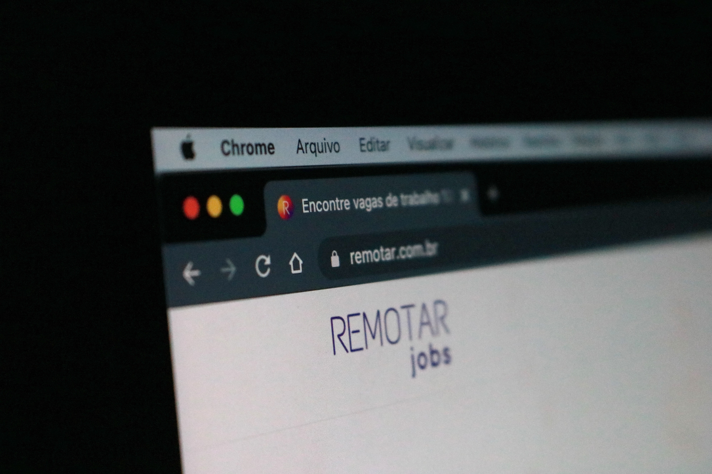
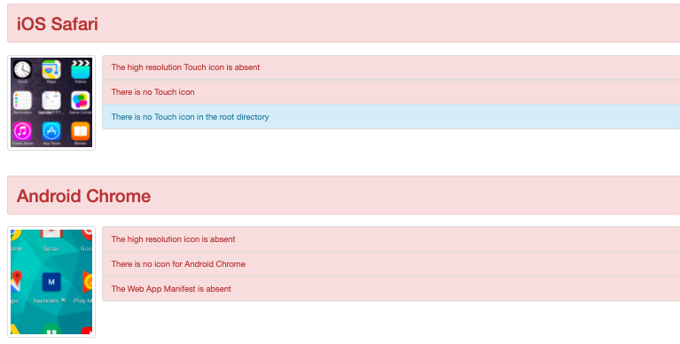
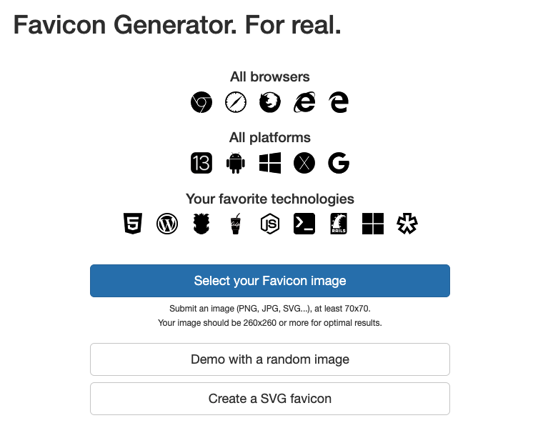
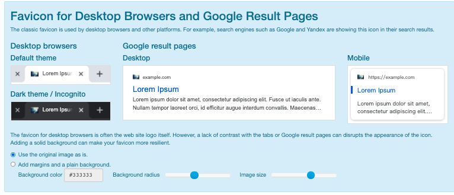
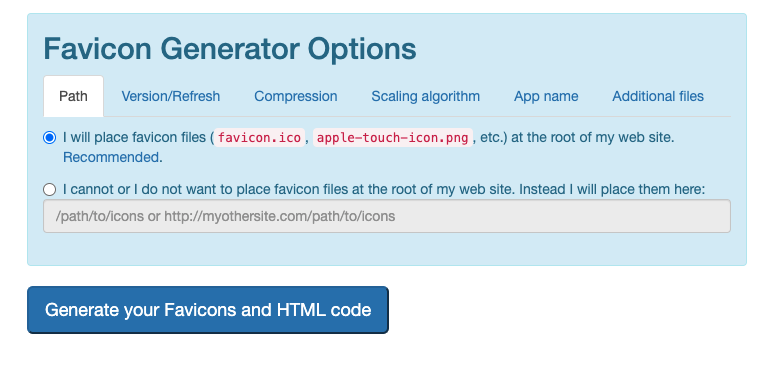
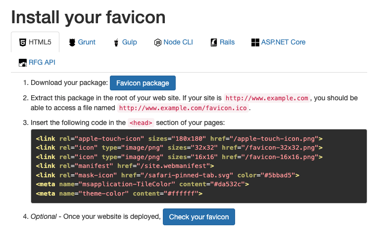
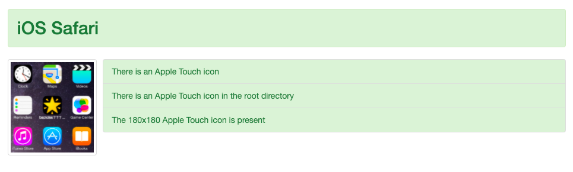

## favicon 是什麼?

favicon 為 favorites icon 的縮寫，也就是網頁頁籤標題左邊的圖案  
通常檔名會是 favicon.ico，但隨著瀏覽器的優化也開始支援 png、gif、svg 檔  
可以從[can i use](https://caniuse.com/?search=favicon "can i use")確認各個瀏覽器對於檔案類型的支援程度  
如果沒有設置的話，預設圖案是一個灰地球，會看起來有點舊或是少了一點信賴感  
如果有 logo 的話就會亮眼許多唷！

## 利用免費線上工具 Real Favicon Generator 生成圖檔

會選用這個工具，是因為嘗試其他線上生成器有的一次只能生成一個檔案  
有的只有 3 種尺寸，相對有限  
這家還提供了[Favicon checker](https://realfavicongenerator.net/favicon_checker#.YcroKBNBxd1 "Favicon checker")讓你檢測你的網站 favicon 在各個瀏覽器的現狀

看到有紅色需改進的地方，是不是就會馬上就想用用看了呢！

## Real Favicon Generator 的使用步驟

1. 進到 https://realfavicongenerator.net/
2. 選右邊的 Select Your Favicon Image 選擇要製作成 favicon 的圖案(正方形的)  
   
3. 等他跑完進度條
4. 如果剛剛丟的圖案不是正方形，他會問你要換圖還是裁剪成正方形  
   接下來就會看到各個瀏覽器呈現的模擬畫面，包含：  
   Desktop Browsers and Google Result Pages, iOS , Android Chrome, Windows Metro, Safari  
   (中間有一個 Resoc Social Image Automation，看起來應該是推廣自家產品用的)  
   
5. 可以調整顏色尺寸樣式等
6. 點選最下方的 Generate your favicons and HTML code  
   
7. 點選 Download your package 旁邊的 Favicon Package  
   
8. zip 解壓縮後，把圖檔丟到網站的根目錄
9. 網站上的 code 記得貼到網頁的`<head>`裡面
10. 網站重新部署上線後，點 4 的 Check your favicon，或是[Favicon checker](https://realfavicongenerator.net/favicon_checker#.YcroKBNBxd1 "Favicon checker")

就會看到剛剛顯示紅色的地方，顯示為綠色唷！是不是讓人覺得很安心呢（？

\*如果圖檔不是丟到根目錄，要變更圖片檔案路徑的話，記得 code 裡的圖檔路徑也需要調整唷
