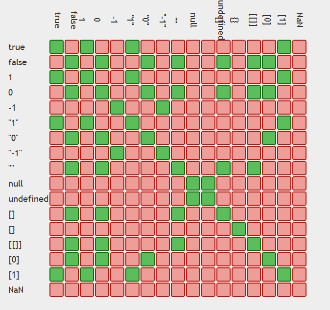

最近看到網路上文章有人推這堂 Udemy 的 JavaScript 課程，然後就買下來了  
[The Complete JavaScript Course - From Zero to Expert](https://www.udemy.com/course/the-complete-javascript-course/ 'The Complete JavaScript Course - From Zero to Expert')

## 為什麼想上這堂課


由於整堂課有 69 小時，自己擷取的重點不一定符合所有階段的學習者，可能比較精簡    
如果有看不懂的地方可以在下方留言，或建議還是來親自體驗一下這堂課  
下方也會加入一些自己過往學習JavaScript的筆記

## 什麼是 ES6（ECMAScript6）？

- ECMAScript 是一個規範，JavaScript 實作了這個規範
- JavaScript 在 2015 年迎來了一次大更新，更新後的版本叫 ES6（ES2015），俗稱 Modern JavaScript
- 當你使用 Google 跟 StackOverflow 社群都找不到解答，閱讀這份文件[ECMAScript](https://tc39.es/ecma262/ 'ECMAScript')也許會有助於你 debug
- 你可能聽過 Vue、React、Angular 這些不同的 JavaScript 套件或是框架，不過最後都會被打包成 JavaScript 在瀏覽器上運行。
- 隨著時代演進使用的框架可能會變，但熟悉 JavaScript 有助於未來與時俱進

## ES6 新增了哪些語法

- 解構賦值  
  -- 可以用精簡的語法來命名變數，可彈性修改變數名稱

```JS
  const variable = { a: 1, b: 2, c: 3}
  const {a, b, c: cat} = variable //若想針對c做新變數命名為cat
  console.log(a, b, cat) // 1 2 3
```

-- 可以用來定義預設值，由於我們從其他地方取用資料時可能會有預料外狀況，當沒有資料時有預設值套用比較保險

```JS
const restaurant = {
starterMenu: ['Focaccia', 'Bruschetta', 'Garlic Bread', 'Caprese Salad'],
}
// 解構賦值時加入預設值[] 避免undefined
const { menu = [], starterMenu: starters = [] } = restaurant
console.log(menu, starters)
// [] [ 'Focaccia', 'Bruschetta', 'Garlic Bread', 'Caprese Salad' ]

// 函數使用預設參數
function check (a, b = 1, c = 2, d) {
  console.log(a, b, c, d)
}
check(1,3)
// 1 3 2 undefined

// 物件方法使用預設參數
const restaurant = {
  orderDelivery: function ({
    starterIndex = 1, // 預設值
    mainIndex = 0,    // 預設值
    time = '00:00',   // 預設值
    address, // 沒訂預設值
  }) {
    console.log(
      `${starterIndex}, ${mainIndex}, ${time}, ${address}` );
  },
};
restaurant.orderDelivery({}) // 1, 0, 00:00, undefined
```

-- 使用解構賦值不用另外宣告 temp 暫存變數，就可以互換變數值，很方便

```JS
// 陣列範例
let [a, b] = [1, 2]
[a, b] = [b, a]
console.log(a, b) // 2 1
// 物件範例
let a = 1
let b = 2
const obj = {a: 11, b: 22}
({b, a} = obj) // 不能直接對block{}賦值，需要包在()中
console.log(a, b) // 22 11
```

-- 用解構賦值取出巢狀變數變得很簡單

```JS
  // 陣列範例
  const nested = [1, 2, [3, 4]]
  const [i, ,[j, k]] = nested
  console.log(i, j, k) // 1 3 4
  // 物件範例
  const openingHours = {
    fri: {
      open: 0, // Open 24 hours
      close: 24
    },
  };
  const {
    fri: { open, close }
  } = openingHours
  console.log(open, close) // 0 24
```

- Promise 語法  
  -- 解決了 callback hell（難以維護的巢狀結構程式碼）  
  -- ES7 有 async/await 更好讀
- 展開運算子  
  -- 可以展開物件、做淺拷貝、合併陣列、把可迭代的物件（string、array、array-like、Set、Map）跟非迭代物件 objects 變成陣列，且不用新增變數

```JS
  const arr = [1, 2, 3]
  const arrCopy = [...arr]

  const str = 'Jonas'
  const letters = [...str] // ['J', 'o', 'n', 'a', 's']
  console.log(...str) // J o n a s
```

- 其餘運算子  
  -- 可以將陣列後方剩下的值存成一個陣列，解構賦值時好用（不會存取 skip,, 的 key 跟有出現過的 key）

```js
// 陣列範例
const [x, , ...y] = [13, 25, 33, 2];
console.log(x); // 13
console.log(y); // [33, 2]

// 物件範例
  const restaurant = {
    openingHours: {
      thu: 12,
      fri: 13,
      sat: 12
    }
  }
  const {sat, ...weekdays} = restaurant.openingHours
  console.log(weekdays) = {thu: 12, fri: 13}
```

- 箭頭函式  
  -- 可以打較少的程式碼，提高程式碼可讀性  
  -- 過往 this 值依照執行環境所有不同，不好判斷  
  -- 而箭頭函式的 this 則是綁定定義他（而非呼叫他）的物件，看他身處在的 function scope 的 this 指向誰
  -- 白話文：箭頭函式沒有自己的this，但可以使用父層的 this
- 模板字串  
  -- 過往可以透過單引號或雙引號跟加號拼接字串，巢狀的時候需要雙引號包裹單引號(反過來則不行)  
  -- 遇到拼接內容是 HTML 結構，換行需要加`\n`，使用上麻煩閱讀上也不容易  
  -- 想寫縮寫或所有格（e.g. I'm cool, bac's）的英文內容可能遇到需要用跳脫字元"I\'m"，而字串模板解決了上述不方便使用的問題

```JS
  const yourName = 'bacnotes';
  const codeName = 'JavaScript';
  const string = `Hi I'm ${yourName}`
  And I love ${codeName}!!`;
```

- Enhanced Object Literals  
  屬性名跟本地變量名相同可以省略後面的冒號跟值
- 引入 class 類別  
  作為 JavaScript 現有原型程式(prototype-based)繼承的語法糖
- 引入模組 Import and Export modules  
  方便管理程式碼之間的相依性，非同步載入（過往 require 是同步語法）

## JavaScript 在網頁渲染時執行位置

- 瀏覽器渲染過程：建立 DOM → 建立 CSSOM → 合併為 Render Tree → Layout（空間位置排版佈局） → Paint（繪製畫面，轉換成像素做呈現）
- 由於 JavaScript 在執行時，會停止渲染動作，阻塞 DOM 和 CSSOM 的建構過程
- 因此會建議把 script 放在 HTML 內容下方，也就是`</body>`前

```JS
<body>
...
<script src='./script.js'></script>
</body>
```

- 如果為了效能想提早載入資源而希望把 script 放在`<head>`區塊，需要加一個`defer`屬性避免阻擋渲染過程（DOM 還在建立）
- 若使用`async`屬性，下載後會立刻執行但不保證順序，且請求回來後會停止解析，還是可能遇到 DOM 跟 CSSOM 還在生成，選不到元素，適合用在不會針對操作 DOM 的 script（e.g. Google Analytics）

## 變數命名限制

- 變數 variable 用來存取 value
- JavaScript 習慣小寫駝峰命名`yourName`，大寫開頭表示建構子
- 使用有意義的命名（e.g. `firstJob`、`currentJob`而非`job1`、`job2`）
- 不能用數字開頭當變數
- 不接受 - 符號（會當成減號)
- 變數內容只能包含數字、英文字、`_`、`$`
- `_`跟`$`開頭的命名通常是有特別用途（e.g. 私有變數）
- 不能使用 Reserved keywords（e.g. new、function），但`$new`或`_funtion`是合法的
- `name` 是 Reserved keywords，可以合法使用但可能有風險，寧願用`firstName`等等

## error msg 與 console.log

- SyntaxError: 語法結構錯誤（可能是括弧、拼字大小寫）
- ReferenceError: 引用錯誤（沒被定義、找不到檔案）
- RangeError: 超出參數範圍
- TypeError: 型別錯誤
- EvalError: eval()方法使用錯誤
- URIError: url 錯誤
- 如果 console.log 結果無法在瀏覽器的 dev tools 顯示出來，點右邊齒輪確認勾選狀況(一般會是勾 default value)，可參考這篇
  https://blog.csdn.net/xianyu_Padding/article/details/78013754

## Data types 型別跟 Dynamic type

- Number(整數/浮點數)
- String(文字)
- Boolean(true/false)
- Object(物件/陣列/函式)
- Undefined(已宣告無定義)
- null(空值/empty value)
- Symbol(ES2015) unique 且無法被改變的 value
- BigInt(ES2020) 大整數 非 number 可以保存的 value
- JavaScript 在命名變數時不用手動定義型別，同一個變數可以賦予不同型別的值
- 變數可能原本是數字，後面變成字串，這也是 bug 產生的風險(但現在也有 typescript XD)
- 確認變數型別`typeof 變數`
- `typeof 變數`  得到的是固定的七種字串值:`'undefined'` `'object'` `'boolean'` `'number'` `'string'` `'function'` `'symbol'`

## null v.s. undefined v.s. not defined

- `null` 有宣告/有賦值 但是是一個空值 → 系統提示沒抓到元素 (e.g. array 當中 key 存在但值是空的)
- `undefined` 有宣告/沒賦值 → 系統提示沒有賦值
- `not defined` 沒宣告/沒賦值 → 系統提示沒有宣告

## 宣告變數方式 let、const、var

從 ES6 開始有了`const`跟`let`兩種新的呼叫方式  
並且最小的區塊切分從`function`變成 block{}，避免變數污染的發生

- `let` 跟 `const` 的差異  
  -- `let`的變數隨時可以用 = 重新賦值  
  -- `const`的變數無法用 = 重新賦值，適合用在常數，若為陣列或物件屬性的值還是可被改變  
  -- `const`若為 primitives，不能做 var += var 的操作  
  -- 由於值的變更有產生 bug 的風險，基本上宣告會使用`const`，若會重複賦值再用`let`  
  -- 不會使用早期的宣告變數方式`var`，早期宣告變數方法只有`var`搭配`function`把作用域鎖在函式裡面，但若放在`if else`等區塊語句，會讓`var`宣告的變數洩漏到全域，造成變數污染

- `let` 跟 `const` 的共同處  
  -- 同區塊上不能重複宣告  
  -- 區塊內宣告不會洩漏到全域

- 作用域  
  -- `var`在主程式區是全域變數，在`function`內是區域變數  
  -- 在 block 區塊語句（if、else、for、while 等）裡面用 var 宣告的變數，會洩漏到全域中，造成區域變數覆蓋全域變數

- 絕對不要直接命名而不使用`let` `const` `var`  
  -- 像是`job = 'code'`  
  -- 沒有 scope，會變成全域變數，而且不在控管下，會造成記憶體管理問題

## 算數運算子 Arithmetic Operator

- `+ = * / ** % ++ --` 加減乘除 指數 取餘數 遞增 遞減
- `x++` 跟 `++x` 有執行順序的差別，前者先列印結果再相加，後者先相加再列印結果
- 運算子還可以用做合併字串 `字串1+ ' '+ 字串2`，但現在合併字串多用 template literal

## 指派運算子 Assignment operators

- `= += -= *= /= %=`
- 將等號右邊的值拷貝給左邊的變數資料

## 比較運算子 Comparison operators

- `== === != !== > >= < <=`
- 可以用來把判斷的結果存在變數

```javascript
console.log(age >= 18); // true 判斷用的參數
const isFullAge = age >= 18;
```

## Operator precedence 運算子優先順序

- [MDN](https://developer.mozilla.org/zh-TW/docs/Web/JavaScript/Reference/Operators/Operator_Precedence 'MDN')可以查詢，不用背有個概念即可
- 如果搞不懂順序，用()把確定要先執行的段落包起來，權重最高

```javascript
() 21
* / 14
+ - 13
> < 比較 11
&& 6
|| 5
```

- 解釋了為何程式可以正確執行類似有許多運算子卻不會誤判執行順序

```javascript
const now = 2039;
const ageJonas = now - 1991;
const ageSarah = now - 2003;
console.log(now - 1991 > now - 2003); // true
```

- = 執行順序右到左

```javascript
let x, y
x = y = 25 - 10 - 5
console.log(x, y) // 10 10
假設是左到右 x＝y時 y會是undefined 所以必須是右到左
```

## 顯性轉型 Type Conversion

- `String()` 可以將 null 和 undefined 轉換為字串
- `toString()` 可以將所有資料都轉換為字串  
  但是要排除 null 和 undefined（TypeError: Cannot read property 'toString' ）
- `toString(value, radix)` 可以轉 2 或 8 或 10 或 16 進位字串
- `JSON.stringify()`轉成 JSON 字串""
- `parseInt(string, radix)` 字串轉成數字，若第一個字符無法轉換為數字回傳 NaN
- `Number()` 字串轉成數字，undefined 回傳 NaN，null 回傳 0，true 回傳 1，false 回傳 0
- `Boolean()` 如果沒傳值，或者是 0、-0、null、false、NaN、undefined、空字串會轉成 Boolean

## 隱性轉型 Coercion

### 運算子

- `- * /`會轉成數字`'23' - '10' - 3 // 10`
- `+`會轉成字串`'23' + '10' // 2310`
- 綜合 `10 - 3 - 3 + '1' // 41`
- `== === != !== ` 也會，可以看下方的嚴格的等號 v.s. 寬鬆的等號說明

### if () 跟!

- if (變數) 在 if 括弧裡的變數都會強制轉為 Boolean
- 程式沒寫好可能回傳 null、undefined、NaN 等，若當作條件判斷變成 false 容易造成判斷式錯誤，需要注意。

```
// 運算前確認型別
if (typeof a === typeof b) {
  console.log(a + b)
} else {
  console.log('need to check problem')
}
```


- !(變數)也會讓變數強制轉型

```javascript
!'Hello'; // false
!0; // true
!{}; // false
!null; // true
!undefined; // true
!NaN; // true
!''; // true
```

## Truthy & Falsy values

- Falsy 包含： `null、undefined、0、空字串、NaN(不等於自己)、false`
- Big Int `0n` 也是 Falsy
- `-1`是 true，`{}`是 true
- 以下為 Falsy 值導致的錯誤設計範例（設計流程時需注意 falsy）

```javascript
// 狀況1
let height;
if (height) {
  console.log('defined');
} else {
  console.log('not defined');
}
// not defined

// 狀況2
let height = 0;
if (height) {
  console.log('defined');
} else {
  console.log('not defined');
}
// not defined 雖然有define為0 但因為0是falsy 所以顯示還是not defined
// 此為設計錯誤導致顯示出非預期的結果
```

## 嚴格的等號=== v.s. 寬鬆的等號 ==

- 使用寬鬆的`==`，會發生會強制轉型，字串跟數字會相等
- 嚴格的等號會檢查資料型別，不會強制轉型
- 寬鬆的等號容易產生 bug，所以只會使用`===`跟`!==`
- `"0" == false` // true ("0"轉成數字 0，false 轉成 0)



有興趣可看這份[MDN 一般相等比較表](https://developer.mozilla.org/zh-TW/docs/Web/JavaScript/Equality_comparisons_and_sameness '一般相等比較表')  
＊`[]`會先由`toString()`強制轉型為字串，再強制轉型為數字

## AND OR ! 邏輯運算子

### 用於 if 條件增加判斷

- `&&` (AND)所有條件為 true 才會是 true
- `||` (OR)有一個條件是 true 就是 true

```javascript
當a is false b is true
!a        // true
a && b    // false
a || b    // true
!a &&  b  // true
a || !b   // false
```

### 用於 short-circuiting

- 可以做為 if 條件判斷的 argument，要執行哪一段程式
- 也可以套用`&&`或`||`的邏輯，為變數賦值，讓程式碼更精簡
- && 可以檢查變數是否為true，true時才會執行後面的程式碼
- || 可以當作處理例外情況，當左邊變數有問題，使用右邊預設值

```javascript
// 不限資料型態
const a = var1 && var2 (當左邊變數為true，才套用右邊的值，若為false會套用左邊值)
console.log(3 && 'cat') // 'cat'
console.log(0 && null)  // 0
console.log('' && 0)    // ''


const a = var1 || var2 (當左邊變數為false，才套用右邊的值，若為true會套用左邊值)
console.log(3 || 'cat') // 3
console.log('' || null) // null
console.log(undefined || 0 || '' || 'hi' || 23) // 'hi'
```

## ?? Nullish Coalescing

- 當 null 或 undefined 才會回傳 (0 或''不會)

```
const guests = restaurant.numGuests || 10
console.log(guests) // 10
// null or undefined
const guestsCorrect = restaurant.numGuests ?? 10
console.log(guestsCorrect) // 10

```

## 表達式 statements v.s. 陳述式 expressions

- 表達式：會回傳結果  
  e.g. 純值、變數、運算子、執行函式、正規表達式、函式表達式…
- 陳述式：會執行一些程式碼，可能是幾個單詞或是片段（不會是單一個字母），不會回傳結果  
  e.g. 宣告（var、function）、流程控制（block、if…else）、迴圈（for、while）、其它（import, export）

## 流程判斷

- if else

```javascript
// 比較運算子來設定條件，可以搭配&& || !邏輯運算子設定更細緻的判斷
const accountName = prompt('your accountName: 8 ~ 20 characters');
if (accountName > 8 && accountName < 20) {
  console.log('correct account length');
} else {
  // 不符合條件，提示使用者檢查帳號長度
  console.log('please check your account length');
}

// 有三組以上條件，中間的條件會用else if標示，最後才是else
if (a > 10) {
  console.log('bigger than 10');
} else if (a === 10) {
  console.log('equal to 10');
} else {
  console.log('smaller than 10');
}
```

- Ternary Operator（條件運算子）

```javascript
// condition ? exprIfTrue : exprIfFalse
const age = 20;
const drink = age >= 18 ? 'wine' : 'water';
console.log(drink); // wine

// expression也可以放到模板字串
console.log(`I can drink ${age >= 18 ? 'wine' : 'water'}`); // I can drink wine
```

- switch（比較少用，看情況還是可以使用）

```javascript
const time = 'morning';

switch (time) {
  case 'morning':
    console.log('go to school');
    break;
  case 'noon':
    console.log('eat lunch');
    break;
  case 'night':
    console.log('sleep');
    break;
  default:
    console.log('nothing');
}
```

## JavaScript 小歷史

```javascript
1995 Brendan Eich10天內創造了第一版JavaScript叫 mocha
1996 LiveScript → JavaScript 改名字希望吸引Java開發者，但無關乎Java這個程式語言
     MS發布IE，從NetScape copyJavaScript叫JScript 擔心侵權改名，但還是很像的東西
     為了長遠發展，需要標準化，於是提交給ECMA獨立機構
1997 ECMAscript ES1發布，大家使用一樣的標準跟規範開發
2009 ES5/ES2016(ECMAScript5) 有一些新feature
2015 ES6/ES2017(ECMAScript6) 新紀元
```

## JavaScript 和瀏覽器的相容性

- Backward compatibility: ES1 語法在現代瀏覽器還是相容的
- Forwards compatibility: 舊版本 IE8 瀏覽器不理解新版本 JavaScript 的規範  
  我們可以透過更新瀏覽器避免不相容
- ES5: fully supported in all browsers IE9(2011)
- ES6 → ES2021: well supported in all modern browsers, not in older ones.  
  can use most features in production with transpiling and polyfilling
  所以會使用 BABEL
- ES2022: ESNext future versions  
  can use some features in production with transpiling and polyfilling
- 先學 Modern JavaScript 但還是需要知道過往 JavaScript 運作方式  
  e.g. const let v.s. var  
  e.g. function construction v.s ES6 Class
- 關於[Polyfills and transpilers](https://javascript.info/polyfills 'Polyfills and transpilers')

恭喜你看完這一篇 JavaScript 基礎知識複習(1)，休息一下再往下一篇前進吧！  
[JavaScript 基礎知識複習(2)](https://bacnotes.github.io/p/javascript-fundamentals-part2/ 'JavaScript 基礎知識複習(2)｜The Complete JavaScript Course')

＊文章內容有錯誤的地方，都歡迎討論與指正
＊以上是 JavaScript 的基礎介紹，未來還會撰寫其他進階的文章。
