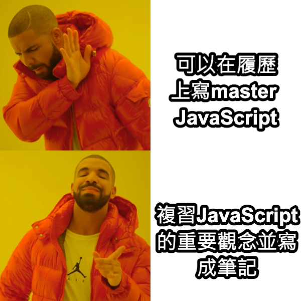
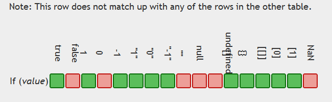
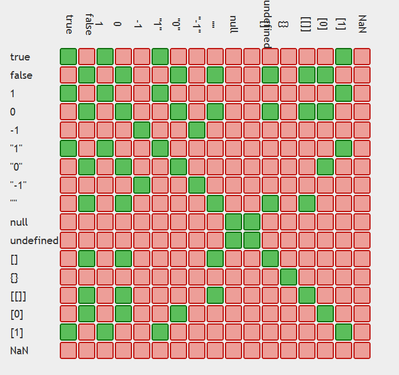

最近看到網路上文章有人推這堂Udemy的JavaScript課程，然後就買下來了  
[The Complete JavaScript Course 2022 - From Zero to Expert](https://www.udemy.com/course/the-complete-javascript-course/ "The Complete JavaScript Course 2022 - From Zero to Expert")  

## 為什麼想上這堂課
 

由於整堂課有69小時，自己擷取的重點不一定符合所有階段的學習者    
建議還是來親自體驗一下這堂課  
下方也會加入一些自己過往學習的資料或筆記  

## JavaScript基礎知識(1)

### 什麼是ES6（ECMAScript6）？
- ECMAScript是一個規範，JavaScript實作了這個規範
- JavaScript在2015年迎來了一次大更新，更新後的版本叫ES6（ES2015），俗稱Modern JavaScript
- 當你使用Google跟StackOverflow社群都找不到解答，閱讀這份文件[ECMAScript](https://tc39.es/ecma262/ "ECMAScript")也許會有助於你debug
- 你可能聽過Vue、React、Angular這些不同的JavaScript套件或是框架，不過最後都會被打包成JavaScript在瀏覽器上運行。
- 隨著時代演進使用的框架可能會變，但熟悉JavaScript有助於未來與時俱進  

### ES6新增了哪些語法
- Promise語法  
解決了callback hell（難以維護的巢狀結構程式碼）  
ES7有async/await更好讀
- 展開運算子  
可以展開物件、做淺拷貝、合併陣列、把可迭代的物件（string、array、array-like object、Set、Map）變成陣列  
- 其餘運算子  
可以將剩下的值存成一個陣列，解構賦值時好用 
```
const [x, ...y] = [13, 25, 33, 2]
console.log(x) // 13
console.log(y) // [25, 33, 2]
```
- 箭頭函式  
除了可以打較少的程式碼，提高程式碼可讀性外  
過往this值依照執行環境所有不同，不好判斷      
而箭頭函式的this則是綁定定義他（而非呼叫他）的物件，看他身處在的function scope的this指向誰
- 模板字串  
過往可以透過單引號或雙引號跟加號拼接字串，巢狀的時候需要雙引號包裹單引號(反過來則不行)  
遇到拼接內容是HTML結構，換行需要加\n，使用上麻煩閱讀上也不容易  
想寫縮寫或所有格（e.g. I'm cool, bac's）的英文內容可能遇到需要用跳脫字元"I\'m" 
而字串模板解決了上述使用上不方便的問題
```
const yourName = 'bacnotes'
const codeName = 'JavaScript'
const string = `Hi I'm ${yourName}. 
And I love ${codeName}!!`
```

### JavaScript在網頁渲染時執行位置
- 瀏覽器渲染過程：建立DOM → 建立CSSOM → 合併為Render Tree → Layout（空間位置排版佈局） → Paint（繪製畫面，轉換成像素做呈現）
- 由於JavaScript在執行時，會停止渲染動作，阻塞DOM和CSSOM的建構過程
- 因此會建議把script放在HTML內容下方，也就是`</body>`前  
```
<body>
...
<script src="./script.js"></script>
</body>
```
- 如果為了效能想提早載入資源而希望把script放在`<head>`區塊，需要加一個`defer`屬性避免阻擋渲染過程（DOM還在建立）
- 若使用`async`屬性，下載後會立刻執行但不保證順序，且請求回來後會停止解析，還是可能遇到DOM跟CSSOM還在生成，選不到元素，適合用在不會針對操作DOM的script（e.g. Google Analytics）

### 變數命名限制
- 變數variable用來存取value
- JavaScript習慣小寫駝峰命名`yourName`，大寫開頭表示建構子
- 使用有意義的命名（e.g. `firstJob`、`currentJob`而非`job1`、`job2`）
- 不能用數字開頭當變數
- 不接受 - 符號（會當成減號)
- 變數內容只能包含數字、英文字、`_`、`$`
- `_`跟`$`開頭的命名通常是有特別用途（e.g. 私有變數）
- 不能使用保留字Reserved keyword（e.g. new、function），但`$new`或`_funtion`是合法的
- `name` 是Reserved keyword，可以合法使用但可能有風險，寧願用`firstName`等等

### error msg與console.log
1. SyntaxError: 語法結構錯誤（可能是括弧、拼字大小寫）
2. ReferenceError: 引用錯誤（沒被定義、找不到檔案）
3. RangeError: 超出參數範圍
4. TypeError: 型別錯誤
5. EvalError: eval()方法使用錯誤
6. URIError: url錯誤
- 如果發現console.log結果無法在瀏覽器的dev tools顯示出來，可以點右邊齒輪確認一下是否有沒勾選到的
https://blog.csdn.net/xianyu_Padding/article/details/78013754

### Data types型別跟Dynamic type
- Number(整數/浮點數)
- String(文字)
- Boolean(true/false) 
- Object(物件/陣列/函式)
- Undefined(已宣告無定義) 
- null(空值/empty value)
- Symbol(ES2015) unique且無法被改變的value
- BigInt(ES2020) 大整數 非number可以保存的value
- JavaScript在命名變數時不用手動定義型別，同一個變數可以賦予不同型別的值
- 變數可能原本是數字，後面變成字串，這也是bug產生的風險(但現在也有typescript XD)
- 確認變數型別 console.log(typeof 變數)/ typeof(變數)

### null v.s. undefined v.s. not defined
- `null` 有宣告/有賦值 但是是一個空值 → 系統提示沒抓到元素 (e.g. array當中key存在但值是空的)
- `undefined` 有宣告/沒賦值 → 系統提示沒有賦值
- `not defined` 沒宣告/沒賦值 → 系統提示沒有宣告

### 宣告變數方式 let、const、var
從ES6開始有了`const`跟`let`兩種新的呼叫方式  
並且最小的區塊切分從`function`變成block{}，避免變數污染的發生
1. `let` 跟 `const` 的差異
- `let`的變數隨時可以用 = 重新賦值
- `const`的變數無法用 = 重新賦值，適合用在常數，若為陣列或物件屬性的值還是可被改變
- 由於值的變更有產生bug的風險，基本上宣告會使用`const`，若會重複賦值再用`let`
- 不會使用早期的宣告變數方式`var`，早期宣告變數方法只有`var`搭配`function`把作用域鎖在函式裡面，但若放在`if else`等區塊語句，會讓`var`宣告的變數洩漏到全域，造成變數污染

2. `let` 跟 `const` 的共同處
- 同區塊上不能重複宣告
- 區塊內宣告不會洩漏到全域

3. 作用域
- `var`在主程式區是全域變數，在`function`內是區域變數
- 在block區塊語句（if、else、for、while等）裡面用var宣告的變數，會洩漏到全域中，造成區域變數覆蓋全域變數

4. 絕對不要直接命名而不使用`let` `const` `var`
- 像是` job =‘code’ `  
- 沒有scope，會變成全域變數，而且不在控管下，會造成記憶體管理問題  

### 算數運算子 Arithmetic Operator
- `+ = * / ** % ++ --` 加減乘除 指數 取餘數 遞增 遞減  
- `x++` 跟 `++x` 有執行順序的差別，前者先輸出結果再相加，後者先相加再輸出結果
- 運算子還可以用做合併字串 `字串1+ ' '+  字串2`，但現在合併字串多用template literal 

### 指派運算子 Assignment operators
- `= += -= *= /= %=`
- 將等號右邊的值拷貝給左邊的變數資料

### 比較運算子 Comparison operators
- `== === != !==  > >= < <=`
- 可以用來把判斷的結果存在變數  
```
console.log(age >= 18) // true 判斷用的參數
const isFullAge = age >=18  
```
### Operator precedence 運算子優先順序
- [MDN](https://developer.mozilla.org/zh-TW/docs/Web/JavaScript/Reference/Operators/Operator_Precedence "MDN")可以查詢，不用背有個概念即可
```
() 21
* / 14
+ - 13
> < 比較 11
&& 6
|| 5
```
- 解釋了為何程式可以正確執行類似有許多運算子卻不會誤判執行順序
```
const now = 2039
const ageJonas = now - 1991
const ageSarah = now - 2003
console.log( now - 1991 > now - 2003 ) // true
```
- = 執行順序右到左
```
let x, y
x = y = 25 - 10 - 5
console.log(x, y) // 10 10
假設是左到右 x＝y時 y會是undefined 所以必須是右到左 
```
### 顯性轉型Type Conversion
- `String()` 可以將null和undefined轉換為字串
- `toString()` 可以將所有資料都轉換為字串  
但是要排除null和undefined（TypeError: Cannot read property 'toString' ）
- `toString(value, radix)` 可以轉2或8或10或16進位字串
- `JSON.stringify()`轉成JSON字串""
- `parseInt(string, radix)` 字串轉成數字，若第一個字符無法轉換為數字回傳NaN
- `Number()` 字串轉成數字，undefined回傳NaN，null回傳0，true回傳1，false回傳0
- `Boolean()` 如果沒傳值，或者是0、-0、null、false、NaN、undefined、空字串會轉成Boolean

### 隱性轉型Coercion 
#### 運算子
- `- * /`會轉成數字`'23' - '10' - 3 // 10`
- `+`會轉成字串`'23' + '10' // 2310`
- 綜合 `10 - 3 - 3 + '1' // 41`
- `== === != !== ` 也會，可以看下方的嚴格的等號 v.s. 寬鬆的等號說明
#### if () 跟!
- if (變數) 在if括弧裡的變數都會強制轉為Boolean

 

- !(變數)也會讓變數強制轉型 
```
!('Hello') // false
!(0) // ture
!({}) // true
!(null) // true
!(undefined) // true
!(NaN) // true
!('') // true
```

### Truthy & Falsy values 
- Falsy包含： `null、undefined、0、空字串、NaN、false`
- Big Int `0n` 也是Falsy
- `-1`是true，`{}`是true
- 以下為Falsy值導致的錯誤設計範例（設計流程時需注意falsy）
```
// 狀況1
let height  
if (height) {
  console.log(‘defined’)
} else {
  console.log(‘not defined’)
}
// not defined

// 狀況2
let height = 0 
if (height) {
  console.log(‘defined’)
} else {
  console.log(‘not defined’)
}
// not defined 雖然有define為0 但因為0是falsy 所以顯示還是not defined
// 此為設計錯誤導致顯示出非預期的結果
```
### 嚴格的等號=== v.s. 寬鬆的等號 ==
- 使用寬鬆的`==`，字串跟數字會相等
- 容易產生bug，所以只會使用`===`跟`!==`
- `"0" == false` // true   ("0"轉成數字0，false轉成0)

 

有興趣可看這份[MDN一般相等比較表](https://developer.mozilla.org/zh-TW/docs/Web/JavaScript/Equality_comparisons_and_sameness "一般相等比較表")  
*`[]`會先由`toString()`強制轉型為字串，再強制轉型為數字

### AND OR ! 邏輯運算子
- `&&` (AND)所有條件為true才會是true
- `||` (OR)有一個條件是true就是true
```
當a is false b is true
!a        // true
a && b    // false
a || b    // true
!a &&  b  // true
a || !b   // false
```
- 可以做為if條件判斷的argument，要執行哪一段程式
- 也可以套用`&&`或`||`的邏輯，為變數賦值，讓程式碼更精簡，例如：
```
const a = var1 && var2 (當左邊條件為真/變數存在，才套用右邊的值)
const a = var1 || var2 (當左邊條件為否/變數不存在，才套用右邊的值)
```


### 表達式statements v.s. 陳述式 expressions

- 表達式：會回傳結果  
e.g. 純值、變數、運算子、執行函式、正規表達式、函式表達式…  
- 陳述式：會執行一些程式碼，可能是幾個單詞或是片段（不會是單一個字母），不會回傳結果  
e.g. 宣告（var、function）、流程控制（block、if…else）、迴圈（for、while）、其它（import, export）

### 流程判斷

- if else
```
 if (a > 0) {
    result = 'positive';
  } else {
    result = 'NOT positive';
  }
```
- Ternary Operator（條件運算子）

```
condition ? exprIfTrue : exprIfFalse
const drink = age >= 18 ? ‘wine’ : ‘water’
console.log(drink)

// expression也可以放到模板字串
console.log(`I like to drink $(age >= ? ‘wine’ : ‘water’)
```

- switch（比較少用，看情況還是可以使用）
```
const day = 'morning'

switch (time) {
  case 'morning':
    console.log('go to school')
    break
  case 'noon':
    console.log('eat lunch')
    break
  case 'night':
    console.log('sleep')
    break
  default:
    console.log('nothing')
} 
```

### JavaScript小歷史
```
1995 Brendan Eich10天內創造了第一版JavaScript叫 mocha
1996 LiveScript → JavaScript 改名字希望吸引Java開發者，但無關乎Java這個程式語言
     MS發布IE，從NetScape copyJavaScript叫JScript 擔心侵權改名，但還是很像的東西
     為了長遠發展，需要標準化，於是提交給ECMA獨立機構 
1997 ECMAscript ES1發布，大家使用一樣的標準跟規範開發
2009 ES5/ES2016(ECMAScript5) 有一些新feature
2015 ES6/ES2017(ECMAScript6) 新紀元
```

### JavaScript和瀏覽器的相容性
- Backward compatibility: ES1語法在現代瀏覽器還是相容的
- Forwards compatibility: 舊版本IE8瀏覽器不理解新版本JavaScript的規範  
我們可以透過更新瀏覽器避免不相容  
- ES5: fully supported in all browsers IE9(2011)  
- ES6 → ES2021: well supported in all modern browsers, not in older ones.  
can use most features in production with transpiling and polyfilling
所以會使用BABEL
- ES2022: ESNext future versions  
can use some features in production with transpiling and polyfilling
- 先學modern JavaScript 但還是需要知道舊JavaScript運作方式  
e.g. const let v.s. var  
e.g. function construction v.s ES6 Class
- 關於[Polyfills and transpilers](https://javascript.info/polyfills "Polyfills and transpilers")

恭喜你看完這一篇JavaScript基礎知識(1)，休息一下再往下一篇前進吧！  
[JavaScript基礎知識(2)｜The Complete JavaScript Course 2022](http://localhost:1313/p/javascript-fundamentals-part2/ "JavaScript基礎知識(2)｜The Complete JavaScript Course 2022")

*若發現文章內容有錯誤的地方，都歡迎討論與指正