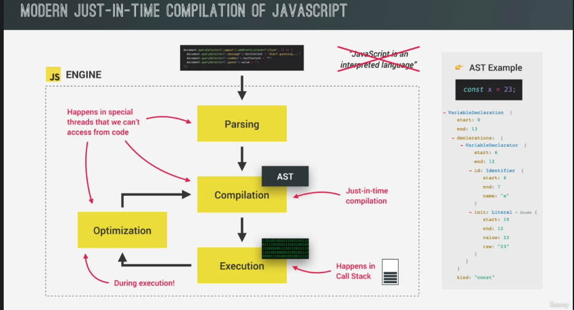
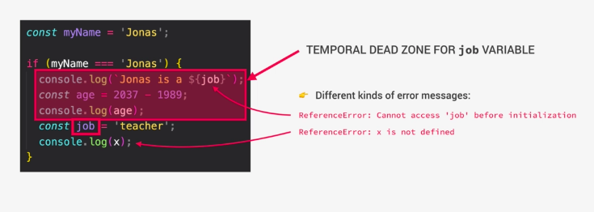

## JavaScript 的特性

### high level 高階(語言)

- 高階是接近人類讀得懂的語言，低階是接近機器的 2 進位的機器碼(machine code)
- 例如 c 語言(低階語言)，需要處理宣告新變數時的記憶體
- 而高階語言的 python 跟 JavaScript 不需要，但效能不會有 c 語言好

### prototype based object-oriented 物件導向

- JavaScript 資料除了 primitives 都是物件
- 陣列也是物件，只是 key 為 index

```JS
let arr = [1, 2, 3]
typeof arr //object
```

### interpreted or just-in-time compiled

- JavaScript 引擎會幫我們轉成 2 進位的機器碼

### dynamic-typed 動態資料型態

- 宣告變數時不需要給予型別(C、Java、Ruby 要)
- 容易改變型別

### single-threaded 單執行緒

- 一次只能執行一件事

### garbage collected 有記憶體回收寄至

- 有機制會自動移除記憶體中老舊或沒有使用的變數

### multi-paradigm 可以同時使用多種風格來寫程式

- 可以用 Procedural Programming 程序化程式設計
- 可以用 Function Programming 函式化程式設計
- 可以用 Object-Oriented Programming 物件導向程式設計

### with first-class functions 一級函式

- 可以把 function 當變數使用
- 可以 function return function，一種 FP 常使用的方式(把函式當作參數傳入)

### non-blocking event loop concurrent model

- 由於單執行緒但又得處理同時發生的多種任務，容易阻塞
- JavsScript 引擎會使用 event loop，一個背景執行的 task，任務執行完的結果會放到 call stack

## JavaScript 引擎 v.s. 執行環境 runtime v.s.執行文本 context

### JavaScript 引擎

- 各家瀏覽器有自己的 JavaScript 引擎，用來執行 JavaScript
- Google 開發的 V8 引擎，不只用於 Chrome 還有 Node.js(可以在瀏覽器外執行 JavaScript)
- JavaScript 引擎包含一個 Call Stack(execution context)跟一個 Heap
- Heap 是非結構化的記憶體池，儲存所有物件
- interpretation：程式碼轉成一行行執行的 code，再轉成機器碼
- compilation：整包程式碼轉成 machine code(2 進位)，再執行程式
- just-in-time compilation: 程式碼轉成 2 進位後立即執行(避免等待)
- 當一段程式碼進到引擎會執行下方程序



```r
step1. parsing: JavaScript → AST(abstract syntax tree) 結構化JavaScript
step2. compilation: AST → 2進位的機器碼
step3. execution: 在call stack執行
step2~3. optimization: 邊執行邊最佳化(在特別的thread執行，無法access)
```

### JavaScript Runtime 執行環境

- browser: JavaScript 引擎 + webAPIs + callback queue
- call stack : 由上到下執行 stack 裡面每一行程式，變數的記憶體也是在這個階段建立(hoisting)，遇到需要呼叫 API 的非同步函式會把裡面的 call back function 丟到 webAPI 排程執行
- webAPIs 處理非同步函式，當有收到回傳結果，會依照回傳時間順序把 callback function 傳到 callback queue
- 當 stack 清空時，callback queue 就會把 callback function 依序丟到 stack 裡執行（先進先出)
- 這整個過程就是 event loop，為了提高瀏覽器的使用體驗，不會被非同步函式等待過程阻塞的機制
  

- node.js: JavaScript 引擎 + C ++ bindings & thread pool + callback queue (這邊知道的大概即可)


＊stack 是先進後出(後進先出)的資料結構，queue 是先進先出的資料結構

### execution context 執行文本

＊為了跟執行環境 runtime 做名詞區隔，使用不同中文名稱指稱

- 有創造階段跟執行階段
- 執行文本包含  
  -- variable environment 變數環境(let const var 宣告, 函式, 參數 arguments obj)  
  -- scope chain 作用域鏈，讓個別函式可以 ref 到函式外的變數，會存在個別執行文本  
  -- this，每個執行文本都有自己的 this，在創造階段時誕生(執行階段前)
- 箭頭函式沒有自己的 this 或參數，但可以使用父層的 this 或參數

```r
step1. 創造全域執行文本(top-level/not inside the function)
- 只有非function的會被執行，因為function要被呼叫才會執行
- 只會有一個global execution context
step2. 執行全域執行文本(inside global EC)
step3. execution of functions & waiting for callbacks
- 依序呼叫個別函式，個別函式的文本會被創造
- call stack的內容就是由這些個別函式跟文本所組成
```


## scope 作用域 & scope chain 作用域鏈

- scoping 如何設計變數的位置跟獲取程式的變數
- lexical scoping 使用 function 跟 block 等封閉環境，控制變數存取
- scope 宣告變數的環境，有 global 全域, function 函式跟 block 區塊三種作用域
- scope of a variable 可以獲取變數的範圍

### global scope 全域

- 位於 function 跟 block 外
- 可以被所有地方存取

### function scope 函式作用域

- 也被稱作 local scope
- 只能在函式內存取，嘗試存取會出現 error

### block scope(ES6 開始出現) 區塊作用域

- let 跟 const 被限制只能在 block 範圍內存取
- var 還是可以被 function scope 存取
- 嚴格模式下 function scope 也是 block scope

### scope chain

- 當變數不存在現有 scope，無論是 block 或 function 都可以讀外面父層裡的變數
- 找不到時會一層層往外找(variable lookup)，完全找不到會出現 ReferenceError
- 只能往外找，不能往內 console.log(function 或 block 裡面的變數)會 ReferenceError
- sibling 之間不行互相讀取
- 每個 scope chain 都包含他的變數跟的父層的變數
- scope chain 可以讀取的變數跟 function 在 call stack 執行順序無關


### callstack v.s. scope chain


＊下方輸出結果// 視為單獨出現這行的狀況

```JS
'use strict';
const firstName = 'Jonas'
function calcAge(birthYear) {
  const age = 2037 - birthYear
  function printAge() {
    // find age跟output outer
    const output = `You are ${age}, born in ${birthYear}`;
    console.log(output);

    if (birthYear >= 1981 && birthYear <= 1996) {
      var millenial = true;
      // creating new variable with same name as outer scope's variable
      const firstName = 'Steven'
      // reassigning outer scope's variable
      output = 'New output'
      const str = `you are a millenial, ${firstName}`;
      console.log(str); // you are a millenial, Jonas
    }

    function add(a, b) {
      return a + b;
    }
    console.log(str); // str is not defined
    console.log(millenial); // 獲取同function的變數 true
    console.log(add(3,5)) //嚴格模式下ReferenceError，非嚴格模式下8
  }

  printAge()
  return age
}
calcAge(1991)
console.log(age) // ReferenceError 無法獲取內部變數age
printAge(); // ReferenceError 無法獲取內部變數 printAge()
```

## Hoisting 提升

- 表面上是可以在宣告前被使用
- 其實是在執行階段前，已經在創造階段就建立在變數環境(variable environment)
- 不同變數行為不同

### 函式宣告

- 函式宣告會提升
- 未宣告使用為實際值
- 變數存取範圍嚴格模式下為 block scope，非嚴格模式下為 function scope

### var

- var 會提升
- 未宣告使用為 undefined
- 變數存取範圍為 function scope

### const/let

- const 跟 let，技術上來說有提升但是未初始化 uninitialized 沒有可取用的值
- 未宣告使用下會被鎖在 TDZ(temporary dead zone)
- 變數存取範圍為 block scope


### 函式表達式跟箭頭函式

- 函式表達式跟箭頭函式若用 var 存取會提升
- 未宣告使用是 undefined，反之則跟 const/let 特性一樣
- 這也是為何在函式表達式中，我們無法使用在宣告變數前調用函式，而函式宣告可以不顧函式宣告順序，任何地方都可以調用

### TDZ 是什麼 (ES6 開始出現)

- TDZ 為變數初始化前的區塊
- 下圖 job 在被 const 宣告前被呼叫，會出現 ReferenceError cannot access 'job' before initialization，需要宣告後才能被使用
- 但如果呼叫完全沒被創造的變數，會顯示另一種訊息 ReferenceError x is not defined
- 有 TDZ 比較容易抓出未宣告使用的錯誤
- 另一個 TDZ 存在好處是，因 const 無法重新賦值，所以無法設定 undefined 再給新的值，TDZ 可以讓 const 順利運作
- hoisting 的好處：mutual recursion，讓 code 可讀性高，而 var 的 hoisting 算是副產物，後見之明看來不是好東東



＊下方輸出結果// 視為單獨出現這行的狀況

```JS
// Variables
console.log(me); // not defined
console.log(job); // ReferenceError cannot access 'job' before initialization
console.log(year); // ReferenceError cannot access 'job' before initialization

var me = 'Jonas';
let job = 'teacher';
const year = 1991;

--

// Functions
console.log(addDecl(2, 3)); // 5
console.log(addExpr(2, 3)); // cannot access 'addExpr' before initialization
console.log(addArrow(2, 3)); // undefined(2,3) -> // addArrow is not a function

function addDecl(a, b) {
  return a + b;
}

const addExpr = function (a, b) {
  return a + b;
};

var addArrow = (a, b) => a + b;
```

- 因為 hoisting 造成的 bug 範例，使用 const/let 可避免，養成先宣告變數再使用的好習慣

```JS
// 原本期待不存在product執行deleteShoppingCart()
// 因為沒宣告變數就使用，值變成undefined
// !undefined而變成true
console.log(!numProducts); //true  // !undefined is true
if (!numProducts) deleteShoppingCart();

var numProducts = 10;

function deleteShoppingCart() {
  console.log('All products deleted!');
}
```

- 當用 var 宣告，會在 browser 的 window(全域變數)下多一個屬性

```JS
var x = 1;
let y = 2;
const z = 3;

console.log(x === window.x); // true
console.log(y === window.y); // false
console.log(z === window.z); // false
```

## this 是什麼?

- 所有執行文本下都會有的特別變數，值取決於被呼叫的方式
- 作為 Method(物件下的 function)呼叫時，this 是呼叫他的變數
- 一般函式呼叫，嚴格模式下 this 值是 undefined，非嚴格模式下為全域物件
- 箭頭函式沒有自己的 this，this 值取決於父層(parent scope)
- eventListener 呼叫時，指向觸發的元素
- this 不會是函式自己，也不會是變數環境
- new, call, apply, bind 會於其他篇介紹

＊下方輸出結果// 視為單獨出現這行的狀況

```JS
// this Keyword in Practice
console.log(this); //window object

const calcAge = function (birthYear) {
  console.log(2037 - birthYear);
  console.log(this);
};
calcAge(1991); // 46 嚴格模式 this是undefined 非嚴格模式this是window object

const calcAgeArrow = birthYear => {
  console.log(2037 - birthYear);
  console.log(this);
};
calcAgeArrow(1980); // 父層的this window object

const jonas = {
  year: 1991,
  calcAge: function () {
    console.log(this);
    console.log(2037 - this.year);
  },
};
jonas.calcAge(); // 46 jonas呼叫 this是jonas

const matilda = {
  year: 2017,
};

matilda.calcAge = jonas.calcAge; // copy calcAge method from jonas
matilda.calcAge(); // matilda, 20

// this是動態的
const f = jonas.calcAge; // copy function to a new variable
f(); // 一般函式方法呼叫 undefined, cannot read property 'year' of undefined at calcAge
```

### 讓 this 指向父層的 2 種做法

```JS
// var firstName = 'Matilda';

const jonas = {
  firstName: 'Jonas',
  year: 1991,
  calcAge: function () {
    // console.log(this); // jonas
    console.log(2037 - this.year);

    // Solution 1 (ES6前) 在函式外定義self為this 取得jonas
    // const self = this; // self or that
    // const isMillenial = function () {
    //   console.log(self);
    //   console.log(self.year >= 1981 && self.year <= 1996);
    // };

    // Solution 2 （modern) 使用箭頭函式，沒有自己的this，會往父層找
    const isMillenial = () => {
      console.log(this);
      console.log(this.year >= 1981 && this.year <= 1996);
    };

    isMillenial(); // 一般函式呼叫 嚴格模式下undefined 除非用self綁定this或用箭頭函式呼叫
  },

  greet: () => {
    console.log(this);
    console.log(`Hey ${this.firstName}`);
  },
};
jonas.greet();
jonas.calcAge(); // 沒有solution狀況下 cannot read property of 'year' of undefined
```

## 一般函式 v.s. 箭頭函式

### 物件內的函式

- 當使用一般函式會有自己的 this，可以取得 jonas.firsName
- 當使用箭頭函式會沒有自己的 this，會往父層取變數，bug 通常在這裡發生（可能取得 undefined 或真的有一個變數值)
- 全域避免使用 var

```JS
// 用 let/const 的話會是 undefined，使用 var 就會是'hey mirenda'
var firstName = 'mirenda'
const jonas = {
  firstName: 'Jonas',
  year: 1991,
  greet: () => {
    console.log(this);
    console.log(`Hey ${this.firstName}`);
  },
};
jonas.greet();
```

### arguments

- 只存在一般函式，箭頭函式沒有

```JS
const addExpr = function (a, b) {
  console.log(arguments);
  return a + b;
};
addExpr(2, 5);
addExpr(2, 5, 8, 12); // 雖然function上面參數設定2個，但可以加上更多arguments存到Arguments陣列，可以loop加總這些參數等

var addArrow = (a, b) => {
  console.log(arguments);
  return a + b;
};
addArrow(2, 5, 8);
```

- arguments 跟其餘運算子的搭配

```JS
const restaurant = {
  orderPizza: function(mainIngredients, ...otherIngredients) {
    console.log(mainIngredients)
    console.log(otherIngredients)
  }
}
restaurant.orderPizza('mushrooms', 'onions', 'olives', 'spinach')
// mushrooms [ 'onions', 'olives', 'spinach' ]
restaurant.orderPizza('mushrooms')
// mushrooms []
```

- 當函式很多 argument 不好記順序，可以傳入一個物件作為參數，函式會解構物件並執行函式
- 常用於第三方函式庫

```JS
const restaurant = {
const restaurant = {
  starterMenu: ['Focaccia', 'Bruschetta', 'Garlic Bread', 'Caprese Salad'],
  mainMenu: ['Pizza', 'Pasta', 'Risotto'],
  orderDelivery: function ({
    starterIndex = 1, // 預設值
    mainIndex = 0,    // 預設值
    time = '00:00',   // 預設值
    address,
  }) {
    console.log(
      `Order received! ${this.starterMenu[starterIndex]} and ${this.mainMenu[mainIndex]} will be delivered to ${address} at ${time}`
    );
  },
};
restaurant.orderDelivery({
  time: '22:30',
  address: 'via del sole, 21',
  mainIndex: 2,
  starterIndex: 2
});
// Order received! Garlic Bread and Risotto will be delivered to via del sole, 21 at 22:30

// 沒有全部參數 會用函式參數的預設值
restaurant.orderDelivery({
  address: 'via del sole, 21',
  starterIndex: 2,
});
// Order received! Garlic Bread and Pizza will be delivered to via del sole, 21 at 00:00
```

## primitives v.s. objects

- primitives 包含 數字、字串、布林、undefined、null、Symbol、BigInt，其他都是 objects
- primitives 記憶體存在 call stack
- objects 記憶體存在 Heap


- let age = 30 給一個 call stack 的記憶體地址跟 30 的值
- let oldAge = age 傳 age 的 call stack 地址給 oldAge
- primitives 的值是 immutable，age = 31 給一個新的記憶體的地址跟值
- const me = {name: 'Jonas'}，給一個 call stack 記憶體的地址跟 Heap 的地址
- 因為物件檔案可能太大，所以存在 Heap
- const friend = me，傳 me 記憶體的地址給 friend
- friend.name = 'mirenda' 會改到 me 的值，因為值參照同樣的 Heap 地址


### 常用淺拷貝方法

- Object.assign
- 用於物件

```JS
const jessica = {
  firstName: 'Jessica',
  lastName: 'Williams',
  age: 27,
  family: ['Alice', 'Bob'],
};
const jessicaCopy = Object.assign({}, jessica);
jessicaCopy.lastName = 'Davis';

console.log('Before marriage:', jessica.lastName); // 'Williams'
console.log('After marriage: ', jessicaCopy.lastName); // 'Davis'
```

- 展開運算子
- 除了物件外也可用於 string、array、array-like、Set、Map 等可迭代物件

```JS
  const arr = [1, 2, 3]
  const arrCopy = [...arr]
```
