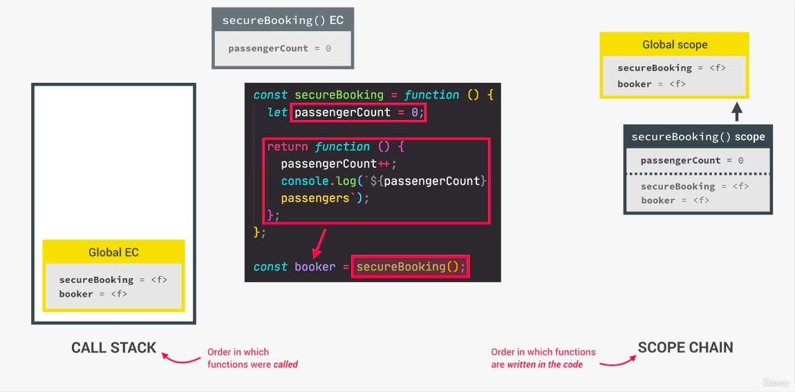
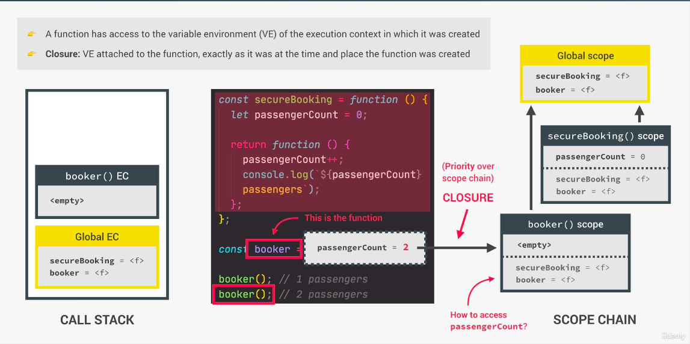

之前在[JavaScript 底層運作原理 101](https://bacnotes.github.io/p/javascript-behind-the-scenes/ 'JavaScript底層運作原理101')，介紹過 primitives 跟 objects 使用記憶體的方式有所不同，也在[JavaScript 基礎知識複習(2)](https://bacnotes.github.io/p/javascript-fundamentals-part2/ 'JavaScript基礎知識複習(2)｜The Complete JavaScript Course')，補充中提到 primitives 賦值時是 `傳值` ，而陣列、物件賦值時是 `傳址`

在這篇文章，我們會繼續介紹傳址跟傳值在函式傳遞參數(arguments)時，primitives 跟 objects 兩者表現會有什麼不同

* 參數為primitives，直接傳值(flightNum)，若為objects則會傳址(passenger)
* 下方checkIn函式會把passenger裡面的屬性name加上一個稱謂

```js
// 有一個字串資料跟一個物件資料
const flight = 'LH234';
const jonas = {
    name: 'Jonas Schmedtmann',
    passport: 24739479284,
};

const checkIn = function(flightNum, passenger) {
    // flightNum 只是一個flight字串值的copy 兩者使用不同記憶體
    flightNum = 'LH999';
    // passenger.name 則是直接把記憶體傳過去 使用同一份記憶體
    passenger.name = 'Mr. ' + passenger.name;

    if (passenger.passport === 24739479284) {
        console.log('Checked in');
    } else {
        console.log('Wrong passport!');
    }
};
// flight是一個primitives 傳值進function
// jonas是一個object 傳址進function
checkIn(flight, jonas); // Checked in

console.log(flight);
// flight變數(primitives): LH234 沒有變
console.log(jonas);
// person.name(物件屬性)：Mr.Jonas Schmedtmann 改變到原資料
```

* 當兩個函式不做淺拷貝直接操作同一個物件，因為傳址，物件內容被修改

```js
const flight = 'LH234';
const jonas = {
    name: 'Jonas Schmedtmann',
    passport: 24739479284,
};
const flightNum = flight;
const passenger = jonas;
const checkIn = function(flightNum, passenger) {

    flightNum = 'LH999';
    // 修改記憶體中的值
    passenger.name = 'Mr. ' + passenger.name;

    if (passenger.passport === 24739479284) {
        console.log('Checked in');
    } else {
        console.log('Wrong passport!');
    }
};
const newPassport = function(person) {
    person.passport = Math.trunc(Math.random() * 100000000000);
};

newPassport(jonas); // a random number
checkIn(flight, jonas); // Wrong passport! (因為改到passport號碼)
```

* 大型專案有時候因為不經意的修改到物件資料，會造成很大的影響，所以需要多注意傳址傳值的概念

## First-Class Function 一級函式

之前介紹 JavaScript 語言特性時，有提到 JavaScript 有一級函式的特性
因此我們可以使用 higher-order function：

1. 可以把 function 當參數傳入另一個 function(又被稱作回呼函式)
2. 可以 function return function

### callback function 回呼函式

回呼函式 callback function 是把函式當作另一個函式的參數，透過另一個函式來呼叫它
只是通常提到的場景是在處理非同步的時候

```js
// 把所有英文字空白去掉，把字拼在一起的函式
const oneWord = function(str) {
    return str.replace(/ /g, '').toLowerCase();
};

// 把第一個英文字都轉大寫字的函式
const upperFirstWord = function(str) {
    const [first, ...others] = str.split(' ');
    return [first.toUpperCase(), ...others].join(' ');
};

// Higher-order function 字串跟函式為參數
const transformer = function(str, fn) {
    console.log(`Original string: ${str}`);
    console.log(`Transformed string: ${fn(str)}`);

    console.log(`Transformed by: ${fn.name}`);
};

// 回呼函式範例1
transformer('JavaScript is the best!', upperFirstWord);
// Original string: JavaScript is the best!
// Transformed string: JAVASCRIPT is the best!
// Transformed by: upperFirstWord

// 回呼函式範例2
transformer('JavaScript is the best!', oneWord);
// Original string: JavaScript is the best!
// Transformed string: javascriptisthebest!
// Transformed by: oneWord
```

### Function return function

* 可以把函式一層層封裝起來，讓外層只傳入一個參數，function programming 常用的程式設計技巧，有助於重複利用程式碼
＊柯里化：把接受多個參數的函式變換成接受一個單一參數（最初函式的第一個參數）的函式，並且返回接受餘下的參數而且返回結果的新函式的技術
* 因為 Function return function 會創造閉包，閉包是函式本身及函式被建立時的執行文本(execution context)，因此下方 greeting 的參數 Hey 會被記住

```js
const greet = function(greeting) {
    return function(name) {
        console.log(`${greeting} ${name}`);
    };
};

const greeterHey = greet('Hey');
greeterHey('Jonas'); // Hey Jonas
greeterHey('Steven'); // Hey Stevens

greet('Hello')('Jonas'); // Hello Jonas

// ＊補充上方的greet函式也可以寫成箭頭函式
const greet = (greeting) => (name) => console.log(`${greeting} ${name}`);
```

## Call & Apply 綁定 this 對象

當我們開發程式後可能會複用不同物件內的方法，但如果你只 copy 方法，使用一般函式呼叫，會發現 this undefined，符合我們之前提到的一般函式呼叫的狀況下，嚴格模式下 this 是 undefined（非嚴格模式下為全域物件）
這個時候你就需要使用 Call 或 Apply 來告訴程式 this 要綁定的對象

### 使用 Call 方法

* call(thisArg, arg1, ... , argN)

```js
const lufthansa = {
    airline: 'Lufthansa',
    iataCode: 'LH',
    bookings: [],
    // book: function() {}
    book(flightNum, name) {
        console.log(
            `${name} booked a seat on ${this.airline} flight ${this.iataCode}${flightNum}`
        );
        this.bookings.push({
            flight: `${this.iataCode}${flightNum}`,
            name
        });
    },
};

lufthansa.book(239, 'Jonas Schmedtmann');
lufthansa.book(635, 'John Smith');

// 也想在這邊使用上面book的方法
const eurowings = {
    airline: 'Eurowings',
    iataCode: 'EW',
    bookings: [],
};

// copy方法，內容為push一段文字到bookings
const book = lufthansa.book;

// 若直接用一般函式呼叫 not work
book(23, 'Sarah Williams');
// Uncaught TypeError: Cannot read property 'airline' of undefined

// 不是去呼叫 book函式而是return 新的函式綁定this對象為eurowings
book.call(eurowings, 23, 'Sarah Williams');
console.log(eurowings);
// 的確有使用book方法把資料push進來了

// {
//  airline: 'Eurowings',
//  iataCode: 'EW',
//  bookings: [ { flight: 'EW23', name: 'Sarah Williams' } ]
// }
```

### 使用 Apply 方法

* apply(thisArg, argsArray)
* Call 跟 Apply 差別在參數傳入的資料結構的不同，使用 Apply 綁定時，參數需要放在陣列當中，Call 則是直接寫在()中。

```js
// 定義另一個物件
const swiss = {
    airline: 'Swiss Air Lines',
    iataCode: 'LX',
    bookings: [],
};

// 參數放入陣列
const flightData = [583, 'George Cooper'];
book.apply(swiss, flightData);
// 可以看到的確有使用到這個方法推新資料進去
console.log(swiss);

// {
//  airline: 'Swiss Air Lines',
//  iataCode: 'LX',
//  bookings: [ { flight: 'LX583', name: 'George Cooper' } ]
// }

// 若使用call需要展開陣列，直接傳參數本身
book.call(swiss, ...flightData);
```

### 不會馬上執行函式的綁定方法：Bind

* bind(thisArg, arg1, ... , argN)
* bind 是創造一個函式物件的拷貝，不會執行函式
* 因此 bind 之後還要再另外寫執行函式的動作()，而 call 是直接執行函式

```js
// 使用剛剛的物件跟原型方法
const lufthansa = {
    airline: 'Lufthansa',
    iataCode: 'LH',
    bookings: [],
    // book: function() {}
    book(flightNum, name) {
        console.log(
            `${name} booked a seat on ${this.airline} flight ${this.iataCode}${flightNum}`
        );
        this.bookings.push({
            flight: `${this.iataCode}${flightNum}`,
            name
        });
    },
};
const book = lufthansa.book;
const eurowings = {
    airline: 'Eurowings',
    iataCode: 'EW',
    bookings: [],
};

// 複習一下 下方是return新的函式綁定this對象為eurowings
// book.call(eurowings, 23, 'Sarah Williams');

// 使用這個邏輯把指向不同對象的book函式存到不同變數
const bookEW = book.bind(eurowings);
const bookLH = book.bind(lufthansa);
const bookLX = book.bind(swiss);

bookEW(23, 'Steven Williams');
// 測試一下有work! Steven Williams booked a seat on Eurowings flight EW23

// 層層參數綁定
const bookEW23 = book.bind(eurowings, 23);

// 只需要傳一個參數進去就可以呼叫裡面的方法，柯里化
bookEW23('Jonas Schmedtmann');
bookEW23('Martha Cooper');
```

* 另一個常用的場景是監聽事件

```js
// With Event Listeners
lufthansa.planes = 300;

// 計數器
lufthansa.buyPlane = function() {
    console.log(this); // 使用監聽時 this指向觸發event元素

    this.planes++;
    console.log(this.planes);
};

lufthansa.buyPlane(); // 的確有+1 變成301

document
    .querySelector('.buy')
    // 我們不希望立即觸發所以使用bind綁定this指向對象，等click再執行
    .addEventListener('click', lufthansa.buyPlane.bind(lufthansa));
```

* 當函式執行內容不包含 this，還是可以使用 Bind 綁定非 this 部分的參數，讓函式更有彈性的被執行
* 不需要 this 的狀況下寫 null 即可

```js
// 不同稅率的計算應用
const addTax = (rate, value) => value + value * rate;
// 一般函式下操作
console.log(addTax(0.1, 200)); // 220

// 用bind綁定稅率23%
const addVAT = addTax.bind(null, 0.23);
// 等於 addVAT = value => value + value * 0.23;

console.log(addVAT(100)); // 123

// 嘗試用function return function 改寫上面bind方法
const addTax = function(rate) {
    return function(value) {
        return value + value * rate;
    };
};
const addVAT = addTax(0.23);
```

## Immediately Invoked Function Expressions (IIFE) 立即執行函式

* 只會執行一次的函式，執行完就馬上消失
* 函式會創造作用域，外部無法獲取內部的變數
* 不會污染外部變數，適合用在第三方函式庫

```js
(function() {
    statements;
})();

// 也可以寫箭頭函式
(() => statements)()

// 但不會存取在一個變數裡const abc = function () {statements}
```

* 在之前的文章有介紹過，const let 也會創造出 block 作用域，外部無法獲取內部參數
* 但 var 會被獲取到

```js
// block區域
{
    const state = 123;
    var state2 = 123;
}

console.log(state); // Uncaught ReferenceError: state is not defined
console.log(state2); // 123
```

* 因為有了 let const 限制住作用域，因此在 ES6 後就比較少使用到 IIFE

## Closure 閉包

* 閉包（Closure）是函式以及該函式被宣告時所在的作用域環境（lexical environment）的組合
* 如果是第一次接觸閉包觀念應該會有下方反應


* 這部分會需要知道什麼是作用域跟執行文本，不熟的話可以看一下這篇 [JavaScript 底層運作原理 101](https://bacnotes.github.io/p/javascript-behind-the-scenes/ 'JavaScript底層運作原理101｜The Complete JavaScript Course')再回來
* 我們以下方函式來講解閉包的運作
* step1. 創造全域執行文本
  + 全域變數環境：secureBooking=fn, booker=fn
* step2. 執行全域執行文本，創造出個別執行文本
  + secureBooking()作用域：可以獲取本地作用域跟父層的環境變數
  + 變數環境：passengerCount=0, secureBooking=fn
  + 程式跑到 return function 後，secureBooking()執行文本消失，回傳的 function 指派給 booker
  + 變數環境：passengerCount=0, secureBooking=fn, booker=fn
* step3. 執行個別文本
  執行 booker()
  + 變數環境：empty, secureBooking=fn, booker=fn)
  + 由於所有函式都可以獲取被創造當下的執行文本(execution context)的變數環境(variable environment)
  + 因為 booker 是全域下的變數，所以可取得全域的secureBooking=fn, booker=fn的變數環境，而secureBooking()的變數環境裡面有passengerCount=0

```js
const secureBooking = function() {
    let passengerCount = 0;

    return function() {
        passengerCount++;
        console.log(`${passengerCount} passenger`);
    };
};
const booker = secureBooking();
booker(); // 1 passenger
```

step 1 & 2 創造＆執行全域執行文本，創造出個別執行文本



step 3 執行個別文本



### 總結

* 閉包的存在建立在所有函式都可以獲取被創造當下的執行文本的變數環境的機制下
* 即便執行文本已經被銷毀，函式還是可以透過某種 ref 獲取到這個變數環境
* 所以可以取得 passengerCount = 0 的值，且可以持續更新這個變數

```js
booker(); // 1 passenger
booker(); // 2 passenger
booker(); // 3 passenger
```

註：如果想知道這個神秘的Closure變數存在哪裡的話，可以在devtools裡console.dir偷偷看一下匿名函式的[[Scopes]]下Closure的passengerCount變數。但因為是private作用域所以無法存取或修改。

```js
console.dir(booker);
//
...[
    [Scopes]
]: Scopes[3]
0: Closure(secureBooking) {
    passengerCount: 0
}
```

以上為[The Complete JavaScript Course - From Zero to Expert](https://www.udemy.com/course/the-complete-javascript-course/ 'The Complete JavaScript Course - From Zero to Expert')的小筆記，附上連結推推這堂課
