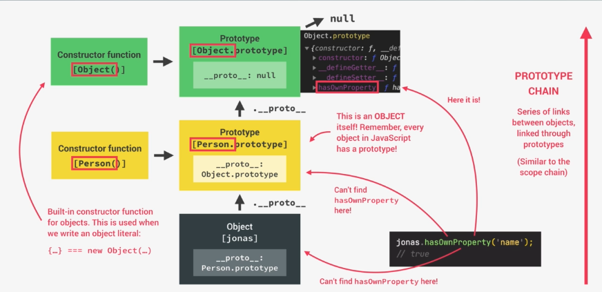
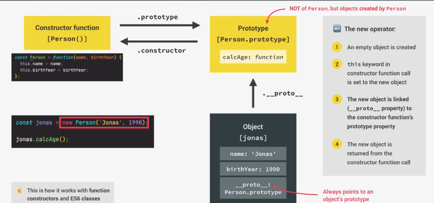

產出好維護好管理的程式碼是重要的，想像今天你的任務是要從這個房間裡找出某一本書，你覺得你需要多少時間？


如果專案程式碼長這樣的話，還沒開始 debug 腦袋就已經先當機了...
而物件導向程式設計就是為了解決這個問題而誕生的一種方便管理程式碼的方式

## 什麼是物件導向程式設計(Object-Oriented Programming)

* 基於物件概念的程式設計方法
* 使用物件形容(model)具體或抽象的 feature(e.g. user, todo-item, 元件或資料結構)
* 我們把相關屬性跟方法都包在一個物件，可以很方便取得內部資料
* 物件是獨立的(self-contained)的程式碼片段，透過彼此互動構築成一個應用程式
* 公開的 API 即是透過物件內方法跟應用程式互動

## 物件導向程式語言四大原則

### 抽象化

* 隱藏實作細節的機制

### 封裝

* 把屬性跟方法封裝在 class 不讓外部讀取修改，但 class 內部可以讀取
* 封裝好(讓屬性跟方法保持 private)可避免產生非預期 bug
* 當外在程式碼能夠更動到 class 內部資料，會連動影響到調用這個 class 的相關程式碼
* 需要公開存取 API 可設計成開放存取

### 繼承

* 當有兩個相似的 class，我們可以使用繼承特性避免撰寫重複程式碼(parent class → child class)

### 多型

* child class 可以覆寫 parent class 的方法

## class 跟 instance 實例是什麼？

* class 是一個藍圖(非物件)，透過 class 建構出來的東西是 instance 實例
* 但 JavaScript 其實沒有真正的 class 這個類別實例(而 Java，C++有)
* JavaScript 的 class 比較像是語法糖，透過建構函式來模擬 class，可以調用原型(prototype-based)方法

## prototype 原型是什麼？

* 在 JavaScript 物件都會連結到原型，原型繼承(prototypal inheritance)表示所有被連結到的實例都可以使用原型的方法
* 舉例來說，我們在使用陣列的 map 方法，也是從陣列的 prototype 取用這個方法，而不是 num 本身有的方法()

## 建立原型的 3 種方法

* 建立原型是為了可以使用原型繼承
 1. 使用建構函式(Constructor functions)跟 new 運算子產生新的實例
 2. ES6 的 class 語法糖
 3. Object.create（最簡單創造出一個物件連結 prototype 的方法)

```js
const num = [1, 2, 3];
console.log(num.map((el) => el + 2)); //[ 3, 4, 5 ]
```

### 使用建構函式跟 new 運算子建立原型連結

* 寫一個建構函式，使用 new 運算子產生新的物件實例{}
* 當函式被呼叫，物件實例的 this 會指向這個實例本身{} (因為使用 new 運算子才有這個特性，跟一般函式 this 不同)
* 實例會連結到建構函式，讓實例可以使用建構函式的方法，因此每個物件下會有`.__proto__`屬性
* 建構函式本身會 return{}

```js
// 使用同原型創造不同實例
const Person = function(firstName, birthYear) {
    // this 指向實例本身
    console.log(this); // Person {}
    // 設定實例屬性為外部傳進來的參數
    this.firstName = firstName;
    this.birthYear = birthYear;
    // 方法不會寫在原型裡面，會造成多餘的程式碼，若有一千個物件就有一千個方法程式碼
};

// 創造一個firstName為Jonas birthYear為1991的Person實例
const jonas = new Person("Jonas", 1991);
console.log(jonas); // Person { firstName: 'Jonas', birthYear: 1991 }

// 創造一個firstName為mirenda birthYear為2003的Person實例
const mirenda = new Person("mirenda", 2003);
console.log(mirenda); // Person { firstName: 'mirenda', birthYear: 2003 }

// 使用.prototype.方法名 新增原型共用方法
// 一樣所有物件可以透過prototype inheritance共用，但只需要管理這段程式碼，不會有多餘的copy
Person.prototype.calcAge = function() {
    console.log(2037 - this.birthYear);
};

// 可以共用原型方法
jonas.calcAge(); // 46
mirenda.calcAge(); // 34

// 使用.prototype 新增原型屬性
Person.prototype.species = "Homo Sapiens";
console.log(jonas.species); // 可以取得共用屬性 Homo Sapiens
console.log(jonas); // Person { firstName: 'Jonas', birthYear: 1991 } 但不會出現在jonas實例裡面，除非有寫入
```

#### 檢查實例所屬原型方法

```js
console.log(jonas instanceof Person); // true
console.log(jonas.__proto__ === Person.prototype); // 若是原型連結的實例為 true
console.log(Person.prototype.isPrototypeOf(jonas)); // 若是原型連結的實例為 true
```

#### 檢查實例是否含有某屬性 hasOwnProperty

```js
console.log(jonas.hasOwnProperty("firstName")); // true
console.log(jonas.species); // Homo Sapiens
console.log(jonas.hasOwnProperty("species")); // false 因為不是jonas擁有屬性 而是原型
```

#### prototype chain 原型鏈



#### 建構函式 v.s. 原型 v.s. 實例 關係圖



```js
// 建構函式.prototype = 原型
// 原型.constructor = 建構函式

// 建構函式
const Person = function(firstName, birthYear) {
    // Instance properties
    this.firstName = firstName;
    this.birthYear = birthYear;
};

// new 建構函式 = 實例
const jonas = new Person("Jonas", 1991);
console.log(jonas); // Person { firstName: 'Jonas', birthYear: 1991 }

// 實例.__proto__ = 物件原型
// jonas的原型是Person，故可以獲取Person的方法或屬性
console.log(jonas.__proto__);
//{species: 'Homo Sapiens', calcAge: ƒ (), constructor: ƒ(firstName, birthYear), [[Prototype]]: Object}

// Person的原型是物件原型 (Object.prototype)
console.log(jonas.__proto__.__proto__);
// {constructor: ƒ, __defineGetter__: ƒ, __defineSetter__: ƒ, hasOwnProperty: ƒ, __lookupGetter__: ƒ, …} 列出物件方法

// 物件原型的prototype是null(原型鏈chain最上層)
console.log(jonas.__proto__.__proto__.__proto__);
// null

// 以陣列實例來看原型鏈
const arr = [1, 2, 3];
// 實例的原型是陣列原型Array.prototype，可獲取陣列的方法
console.log(arr.__proto__);
// [constructor: ƒ, concat: ƒ, copyWithin: ƒ, fill: ƒ, find: ƒ, …]

// 陣列原型的原型是物件，可獲取物件的方法
console.log(arr.__proto__.__proto__);
// {constructor: ƒ, __defineGetter__: ƒ, __defineSetter__: ƒ, hasOwnProperty: ƒ, __lookupGetter__: ƒ, …}

// 物件原型(Object.prototype)的prototype是null(原型鏈chain最上層)
console.log(arr.__proto__.__proto__.__proto__);
// null
```

### ES6 的 class 建立原型連結

#### 跟 function 一樣有 expression 和 declaration 兩種寫法

```js
// class expression
const Person = class {
    constructor(firstName, birthYear) {
        this.firstName = firstName;
        this.birthYear = birthYear;
    }
};

// class declaration（寫起來比上方程式碼工整，都寫在一個物件中，方法不用寫在外面管理)
class Person {
    constructor(firstName, birthYear) {
        this.firstName = firstName;
        this.birthYear = birthYear;
    }
    // 寫在這邊的方法都會進到prototype
    calcAge() {
        console.log(2037 - this.birthYear);
    }

    greet() {
        console.log(`Hey ${this.fullName}`);
    }
}
const jessica = new Person("Jessica Davis", 1996);
console.log(jessica); // Person {firstName: 'Jessica Davis', birthYear: 1996}
jessica.calcAge(); // 41
console.log(jessica.__proto__ === PersonCl.prototype); // true
```

#### 關於 class 的幾個重點

1.  class 不會被提升 hoisting(即便寫 class declaration)
2.  class 具備一級函式特性(可作為參數傳入，也可被回傳)
3.  class 須在嚴格模式下執行
4.  class 寫法比第一種(建構函式/const 實例 = new 函式/Person.prototype.方法)更好閱讀與維護，constructor/屬性/方法都寫在 class 裡，方法不需要寫在外面也可以使用 prototype inheritance

#### getters & setter

* 所有物件都有的屬性(assessor properties)，相對於一般屬性稱為 data properties
* 是獲取值或設定值的 function
* 適合用在 validation

```js
const account = {
    owner: "Jonas",
    movements: [200, 530, 120, 300],

    get latest() {
        // this.movements.slice(-1)是一個陣列，為了取值用pop
        return this.movements.slice(-1).pop();
    },
    // 需要至少一個參數
    set latest(mov) {
        this.movements.push(mov);
    },
};

// 像是獲取屬性一樣來使用這個方法
console.log(account.latest); // 300
// 像是更改屬性一樣來使用這個方法 而非account.latest(50)
account.latest = 50;
console.log(account.movements); // [200, 530, 120, 300, 50]
```

* 可以使用剛剛的 Person 來寫個 get 跟 set function

```js
class Person {
    constructor(fullName, birthYear) {
        // 建構時會使用參數fullName 呼叫set fullName方法
        this.fullName = fullName;
        this.birthYear = birthYear;
    }
    calcAge() {
        console.log(2037 - this.birthYear);
    }

    greet() {
        console.log(`Hey ${this.fullName}`);
    }

    get age() {
        return 2037 - this.birthYear;
    }
    // set a property that already exists
    // 當使用.fullName就會呼叫這個方法，包含一開始建構實例時
    set fullName(name) {
        console.log(name);
        if (name.includes(" "))
            // set跟 constructor都使用firstName會有衝突 使用另一個變數存
            this._fullName = name;
        else alert(`${name} is not a full name`);
    }
    // jessica.fullName才不會undefined
    get fullName() {
        return this._fullName;
    }
}
const jessica = new Person("Jessica Davis", 1996);
console.log(jessica.age); // 41

const walter = new Person("Walter", 1996);
// Walter is not a full name
```

#### static methods

* 使用關鍵字 static 來定義一個靜態的方法（method）給類別（class），靜態方法在由類別所建立的物件實體（instance）上不能被呼叫，靜態方法只能由類別本身呼叫
* 例如 Array.from() 可以把類陣列轉成陣列，但陣列本身不能呼叫這個方法
  因為這個方法是放在 Array constructor 身上，而非陣列的原型，所以陣列無法獲取

```js
class Person {
    constructor(fullName, birthYear) {
        this.fullName = fullName;
        this.birthYear = birthYear;
    }
    calcAge() {
        console.log(2037 - this.birthYear);
    }

    greet() {
        console.log(`Hey ${this.fullName}`);
    }

    get age() {
        return 2037 - this.birthYear;
    }

    set fullName(name) {
        console.log(name);
        if (name.includes(" ")) this._fullName = name;
        else alert(`${name} is not a full name`);
    }
    get fullName() {
        return this._fullName;
    }
}

// 這種寫法方法不會更新在原型，jonas無法繼承
Person.hey = function() {
    console.log("hey", this);
};

Person.hey(); // hey class Person {...省略} (this會是建構函式本身)
jonas.hey(); // Uncaught TypeError: jonas.hey is not a function

// 使用static關鍵字，可出現跟上方一樣的結果
class Person {
    constructor(fullName, birthYear) {
        this.fullName = fullName;
        this.birthYear = birthYear;
    }

    // 實例可以獲取的方法 會被加入原型.prototype property
    calcAge() {
        console.log(2037 - this.birthYear);
    }

    greet() {
        console.log(`Hey ${this.fullName}`);
    }

    get age() {
        return 2037 - this.birthYear;
    }

    set fullName(name) {
        console.log(name);
        if (name.includes(" ")) this._fullName = name;
        else alert(`${name} is not a full name`);
    }
    get fullName() {
        return this._fullName;
    }

    // 建構時才能獲取的方法，實例無法獲取
    static hey() {
        console.log("hey", this);
    }
}
```

* 另一個小練習，get set 時使用另一個變數名(speedUS 而非 speed)就不用擔心撞變數名的問題

```js
class Car {
    constructor(make, speed) {
        this.make = make;
        this.speed = speed;
    }

    accelerate() {
        this.speed += 10;
        console.log(`${this.make} is going at ${this.speed} km/h`);
    }

    brake() {
        this.speed -= 5;
        console.log(`${this.make} is going at ${this.speed} km/h`);
    }

    get speedUS() {
        return this.speed / 1.6;
    }

    set speedUS(speed) {
        this.speed = speed * 1.6;
    }
}

const ford = new CarCl("Ford", 120);
console.log(ford.speedUS); // 75
ford.accelerate(); // Ford is going at 130km/h
ford.accelerate(); // Ford is going at 140km/h
ford.brake(); // // Ford is going at 135km/h
ford.speedUS = 50; // 50
console.log(ford); //Car{make:"Ford", speed: 80}
```

### Object.create() 建立原型連結

* 不需要寫建構函式 constructor new，或是.prototype
* 下方範例一般不會這樣做，顯示機制用

```js
const PersonProto = {
    // 可以不需要寫constructor
    calcAge() {
        console.log(2037 - this.birthYear);
    },
};
// 建立原型連結到steven
const steven = Object.create(PersonProto);
console.log(steven);
// 手動增加原型內容
steven.name = "Steven";
steven.birthYear = 2002;

steven.calcAge(); //35
// {}  > __proto__: calcAge: f calcAge()

console.log(steven.__proto__ === PersonProto); //true

// 建立原型連結到sarah
const sarah = Object.create(PersonProto);

const PersonProto = {
    // 不需要寫constructor

    // 建立一個方法來新增屬性，相較上面一個個新增
    init(firstName, birthYear) {
        this.firstName = firstName;
        this.birthYear = birthYear;
    },
    calcAge() {
        console.log(2037 - this.birthYear);
    },
};
// 誰呼叫this就是誰
sarah.init("Sarah", 1979);
sarah.calcAge(); // 58
```

## class 間的繼承: 父類別 parent class & 子類別 child class

* 了解如何用 Object.create()在 class 間設置原型鏈，讓父類別原型方法跟屬性可以被子類別繼承
* 子類別繼承父類別的方法跟屬性，也可以有自己的方法跟屬性
* 當子層父層有一樣名稱的方法，會用子層的

### 使用建構函式跟 new 運算子建立父子類別繼承

```js
// 人類原型
const Person = function(firstName, birthYear) {
    this.firstName = firstName;
    this.birthYear = birthYear;
};

// 人類原型建立方法
Person.prototype.calcAge = function() {
    console.log(2037 - this.birthYear);
};

// 學生原型
const Student = function(firstName, birthYear, course) {
    // 呼叫人類屬性
    // 如果用一般函式呼叫(沒有用new) Person(firstName, birthYear) 會Uncaught Error: cannot set firstName of undefined
    // a regular function call, the this keyword is set to undefined
    // 如果需要呼叫函式並設置this在這個函式，使用call
    Person.call(this, firstName, birthYear);
    this.course = course;
};

// 使用Object.create建立原型連結
// 新增任何子類別原型的方法前，需要先建立連結，下方會回傳空物件，若順序錯誤空物件會覆蓋掉新增的方法
Student.prototype = Object.create(Person.prototype);

// 學生原型建立方法
Student.prototype.introduce = function() {
    console.log(`My name is ${this.firstName} and I study ${this.course}`);
};

// 建立一個學生
const mike = new Student("Mike", 2020, "Computer Science");
mike.introduce();

// 成功呼叫到父類別方法，跟scope chain一樣當子層找不到會往父層找
// 若子層有定義自己的calcAge()，會呼叫子層的方法
mike.calcAge(); // 17
```

* 子類別實例跟子類別跟父類別關係

```js
// 學生原型 可以看到introduce方法
console.log(mike.__proto__); // Person { introduce: [Function (anonymous)] }
// 人類原型 可以看到calcAge方法
console.log(mike.__proto__.__proto__); // { calcAge: [Function (anonymous)] }

console.log(mike instanceof Student); // true
console.log(mike instanceof Person); // true 若沒有上面建立連結會是false
console.log(mike instanceof Object); // true

Student.prototype.constructor = Student; // 加上這行fix mike的constructor指向ㄎ
console.dir(Student.prototype.constructor); // 若沒有上面這行會指向Person
```

### 使用 ES6 class 建立父子類別繼承

* 使用 extend 父類別 搭配 super 父類別參數
* super 是父層的建構函式 constructor

```js
// 人類原型
class Person {
    constructor(firstName, birthYear) {
        this.firstName = firstName;
        this.birthYear = birthYear;
    }
    // 人類原型建立方法
    calcAge = function() {
        console.log(2037 - this.birthYear);
    };
}

// 學生原型 不用寫父層.call 用extends就會指向父層了
class Student extends Person {
    constructor(firstName, birthYear, course) {
        // super永遠寫在最上面 子層的this
        super(firstName, birthYear);
        this.course = course;
    }
    introduce() {
        console.log(`My name is ${this.firstName} and I study ${this.course}`);
    }
    // 覆寫父層方法
    // calcAge() {
    //  console.log(`i am ${2037- this.birthYear}`)
    // }
}

// 使用Object.create建立原型連結，讓兩個class建立父子關係
// 在添加任何學生原型的方法前，需要先建立連結，因為下方會先回傳空物件，若順序錯誤空物件會覆蓋掉新增的方法
Student.prototype = Object.create(Person.prototype);

// 建立一個學生
const mike = new Student("Mike", 2020, "Computer Science");
mike.introduce(); // My name is Mike and I study Computer Science

// 成功呼叫到父類別方法，若子層有同樣calcAge()則會呼叫子層方法
mike.calcAge(); // 17
```

### 使用 Object.create 建立父子類別繼承

```js
const PersonProto = {
    calcAge() {
        console.log(2037 - this.birthYear);
    },

    init(firstName, birthYear) {
        this.firstName = firstName;
        this.birthYear = birthYear;
    },
};
// 使用Object.create建立原型連結
const StudentProto = Object.create(PersonProto);

// 使用Object.create建立原型連結
const jay = Object.create(StudentProto);

// 子層新增相同名稱方法
StudentProto.init = function(firstName, birthYear, course) {
    // 呼叫函式並設置this在這個函式，使用call 獲取父層init方法
    PersonProto.init.call(this, firstName, birthYear);
    this.course = course;
};

// 子層新增不同方法
StudentProto.introduce = function() {
    console.log(`My name is ${this.firstName} and I study ${this.course}`)
};

jay.init("Jay", 2010, "computer science");
jay.introduce() // My name is Jay and I study computer science
jay.calcAge() // 27
```

jay.init("Jay", 2010, "computer science"); 
jay.introduce() // My name is Jay and I study computer science
jay.calcAge() // 27
```
