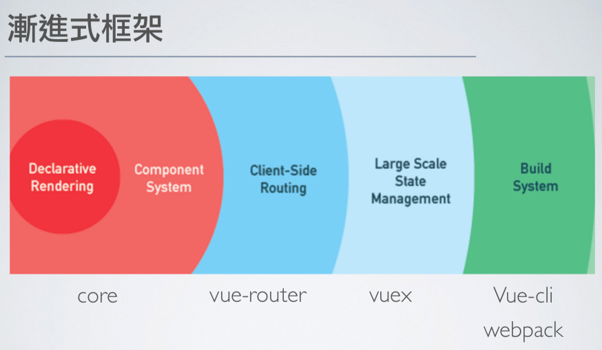
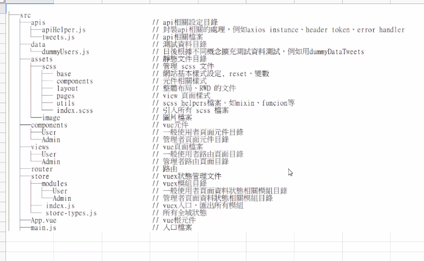
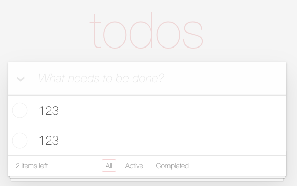

## 什麼是 Vue



* Vue 是打造使用者介面的 JavaScript 漸進式框架(可依開發需求擴增功能 e.g. vue-router vuex)
* 以元件為中心的宣告式程式設計，無需直接操作 DOM，資料驅動畫面，透過雙向綁定讓資料有變化畫面也會響應，提高開發效率
* 實現關注點分離，把視覺呈現、資料等元素，放在單一檔案中，但又在技術上切分得很乾淨；template 專注在 HTML 結構，script 處理 JavaScript 邏輯，Style 則是撰寫樣式的部分，每一模組各自有獨立關注焦點
* 過往 DOM 操作，元素需要一個個用 CSS 選擇器選出來，而 Vue 只在單頁面創造一個容器`<div id="root"></div>`；其他變數跟事件綁定則是使用語法糖直接寫在 HTML 上
* SPA 單頁應用，不像過往跟 server 溝通，每次發請求收到新的 HTML 就會重新渲染頁面，Vue 可部分更新畫面，不需要整個頁面重新渲染，使用者體驗佳(伺服器傳送一次 HTML，就接管整個頁面的生命週期)；對比全端開發的多頁應用，則每次請求後都會再刷新一次頁面
* 程式碼較簡潔，可讀性高(相對沒有使用框架的狀況)，有助於後續協作跟維護

## Framework 框架 v.s Library 函式庫

* 兩者都是幫助我們在開發時可以少寫一些 code 的工具
* 差異在於函式庫是我們決定呼叫的時機，而框架是我們依照邏輯去填寫框架所需要的資料，框架決定呼叫的時機
* 框架呼叫我們的程式碼，我們的程式碼呼叫函式庫
* 函式庫被包含在框架裡

### framework 框架(e.g. Vue, React, Angular)

* 有自己的生命週期來決定調用這些資料跟方法的時機，裡面的資料跟方法該如何傳遞會有一定的規範，

### Library 函式庫(e.g. day.js, SweetAlert)

* 類似套件的概念，透過函式庫的處理，可以獲取對應的回傳結果(格式轉換/彈跳視窗)

[The Difference Between a Framework and a Library](https://www.freecodecamp.org/news/the-difference-between-a-framework-and-a-library-bd133054023f/ "The Difference Between a Framework and a Library")

## 建構 Vue 專案 的方式

### CDN

  + 開發版：會有對應 console warnings
  https://cdn.jsdelivr.net/npm/vue@2/dist/vue.js

  + 上線版：optimized for size and speed  
  https://cdn.jsdelivr.net/npm/vue@2

  優點：
  + 依照地區最近的伺服器提供服務(透過不同節點提供當地使用者服務)，減少存取資料延遲
  + CDN 伺服器分擔流量，降低本來的 loading
  + CDN 有快取，當服務突然有問題短時間還可以撐一下

  缺點：
  + 要付費
  + CDN 掛掉你的產品也會掛掉
  + 每次網站更新，需要主動清除 CDN 快取，不然使用者會看到不夠即時的 資訊

### Vue CLI

  + 基於 Webpack 打包程式碼，透過讀取入口文件、解析依賴模組、收集 dependency、程式碼轉譯、打包合併、程式碼優化，最終將高版本/離散的程式碼編譯打包成低版本/高兼容性的產物程式碼建構成一個 JavaScript 的捆綁包，結合 webpack-dev-server 提供靜態資源
  + 開發環境運行相對 Vite 慢，冷啟動跟熱加載都會隨著應用程式變大，等待時間更長，開發體驗較差
  + 配置很齊全，舊瀏覽器相容性高


### Vite

  + 基於 ESM (ES Modules)，開發時使用 ESbuild(Go 語言撰寫)，依賴瀏覽器 ES6 Modules 的原生支持，在運行的時候直接發 HTTP 請求 JavaScript 模組
  + 冷啟動跟熱加載快速，開發體驗速度快，開發時編譯的程式碼簡潔，舊瀏覽器相容性低
  + production 會使用 rollup 打包，開發編譯跟 production 打包是不同系統，可能少數狀況下會有不同行為


## Vue 生命週期

在 SPA 應用，針對部分元件掛載/資料更新/卸載時有對應的生命週期適合操作，透過這些 Vue 內建的 Hook function 來介入

* beforeCreate：初始化 Vue 實例/事件跟生命週期
  + 尚無法讀取 data, computed, methods, watch/event callbacks
  + 適合展示 loading 畫面，不適合 fetch 資料，還沒有 data 可以存
* created：創建完實例(虛擬 DOM)
  + 設置 data, computed, methods, watch/event callbacks
  + 尚無法讀取$el，適合 fetch 資料
* beforeMount：尚未掛載模板
  + 相關 render 函式首次被調用
* mounted：實例掛載模板(真實 DOM)
  + el 被新創建的 vm.$el 替換
* beforeUpdate：data 更新但還沒重新渲染畫面
  + 適合在此更新資料，可重複呼叫
* updated：data 更新且渲染畫面完成
  + 可以取得更新的 DOM，可重複呼叫
* beforeDestroy：實例被銷毀前
  + 適合在此時卸載手動添加的監聽/訂閱
* destroyed：實例被銷毀


### 父子元件的生命週期

1. 掛載：父元件是在子元件 mounted 後才 mounted
   父元件 beforeCreate
   父元件 created
   父元件 beforeMount
   子元件 beforeCreate
   子元件 created
   子元件 beforeMount
   子元件 mounted
   父元件 mounted

2. 資料更新
   父元件 beforeUpdate
   子元件 beforeUpdate
   子元件 updated
   父元件 updated

3. 銷毀元件
   父元件 beforeDestroy
   子元件 beforeDestroy
   子元件 destroyed
   父元件 destroyed

## Vue 跨元件傳遞資料

1. 父傳子：Props
   透過 props 把值從父層丟到子層，當元件距離很遠就會不好傳遞
   [props API](https://vuejs.org/api/options-state.html#props "props")

2. 子傳父：emit
   子層要改變父層狀態的話，可透過子層發送 emit 觸發父層的 methods 來更新狀態
   [emits API](https://vuejs.org/api/options-state.html#emits "emits")

3. 兄弟層的傳遞：
   需要搭配 event 往上傳，Props 往下傳
   使用 EventBus（vue3 已移除，建議用 vuex 管理)
   $on: 監聽 $once: 監聽一次 $off: 取消監聽 $emit: 傳遞事件
   created 即進行監聽，beforeDestroy 進行取消
   [可以參考這篇](https://ithelp.ithome.com.tw/articles/10266312?sc=iThelpR "這篇")

4. vuex store
   統一管理讓所有元件可跨層級獲取這些資料，若需要非同步觸發資料的更新，也可以用 action 來 emit 事件，然後透過 mutation 裡面的方法來更新資料

＊避免濫用 vuex 管理所有資料，在傳遞不易或跟跨頁面（切換路由等）時使用（e.g. 驗證狀態/購物車/遊戲結果等)；父子元件就用本來的 props 或 emit 即可(e.g. fetch API 資料往下傳遞給各元件)

5. Event-bus
   Event-bus emit / on 事件，做跨層級傳遞，缺點是事件命名相同就會導致衝突，且監聽也需要做好管理，不需要的時候要記得清除，例如在多個路由切換時，若不同頁面使用了同一個事件名，會導致重複觸發事件的問題（因事件的監聽不會隨著元件的銷毀而跟著銷毀，要主動去註銷事件），且註銷也需要小心處理，沒註銷正確也有可能導致後續觸發失敗

## 專案資料夾配置

之前曾經看到過很完整的配置範例，包含 Sass 資料夾規劃



## vue 開發者工具

[chrome extension 連結](https://chrome.google.com/webstore/detail/vuejs-devtools/nhdogjmejiglipccpnnnanhbledajbpd/related "chrome extension連結")

## User Story 概略版

* 輸入框一開始會是 focus 狀態，placeholder 有提示文字
* 有任務時輸入框會多一個 label 做出來的三角形按鈕
* 點三角形按鈕會全選所有任務
* 手動全選任務也會觸發三角形按鈕全選樣式
* 任務的 layout 是 checkbox/任務內容/刪除按鈕
* 雙擊選項編輯任務內容
* footer 有 span 文字提示還有多少件事項沒完成，需考慮單複數
* 三個篩選器篩選不同狀態的任務 all/active/complete (不同路由)



[CSS](https://cdn.jsdelivr.net/npm/todomvc-app-css@2.4.1/index.css "CSS")

## 創建 Vue 實例

* CDN 載入 Vue 後就有構造函式，我們可以透過 new Vue 創建實例，綁定對應 HTML 元素/容器
* JavaScript 創建 Vue 實例，綁定 HTML 元素/容器
* 下方為 todomvc 簡單規劃區塊， `#app` 綁定 `<div id ="#app"></div>`

```vue
<template>
  <div id="app">
    <header>
      <h1>{{ title }}</h1>
    </header>
    <input type="text" />
    <main></main>
    <footer></footer>
  </div>
</template>

<script>
new Vue({
  el: "#app",
  data: {
    title: "todos", // 屬性：值
  },
});
</script>
```

## vue 模板語言跟表達式

* 雙括弧{{ 表達式 }}，若為變數會顯示 key 的對應 Value，跟 React 的{表達式}一樣，放在`<HTML元素>{{ }}</HTML元素>`之間
* 如果變數被""包著{{"變數"}}，會顯示純字串
* 用來形容 HTML 屬性用的變數會使用`""`，`<HTML元素 class="變數"></HTML元素>`

## v-bind 動態綁定 data 屬性 

* `:屬性名`
* [data API](https://vuejs.org/api/options-state.html#data "data")
* 實現 JavaScript 跟 HTML 資料綁定
* `v-bind`可以用縮寫符號`:`代替
* 當屬性值為 true 會出現，若值為`null` `undefined` `false` 屬性不會出現
* `:class`可以異動 class name，但只能針對 vue 自己增加的做改變，不能動到原本生成的
* 由 completed 的布林值決定 text 樣式，`<li :class="completed">text</li>`

```vue
<template>
  <li class="todo" :class="{ completed }"></li>
  //也可以直接寫成一個key value物件
  <li class="todo" :class="{ completed: true }"></li>
  // 若單個屬性要插入多個值，可以運用陣列
  <li class="todo" :class="[{ completed: true }, { edit: true }]"></li>
</template>

<script>
new Vue({
  el: "#app",
  data: {
    completed: true,
  },
});
</script>
```

## v-for 迴圈 

* `v-for="(item, index) in items" :key="item.id"`
* items 可為陣列/物件/數字/字串/Iterables
* 物件迭代順序是根據 key，key 像是 MongoDB 內建的`_id`，vue 會用 key 確認資料是否有正常刪改，為了避免在 diff 演算後減少發生刪改後渲染有錯，且為了讓演算法有更好的效能，強烈建議要加上，但不要使用 index
* 如果一串資料中沒定義 id，可用 uuid 套件產出補上，不要用 index 作為 key。由於 index 對應的資料是浮動而非絕對位置，因此在比較虛擬 dom 跟真實 dom 的過程中會出錯
* vue2 v-for 的優先順序高於 v-if，vue3 v-if 的優先順序高於 v-for，避免在同一元素上同時使用兩者，最好的做法是用 computed 篩選出列表再迴圈渲染
* 這邊的 item 物件也可以傳給下層 HTML 元素利用

```vue
<template>
  <li
    v-for="item in items"
    :key="item.id"
    class="item"
    :class="{ completed: item.completed }"
  >
    <div class="view">
      <input class="toggle" type="checkbox" />
      <label for="">{{ item.title }}</label>
      <button class="destroy" />
    </div>
    <input type="text" class="edit" />
  </li>
</template>

<script>
new Vue({
  el: '#app',
  data: {
    todos: [
      {
        title: 'todo1',
        completed: true,
      },
      {
        title: 'todo2',
        completed: false,
      },
      {
        title: 'todo3',
        completed: false,
      },
    ],
  },
}
</script>
```

## v-on 監聽事件 

* `@事件類型`
* `v-on`可以用縮寫符號`@`代替，@click @change @keyup
* 參數加上  $event，可以用來取得 DOM event  物件的值
* v-for="item in items"的結構裡，還可以傳物件給事件 @click="事件類型(item 物件)"
* 由於 windows.event(全域 event 物件)已經被棄用，若事件方法有用到 event 物件設定$event參數以取得event物件，參數使用 $event，`@click="事件類型($event)"`，以取得觸發事件內部參數
* 常見的按鍵.enter .esc .space 等有專用修飾符不需要再另記 key code
  [鍵盤支援清單](https://cn.vuejs.org/v2/guide/events.html"鍵盤支援清單")
* 常見的事件修飾符.stop(阻擋冒泡) .prevent(阻擋預設事件重載頁面) .capture(向下捕獲方式觸發) .self(限定指定元素本身觸發) .once(只觸發一次) .passive(滾動事件延遲，讓行動端不卡)，修飾符可以串連
* 事件綁定的方法 callback function 寫在 script 的 methods 裡面
* input 綁定事件參數差異

```vue
<template>
  // input綁定任意鍵觸發handleKeyup方法，並傳入newTodo變數
  <input
    v-model="newTodo"
    @keyup="handleKeyup(newTodo)"
    type="text"
    class="new-todo"
    autofocus
    placeholder="what needs to be done？"
  />

  // input限制enter鍵觸發handleKeyup，並傳入newTodo變數
  <input
    v-model="newTodo"
    @keyup.enter="handleKeyup(newTodo)"
    type="text"
    class="new-todo"
    autofocus
    placeholder="what needs to be done？"
  />

  // 透過$event 來拿到 event 物件
  <input
    v-model="newTodo"
    @keyup="handleKeyup(newTodo, $event)"
    type="text"
    class="new-todo"
    autofocus
    placeholder="what needs to be done？"
  />
</template>

<script>
// 測試有無成功觸發事件，console出傳入參數，名稱任意
methods: {
    handleKeyup2(inputContent, event) {
      console.log(inputContent, event);
    }
  }
</script>
```

## v-model 雙向綁定 input 跟資料 

* v-bind + v-on 的結合，只適合用在表單元素
* v-bind 資料 → 畫面，v-on 畫面 → 資料
* v-model 初始值優先看 data 裡面的值，表單上寫的`checked selected屬性`會忽略

```vue
<template>
  // 綁定在 input 寫一個 v-model="data對應屬性"
  <input
    v-model="newTodo"
    type="text"
    class="new-todo"
    autofocus
    placeholder="what needs to be done？"
  />
</template>
```

```js
new Vue({
    el: "#app",
    data: {
        newTodo: "", //新增一個屬性 初始值空的字串''
        // ...
    },
});
```

* 不同類型的 input 會偵測不同事件，更新不同屬性
* `type = text` `textarea元素` 偵測到  `input`  事件會更新  `value` (`<input>, <select> <textarea> `元素的 value 被修改時會觸發 input 事件)
  ＊ textarea 標籤中間的雙括弧不會雙向綁定，只會單向顯示資料內容，不要用這個 ( `<textarea>{{text}}</textarea>` ) 使用   `v-model`

  [https://vuejs.org/v2/guide/forms.html](https://vuejs.org/v2/guide/forms.html)

```vue
<template>
  <input v-model="text" />
  <span>Multiline message is:</span>
  <p style="white-space: pre-line;">{{ message }}</p>
  <textarea v-model="message" placeholder="add multiple lines"></textarea>
</template>
<script>
new Vue({
  el: "#app",
  data: {
    text: "",
    message: "",
  },
});
</script>
```

* `type = checkbox type= radio` 單複選偵測  change  事件，抓取 checked  值(true/false)

```vue
<template>
  // 單選radio
  <input type="radio" id="one" value="One" v-model="picked" />
  <label for="one">One</label>
  <br />
  <input type="radio" id="two" value="Two" v-model="picked" />
  <label for="two">Two</label>
  <br />
  <span>Picked: {{ picked }}</span>
  // 單選checkbox
  <input type="checkbox" id="checkbox" v-model="checked" />
  <label for="checkbox">{{ checked }}</label>
  <br />
  // 多選checkbox，綁定陣列，透過"checkedNames"
  將對應的value傳入陣列，顯示勾選的名字
  <input type="checkbox" id="jack" value="Jack" v-model="checkedNames" />
  <label for="jack">Jack</label>
  <input type="checkbox" id="john" value="John" v-model="checkedNames" />
  <label for="john">John</label>
  <input type="checkbox" id="mike" value="Mike" v-model="checkedNames" />
  <label for="mike">Mike</label>
  <br />
  <span>Checked names: {{ checkedNames }}</span>
</template>

<script>
new Vue({
  el: "#app",
  data: {
    picked: "",
    checked: true,
    checkedNames: [],
  },
});
</script>
```

* `select`下拉選單偵測`change`事件，更新`value`值

```vue
<template>
  //"selected" 將勾選的value 傳到陣列顯示
  <select v-model="selected">
    <option disabled value="">Please select one</option>
    <option>A</option>
    <option>B</option>
    <option>C</option>
  </select>
  <span>Selected: {{ selected }}</span>
</template>

<script>
new Vue({
  el: "#app",
  data: {
    selected: "",
  },
});
</script>
```

## 新增 todo

* 引入 uuid 套件，在 script 測試 alert(uuidv4())
* 把 newTodo 內容加上新屬性 uuid 產出的 id，push 到 data 裡面的 todos 陣列
* 新增完後把 newTodo 清空(避免按 enter 會增加一樣的內容)
* 空白 return 提示內容為空

```vue
<template>
  <input
    v-model="newTodo"
    @keyup.enter="addTodo(newTodo, $event)"
    type="text"
    class="new-todo"
    autofocus
    placeholder="what needs to be done？"
  />
</template>

<script>
new Vue({
  el: "#app",
  data: {
    newTodo: "",
    // update dummy data with id
    todos: [
      {
        id: uuidv4(),
        title: "todo1",
        completed: true,
      },
      {
        id: uuidv4(),
        title: "todo2",
        completed: false,
      },
      {
        id: uuidv4(),
        title: "todo3",
        completed: false,
      },
    ],
  },
  methods: {
    addTodo() {
      const title = this.newTodo.trim();
      console.log(this.newTodo);
      if (!title) {
        return;
      }
      // 每筆資料都增加 id 屬性，值帶入 uuidv4()
      this.todos.push({
        id: uuidv4(),
        title: this.newTodo,
        completed: false,
      });
      this.newTodo = "";
    },
  },
});
</script>
```

## 刪除 todo

* 要找到對應元素需要 id，透過參數回傳

```vue
<template>
  <ul class="todo-list">
    <li
      v-for="todo in todos"
      class="todo"
      :class="{ completed: todo.completed }"
    >
      <div class="view">
        <input type="checkbox" class="toggle" />
        <label for="">{{ todo.title }}</label>
        <!-- 帶入 todo 參數 -->
        <button @click="removeTodo(todo)" class="destroy"></button>
      </div>
      <input type="text" class="edit" />
    </li>
  </ul>
</template>

<script>
new Vue({
  el: '#app',
  data: {
    newTodo: '',
    todos: [
      {
        id: uuidv4(),
        title: "todo1",
        completed: true
      },
      {
        id: uuidv4(),
        title: "todo2",
        completed: false
      },
      {
        id: uuidv4(),
        title: "todo3",
        completed: false
      }
    ],
  },
  methods: {
    ...
    removeTodo(todo){
      // 留下非點擊到的todo
      this.todos = this.todos.filter(todo => todo.id !== todo.id)
    }
  }
})
</script>
```

### 動態切換 todo 刪除線樣式(雙向綁定)

* 點 label 切換會有打勾變化，是 checkbox 本身有無 checked 的樣式，還沒跟資料狀態綁定，需要在使用者點擊核選方塊時，改變刪除線樣式
* 先前用:todo.completed 屬性來動態顯示刪除線 :class="{completed: todo.completed}，現在把 todo.completed 資料狀態用 v-model="todo.completed"綁定回 input 的 checked 值（這個是 vue 預設 v-model 使用情境)
* 此當我們畫面操作改變 checked 值 todo.completed 值也會連動
* 資料 completed 初始值要設定好，確認沒有寫反

```vue
<template>
  <li
    v-for="todo in todos"
    :key="todo.id"
    class="todo"
    :class="{ completed: todo.completed }"
  >
    <div class="view">
      // "todo.completed" 為真與否也會影響:class //
      如果completed:false就會這個v-bind綁定就會消失
      <input v-model="todo.completed" class="toggle" type="checkbox" />
      <label for="">{{ todo.title }}</label>
      <button @click="removeTodo(todo)" class="destroy" />
    </div>
    <input type="text" class="edit" />
  </li>
</template>

<script>
new Vue({
  el: "#app",
  data: {
    newTodo: "",
    todos: [
      {
        id: uuidv4(),
        title: "todo1",
        completed: true,
      },
      {
        id: uuidv4(),
        title: "todo2",
        completed: false,
      },
      {
        id: uuidv4(),
        title: "todo3",
        completed: false,
      },
    ],
  },
});
</script>
```

## 條件渲染：v-show 和 v-if

* 清單為空時， main 跟 footer 跟 toggle all 的 icon 也會消失
* 用 todos.length 來判斷清單為空，依條件顯示 footer & main
* 根據條件隱藏的元素加上 v-show="todos.length"
* `v-if`：適合切換頻率小，不希望出現在 DOM tree，不希望使用者打開 DevTool 就看到隱藏的內容
* `v-show`：只是加上  `display: none`  讓使用者看不到，仍保留在 DOM tree，適合切換頻率高的元件

```vue
<template>
// 清單為空為false不會顯示 但DOM會有下方這行且加上屬性display:none
<footer class="footer"  v-show="todos.length">
// 清單為空為false不會顯示 這行在DOM會顯示為<!---->
<footer class="footer"  v-if="todos.length">
</template>

<script>
new Vue({
  el: '#app',
  data: {
    newTodo: "",
    todos: [
      ...
    ]
  },
})
</script>
```

* 組合  `v-if`、`v-else`、`v-else-if`  來控制流程

```vue
<template>
  <div v-if="Math.random() > 0.5">Now you see me</div>
  <div v-else>Now you don't</div>
</template>


<template>
  <div v-if="type === 'A'">A</div>
  <div v-else-if="type === 'B'">B</div>
  <div v-else-if="type === 'C'">C</div>
  <div v-else>Not A/B/C</div>
</template>
```

* 當 todos.length 為 false 只留 No footer 文字

```vue
<template>
  <footer class="footer" v-if="todos.length">
    <!-- ... -->
  </footer>
  <div v-else>No footer</div>
</template>
```

## computed 需運算再放到畫面上的資料

* [computed API](https://vuejs.org/api/options-state.html#computed "computed")
* 跟 data 一樣會 return 值
* 會建立一個快取，值沒有變化就不會重新運算，相較 methods 每次重新渲染就會呼叫一次方法，computed 效能較好（類似 react 的 useState)
* 可以用來實作運算邏輯，當資料有改變就會更新

### 篩選 all active complete

* 運用陣列的  `filter`  方法來篩選 all active complete todos
* 篩選 function 用 filters 封裝
* active 數量顯示在 footer
* 新增變數 filteredOption，設定狀態 all active completed
* 透過按鈕觸發 setFilterdOption  更新狀態
* 改用  filteredTodos  來渲染清單內容，computed 裡新增  filteredTodos

```vue
<template>
  <ul class="todo-list">
    <li v-for="todo in filteredTodos"
      :key="todo.id"
      class="todo"
      :class="{ completed: todo.completed }"
    >{{ todo.title }}
    </li>
  </ul>

  <strong>{{ activeTodos }}</strong> items left

  <ul class="filters">
    <li>
      <a href="#/all" @click="setFilteredOption('all')">All</a>
    </li>
    <li>
      <a href="#/active" @click="setFilteredOption('active')">Active</a>
    </li>
    <li>
      <a href="#/completed" @click="setFilteredOption('completed')">Completed</a>
    </li>
  </ul>
</template>

<script>
// 過於分散
// const allTodos = (todos) => todos
// const activeTodos = (todos) => todos.filter((todo) => !todo.completed)
// const completedTodos = (todos) => todos.filter((todo) => todo.completed)

const filters = {
  all: (todos) => todos,
  active: (todos) => todos.filter((todo) => !todo.completed),
  completed: (todos) => todos.filter((todo) => todo.completed),
};
new Vue({
  el: "#app",
  data: {
    ...
    filteredOption: "all",
  },
  methods: {
    setFilteredOption(filteredOption) {
      this.filteredOption = filteredOption;
    },
  },
  computed: {
    activeTodos() {
      return filters.active(this.todos).length;
    },
    // bracket notation
    filteredTodos() {
      return filters[this.filteredOption](this.todos);
      // filters.all(this.todos)
      // filters.active(this.todos)
      // filters.completed(this.todos)
    },
  },
});
</script>
```

### 被選擇的按鈕樣式

* 被點的會掛上 selected 取消原先點的 selected
* 用 v-bind 的 true 會顯示屬性 false 不會顯示屬性實作 selected(不用另外定義 data)

```vue
<template>
  <footer class="footer" v-show="todos.length">
    <span class="todo-count">
      <strong>{{ activeTodos }}</strong> {{ activeTodos | pluralize }} left
    </span>
    <ul class="filters">
      <li>
        <a
          href="#/all"
          :class="{ selected: filteredOption === 'all' }"
          v-on:click="setFilteredOption('all')"
          >All</a
        >
      </li>
      <li>
        <a
          href="#/active"
          :class="{ selected: filteredOption === 'active' }"
          v-on:click="setFilteredOption('active')"
          >Active</a
        >
      </li>
      <li>
        <a
          href="#/completed"
          :class="{ selected: filteredOption === 'completed' }"
          v-on:click="setFilteredOption('completed')"
          >Completed</a
        >
      </li>
    </ul>
    <button v-on:click="removeCompleteTodos(todos)" class="clear-completed">
      Clear completed
    </button>
  </footer>
</template>
```

## filters (vue3 移除，可用 computed 代替)

* `{{ 變數 | filters 的方法 }}`
* 常用於大小寫 / 單複數 / 時間格式 / 貨幣格式
* 當 activeTodos 為 1，回傳 item，超過則傳 items

```vue
<template>
  ...
  <span class="todo-count">
    <strong>{{ activeTodos }}</strong> {{ activeTodos | pluralize }} left
  </span>
  ...
</template>

<script>
new Vue({
  el: '#app',
  data: {
    ...
  },
  methods: {
    ...
  },
  filters: {
    toUpperCase(words) {
      return words.toUpperCase();
    }
    pluralize(n) {
      return n > 1 ? 'items' : 'item'
    }
  }
})
</script>
```

### 清空已完成項目

* removeCompleteTodos(todos)

```vue
<template>
  <button v-on:click="removeCompleteTodos(todos)" class="clear-completed">
    Clear completed
  </button>
</template>

<script>
...
methods: {
  removeCompleteTodos(todos){
      this.todos = this.todos.filter((todo) => todo.completed === false);
  }
}
...
</script>
```

### LocalStorage 保存資料

* saveStorage 掛載 created 後，預設值已經定義在 created 階段。原本在 data 寫的 todos 預設值可以刪除

```vue
<script>
...
created() {
  // 取出時JSON.parse()轉JavaScript物件
  // 當沒有資料時給他一個空陣列 不然如果是null會造成連鎖錯誤
   this.todos = JSON.parse(localStorage.getItem('STORAGE_KEY'))|| []
},
methods: {
 saveStorage() {
  // 存入時搭配 JSON.stringify() 轉成字串
    localStorage.setItem(STORAGE_KEY, JSON.stringify(this.todos))
  }
}
...
</script>
```

## watch 監控資料變化

* 淺層監聽：陣列內資料數量增減（預設）
* [watc API](https://vuejs.org/api/options-state.html#watch "watch")

```vue
<script>
new Vue({
  // 一旦 todos 有變化，就會執行{}裡的內容。
  watch: {
    todos() {
      this.saveStorage();
    },
  },
});
</script>
```

* 深層監聽：陣列資料屬性改變

```vue
<script>
new Vue({
  watch: {
    // 為了帶入deep屬性 把todos 改寫
    todos: {
      handler: function () {
        console.log("saveStorage"); //測試用
        this.saveStorage();
      },
      deep: true, //開啟深層監聽
    },
  },
});
</script>
```

## 編輯 todo

* 雙擊觸發編輯模式，<li> 加上.editing 樣式（display:block /none 切換）
* 編輯模式(focus 狀態)按下 Enter 完成編輯並解除編輯模式
* 編輯模式按下 ESC 跟離開輸入框 (blur 事件)取消編輯並解除編輯模式
* 完成編輯時(Enter)內容是空白的話，會刪除這個 id 的空白 todo（內容不得為空)
* 新增 currentEditTodo 來管理編輯內容
* currentEditTodo 使用 v-model 進行雙向綁定，type 即時更新 currentEditTodo
* 完成編輯時覆寫回原本的 todos

### 動態添加 editing 樣式

* 當 todo 的 id === currentEditTodo.id，input 加上 editing 的 class
* 原本已經有:class 了，用物件包裹兩個 key value

```vue
<template>
  <ul class="todo-list">
    <li
      v-for="todo in filteredTodos"
      :key="todo.id"
      class="todo"
      :class="{
        completed: todo.completed,
        editing: todo.id === currentEditTodo.id,
      }"
    >
      <div class="view">
        <input v-model="todo.completed" class="toggle" type="checkbox" />
        // 雙click就可以取得物件 todo是v-for的元素
        <label @dblclick="editTodo(todo)">{{ todo.title }}</label>
        <button class="destroy" @click="removeTodo(todo)" />
      </div>
      // edit這邊的input加上v-model，就可以讓資料跟畫面連動
      <input v-model="currentEditTodo.title" type="text" class="edit" />
    </li>
  </ul>
</template>

<script>
data: {
  newTodo: "",
  todos: [ ],
  currentEditTodo:[],
  filteredOption: "all"
}

method: {
  editTodo(todo){
   // 複製todo 如果直接寫= {todo}會指稱到同一個物件記體，改到原始資料
    this.currentEditTodo = { ...todo }
  },
}
</script>
```

### 取消編輯（回到原來沒有 editing 狀態）

* cancelEdit 把 this.currentEditTodo 變成一個空物件
* 當 currentEditTodo 被清空後 v-bind 的條件  `todo.id === currentEditTodo.id`  無法成立
* editing 屬性消失，畫面也從輸入框變回一般的顯示狀態
* esc 鍵綁定 keyup 事件

```vue
<template>
  <input
    v-model="currentEditTodo.title"
    type="text"
    class="edit"
    @keyup.esc="cancelEdit"
  />
</template>
<script>
...
  methods: {
    cancelEdit() {
      this.currentEditTodo = {}
    },
  }
...
</script>
```

### 完成編輯

* 按下 enter(click 事件)或點其他地方(blur 事件)就把 currentEditTodo 換進去 this.todo 裡面
* 把編輯完成的 currentEditTodo，放入 todos 陣列中 id 相同的位置
* 編輯狀況下修改最後是空白的話，直接刪除這個項目
* 放入後清空 currentEditTodo，li 上的 editing 樣式會同時消失

```vue
<template>
  <input
    v-model="currentEditTodo.title"
    type="text"
    class="edit"
    @keyup.esc="cancelEdit"
    @keyup.enter="doneEdit"
    @blur="doneEdit"
  />
</template>
<script>
methods: {
  doneEdit() {
  // map複製一份id 與 currentEditTodo 對應的新內容。否則就原封不動更新到this.todos
    this.todos = this.todos.map(todo => {
  // 兩者id一樣代表在修改狀態 沒在修改時this.currentEdit是空物件
        if (todo.id === this.currentEditTodo.id) {
          return {
            ...this.currentEditTodo
          }
        } else {
          return todo
        }
        // trim完變成空字串 內容強制轉型false會被過濾掉
      }).filter(todo => todo.title.trim())
        this.currentEditTodo = {}
  },
}
</script>
```

## 全部勾選/取消

### 所有 todo 打勾上方 label #toggle-all 也會連動打勾

* 點擊 label 也能選到 checkbox，所以樣式是做在 label 上
* html 架構 label 位於 input 後方，但畫面上呈現在 input 架構之前，利用 position 調整位置
* css 上是用偽元素做>的 content 並把旋轉 90 度
* 設計一個 computed 屬性回傳 todos 是否全部完成
* 用 activeTodos === 0 判斷
* 雙向綁定 input 切換 todos 裡全部項目 checked 完成狀態

```vue
<template>
  // 在 true/false 值改變時，都會觸發
  <input id="toggle-all" class="toggle-all" type="checkbox" v-model="allDone" />
</template>
<script>
...
computed: {
  allDone() {
      return this.activeTodos === 0
  },
}
...
</script>
```

### 最上方的打勾下方所有清單也會打勾

* 切換 todos 裡全部項目的 completed 屬性，每次點擊都會切換 true/false
* 用展開運算子  ...  把 todo 內容全部拷貝一份，然後再針對想要修改的  completed  屬性重新設定

```vue
<script>
methods: {
  allDone: {
     // 下面全打勾 連動上面toggle all
    get() {
      return this.activeTodos === 0
    },
     // 上面打勾就會下面completed都會變成completed
    set(value) {
      this.todos = this.todos.map((todo) => ({
        ...todo,
        completed: value
      }))
    }
  }
}
</script>
```

## directives 自定義屬性

* 讓不同的 Vue 實例可以共享指令
* 第一個參數一定要帶入想綁定的元素 element
* 第二個參數 binding 下有很多屬性 value, oldValue，詳細可參考[這裡](https://vuejs.org/guide/reusability/custom-directives.html "這裡")
* 做好指令可以在 template 裡用  `v-todo-focus`  來使用

### 編輯模式自動 focus 表單

* 當  v-todo-focus  回傳  true，就為該元素呼叫  focus()  方法，讓游標鎖定到編輯輸入框裡

```vue
<template>
  // 把 v-todo-focus 放到 input
  當 todo.id 和 currentEditTodo.id 相同時，就代表該 to-do 正在編輯模式中
  <input
    v-model="currentEditTodo.title"
    v-todo-focus="todo.id === currentEditTodo.id"
    type="text"
    class="edit"
    @keyup.esc="cancelEdit"
    @keyup.enter="doneEdit"
    @blur="doneEdit"
  />
</template>
<script>
new Vue({
  //...
  directives: {
    // 在 JavaScript 的物件 key 帶入特殊符號，需要把 key 設定成字串
    "todo-focus": function (el, binding) {
      if (binding.value) {
        el.focus();
      }
    },
  },
});
</script>
```

## Option API v.s. Composition API

* Option API(data, methods, 生命週期)裡面定義的 property 可以用 this.property 獲取
* this 指向元件實例本身

```vue
<script>
export default {
  // Properties returned from data() becomes reactive state
  // and will be exposed on `this`.
  data() {
    return {
      count: 0,
    };
  },
  methods: {
    increment() {
      this.count++;
    },
  },
  mounted() {
    console.log(`The initial count is ${this.count}.`);
  },
};
</script>

<template>
  <button @click="increment">count is: {{ count }}</button>
</template>
```

* 屬性不使用箭頭函式，會影響裡面的 this 綁定，一開始就會變成全域 window，而不是在呼叫的時候才知道是誰
* 建議寫法為

```vue
<script>
methods: () {
  // 寫法1
  someFunction () {
    // this會是元件
  }
  // 寫法2
  someFunction：function() {
    // this會是元件
  }
  // 勿使用箭頭函式
  removeTodo: () => {
    // this 會指向global context
  }
}
</script>
```

* 想多了解 Composition API 可以參考這篇
  [介紹 Vue3 與 Composition API](https://bacnotes.github.io/vue-compositionapi/ "介紹Vue3與Composition API")
