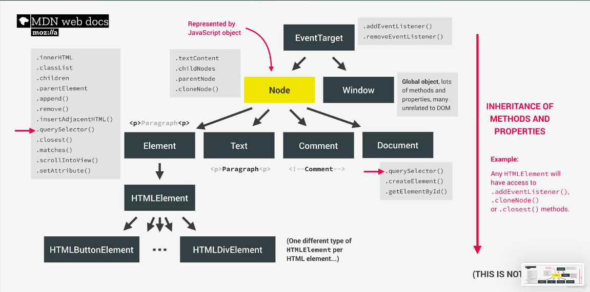
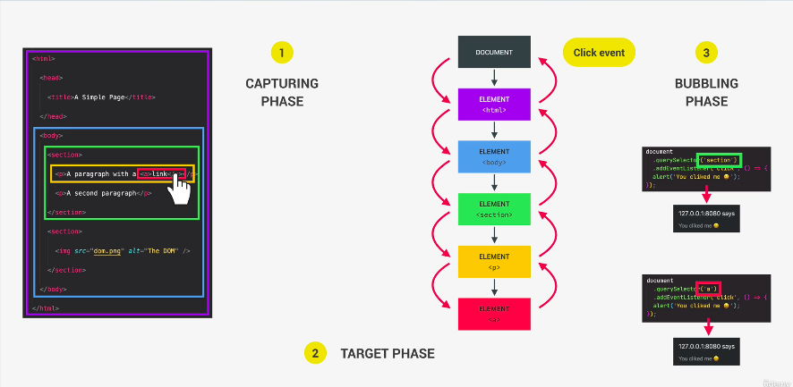
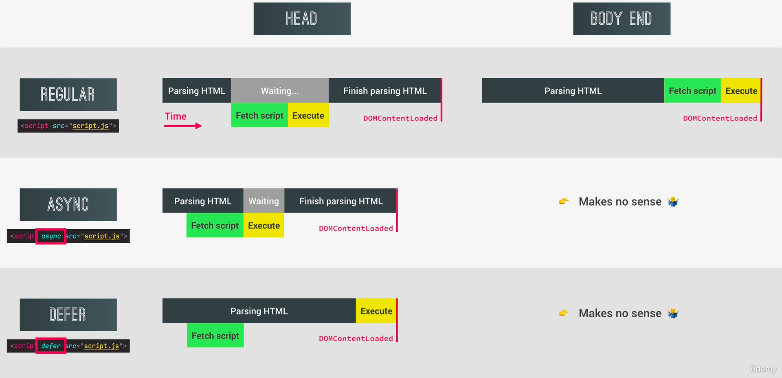

若沒有操作過 DOM 可以先閱讀 [DOM 操作基礎知識複習](https://bacnotes.github.io/p/javascript-dom-manipulation/)



## Node 節點

- 每一個 Dom tree 的元素都是一個 Node
- 所有 HTML 元素可以透過繼承取得父節點方法(.addEventListener(), .cloneNode(), closet())
- :root 同 documentElement 同 html

### 屬性

- node.textContent 表示此節點或其後代的文字內容
- node.childNodes 此節點的所有子節點
- node.parentNode 表示此節點的父節點

### 方法

- node.cloneNode() 回傳呼叫此方法之節點物件的拷貝

### 4 種類型

1. element: <p> </p>可以使用.querySelector(), .classList() 等方法
2. text: 元素裡面的文字
3. comment: <!-- -->
4. document: querySelector(), .createElement()
5. event target 是所有節點的 parent node，下面有一個 window node，讓不同類型的 node，包含 element 跟 document 都可以監聽事件

- element 跟 document 都可以使用.querySelector()

## 元素

### 選取元素

- 現代 選取單個元素 document.querySelector(selector)
- 現代 選取多個元素 document.querySelectorAll(selector)
- 早期 選取單個元素 document.getElementById(id)
- 早期 選取多個元素 document.getElementsByTagName(tagName)
- 早期 選取多個元素 document.getElementsByClassName(name)

- 選取元素內的 HTML 結構 element.innerHTML
- 選取元素內的可見文字 element.innerText
- 選取元素內的所有文字(包含空白) element.textContent

### 創造與插入元素

- 創造與插入元素 element.insertAdjacentHTML(positionName, htmlText)
- positionName 包含：
  - 'beforebegin': 在 element 之前
  - 'afterbegin': 在 element 裡面，第一個子元素之前
  - 'beforeend': 在 element 裡面，最後一個子元素之後
  - 'afterend': 在 element 之後

```html
<body>
  <ul id="list">
    <li>CSS</li>
    // will add here
  </ul>
</body>

<script>
  const list = document.querySelector('#list')
  list.insertAdjacentHTML('afterbegin', '<li>HTML</li>')
</script>
```

- 創造元素 document.createElement('元素類型')
- 插入元素在 element 裡面第一個 element.prepend(元素)
- 插入元素在 element 裡面最尾巴 element.append(元素)
- 插入元素平行 element 前面 element.before(元素)
- 插入元素平行 element 後面 element.after(元素)

```js
const header = document.querySelector('.header')
const message = document.createElement('div')
message.classList.add('cookie-message')

message.innerHTML = `we use cookie for ... and .... <button class="btn btn--close-cookie">Got it</button> 
	`
header.prepend(message)
header.append(message)

// 若先prepend後append只會有一個存在，因為指稱的元素是唯一的，希望上下都有新增需要用clone的方式，true代表子節點都有copy
header.append(message.cloneNode(true))

header.before(message)
header.after(message)
```

### 刪除元素

- 刪除元素 element.remove()
- 刪除節點下子元素 node.removeChild()

```js
document.querySelector('.btn--close-cookie').addEventListener('click', () => {
  // message.remove()
  message.parentElement.removeChild(message)
})
```

## class 樣式

### 取得 class 樣式

- 元素.style.屬性名

```js
console.log(message.style.color) // rgb(55, 55, 55)
// 無法取得沒有定義，被隱藏，或不存在於class裡面的屬性
console.log(message.style.height) //
```

- getComputedStyle(元素).屬性

```js
console.log(getComputedStyle(message).color) // rgb(187, 187, 187)
console.log(getComputedStyle(message).height) // 43.55px

message.style.height =
  Number.parseFloat(getComputedStyle(message).height, 10) + 30 + 'px'
```

### 新增/切換/刪除/確認是否有樣式

- element.classList.add('hidden')
- element.classList.toggle('hidden')
- element.classList.remove('hidden')
- element.classList.contains('hidden')

### 設置 CSS 樣式

- style.setProperty(propertyName, value, priority)

```js
// root元素設置顏色樣式
document.documentElement.style.setProperty('--color-primary', 'orangered')
```

## 屬性

### 取得屬性

- element.getAttribute(attributeName)
- 會回傳該網頁元素的屬性。 如果該屬性不存在，其回傳值會是 null 或 ""

```js
const logo = document.querySelector('nav__logo')
// html只有定義 src alt class designer等屬性

// not standard attribute 無法直接dot notation取得
console.log(logo.designer) // undefined

// 可取得標準 / 非標準的屬性
console.log(logo.getAttribute('designer')) // Jonas
console.log(logo.getAttribute('src')) // img/logo.png 相對
```

### 新增/切換/刪除/確認 屬性/回傳屬性值

- element.setAttribute(name, value)
- element.toggleAttribute(name)
- element.removeAttribute(name)
- element.hasAttribute(name)
- element.getAttribute(name)

### 增加 `data-*`屬性

- html 裡面放 `data-*`

```js

const logo = document.querySelector('img')

console.log(logo.dataset.versionNum) // 3
```

## 畫面元素屬性

### 元素寬高


- scrollWidth/scrollHeight(含 overflow 部分)
- offsetWidth/offsetHeight(含 border/scroll)
- clientWidth/clientHeight(不含 border/scroll)
- scrollTop(clientHeight 跟 scrollHeight 的差距)

### 元素相對於視窗的位置

- element.getBoundingClientRect()
- 會回傳一個 DOMRect 物件，包含
  - x/left:元素左上角 x 座標
  - y/top:元素左上角 y 座標
  - width: 寬度
  - height: 高度
  - right:元素右上角 x 座標
  - bottom:元素右上角 y 座標

* IE 跟 Edge 沒有 x 跟 y 屬性，但有 left 跟 top，超出視窗範圍時，數值就會變負

### 視窗水平/垂直滾動位置

- window.pageXOffset, window.pageYOffset

```js
const btnScrollTo = document.querySelector('.btn--scroll-to')
const section1 = document.querySelector('#section--1')

btnScrollTo.addEventListener('click', function (e) {
  const s1coords = section1.getBoundingClientRect()
  console.log(s1coords)
  // DOMRect{ "x": 0,"y": 169.0908966064453 "width": 411.81817626953125,"height": 2953.29541015625,"top": 169.0908966064453,"right": 411.81817626953125,"bottom": 3122.3863067626953,"left": 0 }
  console.log(e.target.getBoundingClientRect())

  console.log('current scroll(x/y)', window.pageXOffset, pageYOffset)
  // current scroll(x/y) 0 0

  console.log(
    'height/width viewport',
    document.documentElement.clientHeight,
    document.documentElement.clientWidth
  )
})
```

### 滾動到指定元素 scrollIntoView

會滾動元素的父容器，讓被調用 scrollIntoView()的元素可以被使用者可以看到。

```js
const btnScrollTo = document.querySelector('.btn--scroll-to')
const section1 = document.querySelector('#section--1')

btnScrollTo.addEventListener('click', function (e) {
  const s1coords = section1.getBoundingClientRect()
  console.log(s1coords)
  // DOMRect{ "x": 0,"y": 169.0908966064453 "width": 411.81817626953125,"height": 2953.29541015625,"top": 169.0908966064453,"right": 411.81817626953125,"bottom": 3122.3863067626953,"left": 0 }
  console.log(e.target.getBoundingClientRect())

  console.log('current scroll(x/y)', window.pageXOffset, pageYOffset)
  // current scroll(x/y) 0 0

  console.log(
    'height/width viewport',
    document.documentElement.clientHeight,
    document.documentElement.clientWidth
  )

  // old scroll method: current position+ current scroll
  // window.scrollTo({
  //   left: s1coords.left + window.pageXOffset,
  //   top: s1coords.top + window.pageYOffset,
  //   behavior: 'smooth'
  // })

  section1.scrollIntoView({ behavior: 'smooth' })
})
```

## 事件類型跟事件處理器

- event.currentTarget 指向事件绑定的元素
- event.target 指向事件觸發的元素

### 阻檔預設事件

- e.preventDefault()
- a 連結跳轉，若為頁面會自動跳轉到指定頁面，若為錨點#(a href="#")，瀏覽器滑動到最上方
- submit 點擊會送出資料且刷新畫面

### 設置或移除監聽

- eventTarget.addEventListener(type, listener, useCapture)
- eventTarget.removeEventListener(type, listener, useCapture)
- 第一個參數為事件，第二個為執行{}內容，第三個是否捕捉冒泡事件
- 第三個參數沒有設定時預設為 false 監聽冒泡事件，設定為 true 監聽捕捉事件



```js
const h1 = document.querySelector('h1')

const printHi = function (e) {
  console.log('Hi')
}

h1.addEventListener('mouseenter', printHi)

// 3秒後移除監聽 便無法再觸發事件
setTimeout(() => h1.removeEventListener('mouseenter', alertH1, 3000))
```

## 事件捕獲與事件冒泡

- 點擊目標元素觸發事件時，若元素父層也有註冊 click 事件，冒泡階段時也會觸發父層相關的函式

```js
// rgb(255, 255, 255)
const randomInt = (min, max) =>
  Math.floor(Math.random() * (max - min + 1) + min)

const randomColor = () => {
  return `rgb(${randomInt(0, 255)}, ${randomInt(0, 255)}, ${randomInt(0, 255)})`
}

document.querySelector('.nav__link').addEventListener('click', function (e) {
  this.style.backgroundColor = randomColor()
  console.log('link', e.target)
  console.log(e.currentTarget === this) // true
})

document.querySelector('.nav__links').addEventListener('click', function (e) {
  this.style.backgroundColor = randomColor()
  console.log('container', e.target)
})

document.querySelector('.nav').addEventListener('click', function (e) {
  this.style.backgroundColor = randomColor()
  console.log('nav', e.target)
})
```

### 阻擋冒泡事件

- event.stopPropagation()阻止冒泡

## 事件委派跟頁面頁面導航

- event listener 加到父層容器
- 決定哪個元素會觸發事件

```js
document.querySelector('.nav__links').addEventListener('click', function (e) {
  e.preventDefault()
  if (e.target.classList.contains('nav__link')) {
    const id = e.target.getAttribute('href')
    console.log(id) // #section--1
    document.querySelector(id).scrollIntoView({ behavior: 'smooth' })
  }
})
```

## 遍歷 DOM

- document 跟 element 都能使用的方法，就不特別標示，若為 node 特有的方法會標示 node
- querySelectorAll 會回傳指定的選擇器匹配的元素組成的 NodeList，也會遍歷深層的節點

### 往子層遍歷

- node.childNodes() 子節點組成之集合，包含所有類型節點
- children() 子層 HTML collection，只有 element 類型
- firstElementChild() 第一個元素
- lastElementChild() 最後一個元素

```js
const h1 = document.querySelector('h1')

console.log(h1.querySelectorAll('.highlight'))
console.log(h1.childNodes) // 較少用
console.log(h1.children)

h1.firstElementChild.style.color = 'white'
h1.lastElementChild.style.color = 'orangered'
```

### 往父層遍歷

- node.parentNode() 父節點
- node.parentElement() 通常跟上方結果一樣，比較常用這個
- element.closest(selectors): 回傳符合自身或上層（父子或祖孫）的第一個元素

```js
const h1 = document.querySelector('h1')

console.log(h1.parentNode) // 較少用
console.log(h1.parentElement)

h1.closest('.header').style.background = 'var(--gradient-secondary)'
```

### 兄弟層遍歷

- element.previousElementSibling 元素相同級別的前一個元素，沒有會回傳 null
- element.nextElementSibling 元素相同級別的後個元素，沒有會回傳 null

```js
const h1 = document.querySelector('h1')
console.log(h1.previousElementSibling)
console.log(h1.nextElementSibling)
[...h1.parentElement.children].forEach(function (el) {
  if (el !== h1) el.style.transform = 'scale(0.5)'
})
```

### tab 應用

- 假設 tab html 結構為下方架構

```js
<div>
  <button>
    <span>01</span>some text
  </button>
</div>
```

```js
// 點擊的tab 加上active

const tabs = document.querySelectorAll('.operations_tab')
const tabsContainer = document.querySelector('operations__tab-container')
const tabsContent = document.querySelectorAll('operations__content')

tabsContainer.addEventListener('click', function (e) {
  // 上方結構，clicked寫e.target 依照點選位置可能會列印出span或button
  // 用closest可以選到button而不用擔心
  const clicked = e.target.closest('.operations__tab')

  // 沒有點到就返回
  if (!clicked) return

  // 還原 取消所有active樣式
  tabsContent.forEach((el) => el.classList.remove('operations__tab--active'))

  // 在被點選的元素加上active
  clicked.classList.add('operations__tab--active')

  // 拿掉所有內容
  tabsContent.forEach((el) =>
    el.classList.remove('operations__content--active')
  )

  // 顯示對應內容
  document
    .querySelector(`.operations__content--${clicked.dataset.tab}`)
    .classList.add('operations__content--active')
})
```

## 傳遞參數給事件處理器

- 希望 nav 沒被 hover 的元素變透明

```js
<nav class='nav'>
  
  <ul class='nav__links'>
    <li class='nav__item'>
      <a class='nav__link' href='#section--1'>
        Features
      </a>
    </li>
    <li class='nav__item'>
      <a class='nav__link' href='#section--2'>
        Operations
      </a>
    </li>
    <li class='nav__item'>
      <a class='nav__link' href='#section--3'>
        Testimonials
      </a>
    </li>
    <li class='nav__item'>
      <a class='nav__link nav__link--btn btn--show-modal' href='#'>
        Open account
      </a>
    </li>
  </ul>
</nav>
```

- mousein 跟 mouseout 傳不同參數到，mousein 透明度變 0.5，mouseout 變回 1

```js
// you can log the handleHover(0.1) to see that it returns a function which
// has access to the argument(opacity value) passed to handleHover() due to closures
const handleHover = function (o) {
  return function (e) {
    if (e.target.classList.contains('nav__link')) {
      const link = e.target
      const siblings = link.closest('.nav').querySelectorAll('.nav__link')
      const logo = link.closest('.nav').querySelector('img')

      siblings.forEach((el) => {
        if (el !== link) el.style.opacity = o
      })
      logo.style.opacity = o
    }
  }
}

nav.addEventListener('mouseover', handleHover(0.5))
nav.addEventListener('mouseover', handleHover(1))
```

## IntersectionObserver()

- const observer = new IntersectionObserver(handleIntersect, options);
- Intersection Observer API 會註冊一個 callback function，當被監聽的元素進入/退出另一個元素(或 viewport)，或目標跟元素(或 viewport)兩個元素相交部分大小改變，會執行 callback function，減少主要的執行緒監聽元素的 loading，給瀏覽器處理
- options 裡面有 root（null 代表 viewport)、rootMargin(移動到目標的相對位置)、threshold(設定目標進入可見範圍多少百分比後會觸發，1 表示元素全部進到 viewport 才觸發，0.1 表示交疊目標 10%才觸發，0 表示一碰到目標馬上觸發)
- 可以透過`const [entry] = entries`，去調用 entry.target 元素執行對應操作

```js
// 預設值
// root Must be the ancestor of the target. Defaults to the browser viewport
{
  root: null,
  rootMargin: "0px 0px 0px 0px",
  threshold: [0]
}
```

- 常用於 lazy loading、無限滾動、檢測廣告曝光、使用者看到某些區域時執行任務或放影片

```js
// 展示entries參數
const obsCallback = function (entries, observer){
  entries.forEach(entry => {
    console.log(entry)
  })
}

const obsOptions = {
  root: null,
  threshold: 0.1
}

const observer = new IntersectionObserver(obsCallback, obsOptions){
  observer.observe(section1)
}
window.addEventListener('scroll', function (){

})
```

### sticky navbar

```css
.sticky {
  position: fixed;
  background-color: white;
  opacity: 0.9;
}
```

```js
const header = querySelector('.header')
// 動態計算nav高
const navHeight = nav.getBoundingClientRect().height
console.log(navHeight)

// function
const stickToTop = function (entries) {
  // Entries is always an array because the options in IntersectionObserver can have multiple thresholds, and for each threshold, there will be an entry in the array, even if there is only one threshold.
  const [entry] = entries
  console.log(entry)

  if (!entry.isIntersecting) nav.classList.add('sticky')
  else nav.classList.remove('sticky')
}

const obsOptions = {
  root: null,
  threshold: 0,
  // 把視窗上右下左都內縮navHeight px 讓位置卡在距離新section進入前的navHeight
  rootMargin: `-${navHeight}px`,
}

const headerObserver = new IntersectionObserver(stickToTop, obsOptions)

headerObserver.observe(header)
```

### 滾動時圖片跳出顯示

```css
.hidden {
  visibility: hidden;
  opacity: 0;
}

.section--hidden {
  opacity: 0;
  transform: translateY(8rem);
}
```

```js
// nodelist
const allSections = document.querySelectorAll('.section')

// callback
const revealSection = function (entries, observer) {
  const [entry] = entries
  console.log(entry)

  if (!entry.isIntersecting) return
  entry.target.classList.remove('section--hidden')
  // for performance
  observer.unobserve(entry.target)
}

const sectionObserver = new IntersectionObserver(revealSection, {
  root: null,
  threshold: 0.15,
})

allSections.forEach(function (section) {
  // 每個section都加上sectionObserver
  sectionObserver.observe(section)
  // 初始時先全部都隱藏
  section.classList.add('section--hidden')
})
```

## Lazy Loading

```js
const imgTargets = document.querySelectorAll('img[data-src]')

const loadImg = function (entries, observer) {
  const [entry] = entries
  if (!entry.isIntersecting) return
  // change photo
  entry.target.src = entry.target.dataset.src
  // remove filter

  entry.target.addEventListener('load', function () {
    entry.target.classList.remove('lazy-img')
  })
  ebserver.unobserve(entry.target)
}

const imgObserver = new IntersectionObserver(loadImg, {
  root: null,
  threshold: 0,
  // 視窗擴大提早觸發下載
  rootMargin: '200px',
})

imgTargets.forEach((img) => imgObserver.observe(img))
```

## 燈箱

```js
const slider = function () {
  const slides = document.querySelectorAll('.slide')
  const btnLeft = document.querySelector('.slider__btn--left')
  const btnRight = document.querySelector('.slider__btn--right')
  const dotsContainer = document.querySelector('.dots')
  let curSlide = 0
  const maxSlide = slides.length
  const slider = document.querySelector('slider')

  // 方便調適用
  // const slider = document.querySelector('.slider')
  // slider.style.tranform = 'scale(0.4) translateX(-800px)'
  // slider.style.overflow = 'visible'

  // function
  const createDots = function () {
  slides.forEach(function (_, i) {
    dotContainer.insertAdjacentHTML(
      'beforeend',
      `<button class="dots__dot" data-slide="${i}"><button>`
    )
  })
  }

  const activateDot = function (slide){
  document.querySelectorAll('.dots+dot')
  .forEach(dot => dot.classList.remove('dots__dot--active'))

  document.querySelector(`.data__dot[data-slide="${slide}"]`)
  .classList.add('dots_dot--active')
  }

  const goToSlide = function (slide) {
  slides.forEach(
    (s, i) => (s.style.transform = `translateX(${100 * (i - slide)}%)`)
  )
  }

  const nextSlide = function () {
  if (curSlide === maxSlide - 1) {
    curSlide = 0
  } else {
    curSlide++
  }
  goToSlide(curSlide)
  activateDot(curSlide)
  }

  const prevSlide = function () {
  if (curSlide === 0) {
    curSlide = maxSlide - 1
  } else {
    curSlide--
  }
  goToSlide(curSlide)
  activateDot(curSlide)
  }

  const init = function () {
  createDots()
  activateDot(curSlide)
  goToSlide(0)
  }

  init()

  // curSlide= 0: 0 100% 200% 300%
  // curSlide= 1: -100% 0% 100% 200%

  // Event Handlers
  btnRight.addEventListener('click', nextSlide)
  btnLeft.addEventListener('click', prevSlide)


  dotContainer.addEventListener('click', function() {
    if (e.target.classList.contains('dots__dot')) {
      const { slide } = e.target.dataset
      goToSlide(slide)
      activateDot(curSlide)
    }
  })
}
slider（）
```

## DOM events 生命週期

### DOMContentLoaded

- HTML 解析完，DOM 建構完成後觸發
- 不會等待 stylesheets, 圖片和 subframes 等外部資源完成讀取
- 在 DOMContentLoaded 前，所有 JavaScript 腳本應該被下載跟執行
- 我們的 JavaScript 都放在 body 尾端，所以不用監聽這個事件

```js
document.addEventListener('DOMContentLoaded', function (e) {
  console.log('HTML parsed and DOM tree built')
})
```

### load

- 發生在加載完目標資源、該資源依賴的其他資源時

```js
window.addEventListener('load', function (e) {
  console.log('page fully loaded', e)
})
```

### beforeunload

- 瀏覽器關閉或刷新，觸發一個 dialog，當前頁面不會直接關閉，可以點確定或取消
- 需要搭配 e.preventDefault 使用

```js
window.addEventListener('beforeunload', funciton(e){
  e.preventDefault()
  e.returnValue= ''
})
```

- 瀏覽器渲染畫面流程：建立 DOM → 建立 CSSOM → 合併為 Render Tree → Layout（空間位置排版佈局） → Paint（繪製畫面，轉換成像素做呈現）
- 由於 JavaScript 在執行時，會停止渲染動作，阻塞 DOM 和 CSSOM 的建構過程
- 因此會建議把 script 放在 HTML 內容下方，也就是`</body>`前，等於 HTML 都解析完成了才會去 fetch 跟執行 script，但如果要優化提早在head區塊先下載，可以考慮defer跟async屬性

```html
<body>
  ...
  <script src="./script.js"></script>
</body>
```

- 如果為了效能想提早載入資源而希望把 script 放在`<head>`區塊，需要加一個`defer`屬性避免阻擋渲染過程（DOM 還在建立），保證執行順序跟程式碼相同，通常是最佳解
- 若使用`async`屬性，下載後會立刻執行但不保證執行順序，且請求回來後會停止解析，還是可能遇到 DOM 跟 CSSOM 還在生成，選不到元素，適合用在不會針對操作 DOM 的 script，或是第三方的函式庫（e.g. Google Analytics）



以上為[The Complete JavaScript Course - From Zero to Expert](https://www.udemy.com/course/the-complete-javascript-course/ 'The Complete JavaScript Course - From Zero to Expert')的小筆記，附上連結推推這堂課
