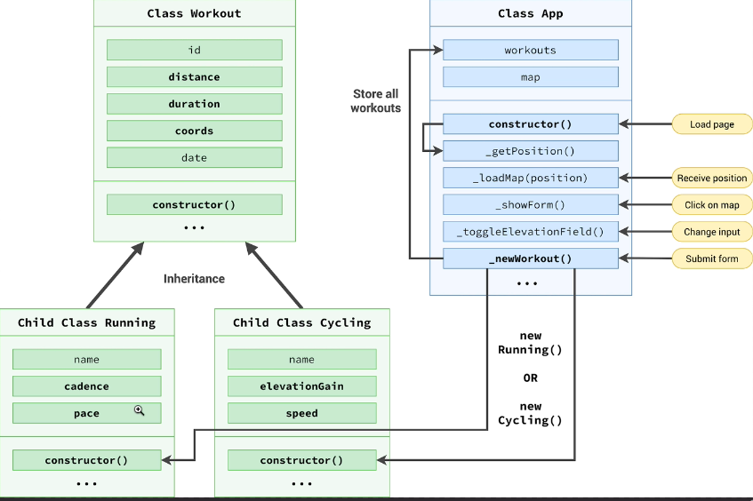

## navigator.geolocation.getCurrentPosition()

- 第一個參數是允許獲取執行的函式，第二個參數是不允許獲取時執行的函式

```js
navigator.geolocation.getCurrentPosition(
  function (position) {
    const { latitude, longitude } = position.coords
    // console.log(`https://www.google.com/maps/@${latitude},${longitude}`)
  },
  function () {
    alert('could not get your position')
  }
)
```

## Leaflat

- 第三方地圖函式庫，CDN 或 npm 下載
- 先以 CDN 為例

```html
// 放在head區塊的記得搭配defer 下載執行順序很重要
<link
  rel="stylesheet"
  href="https://unpkg.com/leaflet@1.8.0/dist/leaflet.css"
  integrity="sha512-hoalWLoI8r4UszCkZ5kL8vayOGVae1oxXe/2A4AO6J9+580uKHDO3JdHb7NzwwzK5xr/Fs0W40kiNHxM9vyTtQ=="
  crossorigin=""
/>
<script
  defer
  src="https://unpkg.com/leaflet@1.8.0/dist/leaflet.js"
  integrity="sha512-BB3hKbKWOc9Ez/TAwyWxNXeoV9c1v6FIeYiBieIWkpLjauysF18NzgR1MBNBXf8/KABdlkX68nAhlwcDFLGPCQ=="
  crossorigin=""
></script>

<!-- 需要上方函式庫才能執行下方功能 -->
<script defer src="script.js"></script>
```

## 初始化地圖與點擊插入座標

- L.map 內傳入的字串要是 html 元素的 id 查找 html 元素的位置`<div id="map"></div>`
- L 是 leaflat 的主要的 function 的 entry point，也是 global var，表示其他比較晚下載的 script 也可以呼叫他
- 需要設置 event handler 處理點擊事件，但我們不知道點擊畫面時對應的 GPS 位置，只有 leaflet 知道，所以需要使用他的方法
- 希望點擊就會出現 marker 且 pop 都會打開
- bindPopup 可以傳入一個物件，放入不同選項

```js
// js
if (navigator.geolocation) {
  navigator.geolocation.getCurrentPosition(
    function (position) {
      const { latitude, longitude } = position.coords
      // console.log(`https://www.google.com/maps/@${latitude},${longitude}`)
      const coords = [latitude, longitude]
      // 13 is zoom
      const map = L.map('map').setView(coords, 13)

      // 除了openstreetmap也可套用其他地圖 google map 或是更換風格 openstreetmap.fr/hot/{z}/{x}/{y}.png
      L.tileLayer('https://{s}.tile.openstreetmap.org/{z}/{x}/{y}.png', {
        attribution:
          '&copy; <a href="https://www.openstreetmap.org/copyright">OpenStreetMap</a> contributors',
      }).addTo(map)

      // leaflat提供的方法跟特殊事件
      map.on('click', function (mapEvent) {
        // console.log(mapEvent)
        const { lat, lng } = mapEvent.latlng
        L.marker([lat, lng])
          .addTo(map)
          // .bindPopup('Workout') // 拿到Workout popup樣式
          .bindPopup(
            L.popup({
              maxWidth: 250,
              minWidth: 100,
              autoClose: false,
              closeOnClick: false,
              className: 'running-popup',
            })
          )
          .setPopupContent('sample text')
          .openPopup()
      })
    },
    function () {
      alert('could not get your position')
    }
  )
}
```

## 調整成 form 輸入完成才會插入座標

- 表單會在 click map 時出現，把 hidden class 拿掉且 focus 在第一個 input
- enter 也會觸發 submit 事件，會在地圖剛剛 click 的地方出現座標，popup 樣式不同
- 出現座標後表單消失，表單內容清空
- 寫監聽事件，當切換 running / cycling 表單的項目類別會更新

```js
let map, mapEvent
if (navigator.geolocation) {
  navigator.geolocation.getCurrentPosition(
    function (position) {
      const { latitude, longitude } = position.coords
      // console.log(`https://www.google.com/maps/@${latitude},${longitude}`)
      const coords = [latitude, longitude]

      map = L.map('map').setView(coords, 13)
      L.tileLayer('https://{s}.tile.openstreetmap.org/{z}/{x}/{y}.png', {
        attribution:
          '&copy; <a href="https://www.openstreetmap.org/copyright">OpenStreetMap</a> contributors',
      }).addTo(map)

      map.on('click', function (mapE) {
        // 點的地方
        mapEvent = mapE
        form.classList.remove('hidden')
        // 選取距離的表單元素
        inputDistance.focus()
        const { lat, lng } = mapE.latlng
      })
    },
    function () {
      alert('could not get your position')
    }
  )
}

form.addEventListener('submit', function (e) {
  e.preventDefault()
  // display marker
  // mapEvent跟map的變數需要變成global var
  const { lat, lng } = mapEvent.latlng
  L.marker([lat, lng])
    .addTo(map)
    .bindPopup(
      L.popup({
        maxWidth: 250,
        minWidth: 100,
        autoClose: false,
        closeOnClick: false,
        className: 'running-popup',
      })
    )
    .setPopupContent('sample text')
    .openPopup()

  // clear input fields
  inputDistance.value =
    inputDuration.value =
    inputCadence =
    inputElevation.value =
      ''
})
// 切換類別字樣，一個出現時另一個隱藏
inputType.addEventListener('change', function () {
  inputElevation.closet('.form__row').classList.toggle('form__row--hidden')
  inputCadence.closet('.form__row').classList.toggle('form__row--hidden')
})
```

## 使用 class 設計 App

- design where and how to store data
- class workout
- child class running
- child class cycling



- 把先前的 function 重構成 class 寫法
- 加上渲染 workout 列表/動態類別/敘述加上時間跟 emoji
- 點擊 marker 會移動 marker 為中心
- 加上一個公有方法外部可以存取
- 使用 localStorage

```js
class Workout {
  date = new Date()
  id = Date.now().toString().slice(-10)
  clicks = 0

  constructor(coords, distance, duration) {
    this.coords = coords // [lat, lng]
    this.distance = distance
    this.duration = duration
  }
  _setDescription() {
    const months = [
      'January',
      'February',
      'March',
      'April',
      'May',
      'June',
      'July',
      'August',
      'September',
      'October',
      'November',
      'December',
    ]

    this.description = `${this.type[0].toUpperCase()}${this.type.slice(1)} on ${
      months[this.date.getMonth()]
    } ${this.date.getDate()}`
  }

  click(){
    this.click++
  }
}

class Running extends Workout {
  type = 'running'
  constructor(coords, distance, duration, cadence) {
    super(coords, distance, duration)
    this.cadence = cadence
    this.type = 'running'
    this.calcPace()
    this._setDescription()
  }
  calcPace() {
    // min/km
    this.pace = this.duration / this.distance
    return this.pace
  }
}

class Cycling extends Workout {
  type = 'cycling'
  constructor(coords, distance, duration, elevationGain) {
    super(coords, distance, duration)
    this.elevationGain = elevationGain
    this.type = 'cycling'
    this.calcSpeed()
    this._setDescription()
  }
  calcSpeed() {
    // km/h
    this.speed = this.distance / (this.duration / 60)
    return this.speed
  }
}
const run1 = new Running([39, -12], 5.2, 24, 178)
const cyc1 = new Running([39, -12], 5.2, 24, 178)
// console.log(run1, cyc1)

class App {
  #map
  #mapZoomLevel, = 13
  #mapEvent
  #workouts = []
  constructor() {
    // global var變成私有property
    this._getPosition()

    // get data from localStorage
    this._getLocalStorage()

    // event listener的this會指向監聽的form本身，需要綁定成app本身
    form.addEventListener('submit', this._newWorkOut.bind(this))
    // 樣式變更沒有跟事件處理有關，所以不用擔心this指向
    inputType.addEventListener('change', this._toggleElevationField)
    containerWorkouts.addEventListener('click', this._moveToPopup.bind(this))
  }
  _getPosition() {
    if (navigator.geolocation) {
      // 綁定this 才不會因為一般函式呼叫而讓this變成undefined
      navigator.geolocation.getCurrentPosition(
        this._loadMap.bind(this),
        function () {
          alert('could not get your position')
        }
      )
    }
  }
  _loadMap(position) {
    const { latitude, longitude } = position.coords
    // console.log(`https://www.google.com/maps/@${latitude},${longitude}`)
    const coords = [latitude, longitude]

    this.#map = L.map('map').setView(coords, this.#mapZoomLevel,)
    L.tileLayer('https://{s}.tile.openstreetmap.org/{z}/{x}/{y}.png', {
      attribution:
        '&copy; <a href="https://www.openstreetmap.org/copyright">OpenStreetMap</a> contributors',
    }).addTo(this.#map)
    // this會變成event handler監聽的對象也就是map
    this.#map.on('click', this._showForm.bind(this))

    this.#workouts.forEach(work => {
      this._renderWorkoutMarker(work)
    })
  }
  _showForm() {
    this.#mapEvent = mapE
    form.classList.remove('hidden')
    // 選取距離的表單元素
    inputDistance.focus()
    const { lat, lng } = mapE.latlng
  }

  _hideForm() {
    inputDistance.value = inputDuration.value = inputCadence = inputElevation.value = ''

    form.style.display = 'none'
    form.classList.add('hidden')
    setTimeout(() => form.style.display = 'grid', 1000)
  }
  _toggleElevationField() {
    inputElevation.closet('.form__row').classList.toggle('form__row--hidden')
    inputCadence.closet('.form__row').classList.toggle('form__row--hidden')
  }

  _newWorkout(e) {
    // rest parameter
    const validInputs = (...inputs) =>
      inputs.every((input) => Number.isFinite(input))
    const allPositive = (...inputs) => inputs.every((input) => input > 0)
    e.preventDefault()

    // get data from form
    const type = inputType.value
    const distance = Number(inputDistance.value)
    const duration = Number(inputDuration.value)
    const { lat, lng } = this.#mapEvent.latlng
    let workout

    // if running, create running obj
    if (type === 'running') {
      const cadence = Number(inputCadence.value)
      if (
        !validInputs(distance, duration, cadence) ||
        !allPositive(distance, duration, cadence)
      )
        return alert('input is not a positive number')
      workout = new Running([lat, lng], distance, duration, cadence)
    }
    // if cycling, create cycling obj
    if (type === 'cycling') {
      const elevation = Number(inputElevation.value)
      if (
        !validInputs(distance, duration, elevation) ||
        !allPositive(distance, duration)
      )
        return alert('input is not a positive number')

      workout = new Cycling([lat, lng], distance, duration, elevation)
    }

    // add new obj to new array
    this.#workouts.push(workout)

    // render on map as marker
    this._renderWorkoutMarker(workout)

    // hide forms, clear input fields
    this._renderWorkout(workout)

    // clear input fields
    this._hideForm()

    // set data to localStorage
    this._setLocalStorage()
  }

  // 為了加入類型的參數 而放到外層
  _renderWorkoutMarker(workout) {
    L.marker(workout.coords)
      .addTo(this.#map)
      .bindPopup(
        L.popup({
          maxWidth: 250,
          minWidth: 100,
          autoClose: false,
          closeOnClick: false,
          className: `${workout.type}-popup`,
        })
      )
      .setPopupContent(`${workout.type === 'running' ? '🏃‍♂️' : '🚴‍♀️'} ${workout.description}`)
      .openPopup()
  }

  _renderWorkout(workout) {
    let html = `
      <li class="workout workout--${workout.name}" data-id="${workout.id}">
          <h2 class="workout__title">${workout.description}</h2>
          <div class="workout__details">
            <span class="workout__icon">${
              workout.type === 'running' ? '🏃‍♂️' : '🚴‍♀️'
            }</span>
            <span class="workout__value">${workout.distance}</span>
            <span class="workout__unit">km</span>
          </div>
          <div class="workout__details">
            <span class="workout__icon">⏱</span>
            <span class="workout__value">${workout.duration}</span>
            <span class="workout__unit">min</span>
          </div>
    `
    if (workout.type === 'running') {
      html += `
        <div class="workout__details">
            <span class="workout__icon">⚡️</span>
            <span class="workout__value">${workout.pace.toFixed(1)}</span>
            <span class="workout__unit">min/km</span>
          </div>
          <div class="workout__details">
            <span class="workout__icon">🦶🏼</span>
            <span class="workout__value">${workout.cadence}</span>
            <span class="workout__unit">spm</span>
          </div>
        </li>
      `
    }

    if (workout.type === 'cycling')
      html += `
        <div class="workout__details">
          <span class="workout__icon">⚡️</span>
          <span class="workout__value">${workout.speed.toFixed(1)}</span>
          <span class="workout__unit">km/h</span>
        </div>
        <div class="workout__details">
          <span class="workout__icon">⛰</span>
          <span class="workout__value">${workout.elevationGain}</span>
          <span class="workout__unit">m</span>
        </div>
      </li>
      `

    form.insertAdjacentHTML('afterend', html)
  }

  _moveToPopup(e) {
    // catch id
    const workoutElement = e.target.closet('.workout')
    // console.log(workoutElement)

    if(!workoutElement) return
    const workout = this.#workouts.find(work => work.id === workoutElement.dataset.id)

    this.#map.setView(workout.coords, this.#mapZoomLevel, {
      animate: true,
      pan: {
        duration: 1
      }
    })

    // using the public interface
    // workout.clicks()
  }

  _setLocalStorage() {
    // 字串化會失去prototype chain跟方法
    localStorage.setItem('workouts', JSON.stringify(this.#workouts))
  }

  _getLocalStorage(){
    const data = JSON.parse(localStorage.getItem('workouts'))
    if(!data) return

    this.#workouts = data
    this.#workouts.forEach(work => {
      this._renderWorkout(work)
    })
  }

  // 公開方法 刪除localStorage資料
  reset(){
    localStorage.removeItem('workouts')
    location.reload()
  }
}

const app = new App()
```

以上為[The Complete JavaScript Course - From Zero to Expert](https://www.udemy.com/course/the-complete-javascript-course/ 'The Complete JavaScript Course - From Zero to Expert')的小筆記，附上連結推推這堂課
