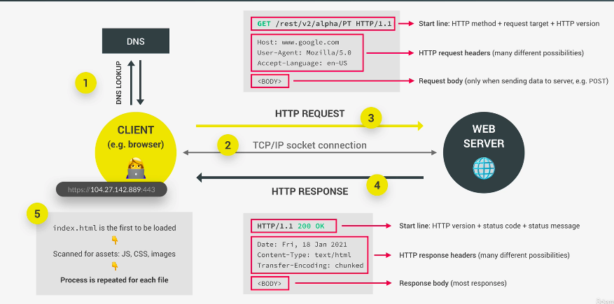

## 非同步 JavaScript

- code 由上往下一行行執行，但這樣的機制容易在執行較久的處理程序中被卡住
- 非同步有不阻塞的好處，先執行等待結果回傳(e.g. 計時器，`img.src = 'someImg'`，AJAX、API)

### AJAX and API

- AJAX(Asynchronous Javascript and XML): 可以動態取得 server data
- API(Application programming Interface): 讓程式之間彼此溝通的介面
- 常見 API 種類: DOM API、Geolocation API、online API、Own Class API
- 第三方 API: Weather、Flight、SMS、貨幣、Google Map
- API 傳的資料格式過往以 XML 格式為主所以名稱才會叫 AJAX，近代主要用 JSON 格式為主
- JSON 格式是 JavaScript 物件轉成字串格式

```js
const p = document.querySelector('p')
p.textContent = 'abc'
alert('text')
p.style.color = 'red'
```

## XMLHttpRequest with callback

- 最早的發送 AJAX 的方式，目前少用因為需要寫的步驟很繁瑣
- 為了使用 callback 方式而使用 XMLHttpRequest 展示
- 若有多個請求，會看哪個結果先回傳，先發送 load event 先渲染
- 若要確保渲染順序會需要 chain request, 也是早成造成 callback hell 的原因

```js
const getCountryData = function (country) {
  const request = new XMLHttpRequest()
  // open request
  request.open('GET', `https://restcountries.com/v2/name/${country}`)

  request.send()
  // send request to url, fetch in the background
  // can not use data = request.response to get result because not finished
  console.log(request.responseText) // can not immediately get anything
  // once it done it will emit load event

  // load after it is done
  request.addEventListener('load', function () {
    console.log(this.responseText) // this = request
    // will get [{...}], so destructure like this
    const [data] = JSON.parse(this.responseText)
  })

  // 根據收到資料update
  const countriesContainer = document.querySelector('.countries')
  const html = `
    <article class="country">
      
      <div class="country__data">
        <h3 class="country__name">${data.name}</h3>
        <h4 class="country__region">${data.region}</h4>
        // 四捨五入到百萬
        <p class="country__row"><span>👫</span>${(
          Number(data.population) / 1000000
        ).toFixed(1)}</p>
        <p class="country__row"><span>🗣️</span>${data.languages[0].name}</p>
        <p class="country__row"><span>💰</span>${data.currencies[0].name}</p>
      </div>
    </article>
    `
  countriesContainer.insertAdjacentHTML('beforeend', html)
}

getCountryData('portugal')
getCountryData('usa')
```

```css
.countries {
  display: flex;
  font-size: 2rem;
  opacity: 0;
  transition: opacity 1s;
}
```

### request and response

- client 發送 request，server 接收 request 並發出 response 給 client

```js
https://restcountries.com/v2/name/portugal
```

- protocol: http/https(https 使用 TLS SSl 加密)
- domain name: restcountries.com
- resource: /v2/name/portugal

### what happens when we access a web server

- step1: DNS(domain name server) lookup 查找 IP 地址
  - 呼叫 protocol + ip address + port number
  - port 用來辨別特定服務(有點類似副地址)
- step2: TCP/IP socket connect
  - TCP is 通訊控制協議, IP is 網路協議。兩者一起定義如何傳輸資料
- step3: HTTP request(hypertext transfer protocol) 可以讓 server 跟 client 互傳訊息
  - start line: HTTP method + request target + http version `Get /rest/v2/alpha/PT HTTP/1.1`
  - http methods: get/post/put/patch
  - 如果地址只寫/就只會到根目錄，也就是 restcountries.com
  - request headers(request itself)(多種組合可能)
  ```
  Host: www.google.com
  User-Agent: Mozilla/5.0
  Accept-Language: en-US
  ```
  - request body(only when sending data to server e.g. POST)
- HTTP response
  - start line: HTTP version + status code + status message `HTTP/1.1 200 OK `
  - HTTP response headers(很多種組合可能)
  ```
  Date: Fri, 18 Jan 2021
  Content-Type: text/html
  Transfer-Encoding: chunked
  ```
  - response body(most responses)，通常是 JSON 格式或看請求內容
- 對 server 發送請求後，server 回傳 html，瀏覽器解析 html 時會隊 server 再次請求相關資源(js/css files/img assets)，就是這樣來回的資源請求讓我們可以看到網頁
- TCP: TCP 會把 request 跟 response 拆成小塊封包送出，收到時會組合成原貌，這樣發送的時候可以在網路中走不同的 route，提高傳輸效率
- IP: IP 負責在網路中發送跟交管 route 這些封包，確保都有傳輸到正確的位置



### callback hell

- nested callback function is hard to read and maintain

```js
// 根據收到資料update
const countriesContainer = document.querySelector('.countries')

const renderCountry = function (data, className = '') {
  const html = `
    <article class="country ${className}">
      
      <div class="country__data">
        <h3 class="country__name">${data.name}</h3>
        <h4 class="country__region">${data.region}</h4>
        // 四捨五入到百萬
        <p class="country__row"><span>👫</span>${(
          Number(data.population) / 1000000
        ).toFixed(1)}</p>
        <p class="country__row"><span>🗣️</span>${data.languages[0].name}</p>
        <p class="country__row"><span>💰</span>${data.currencies[0].name}</p>
      </div>
    </article>
    `
  countriesContainer.insertAdjacentHTML('beforeend', html)
  countriesContainer.style.opacity = 1
}

const getCountryAndNeighbor = function (country) {
  // AJAX call country 1
  const request = new XMLHttpRequest()
  // open request
  request.open('GET', `https://restcountries.com/v2/name/${country}`)
  request.send()

  // load after it is done
  request.addEventListener('load', function () {
    // array
    const [ data ] = JSON.parse(this.responseText) // [ {...} ]
    renderCountry(data)
    // get neighbour country (2)
    const [ neighbour ] = data.borders
    if(!neighbour) = return

  // AJAX call country 2
  const request2 = new XMLHttpRequest()
    // open request
    request2.open('GET', `https://restcountries.com/v3.1/alpha/${neightbor}`)
    request2.send()
    request2.addEventListener('load', function(){
    // obj
    const data2 = JSON.parse(this.responseText)
      renderCountry(data2, 'neighbour')
    })
  })

}
```

getCountryAndNeighbor('usa')

### Why Promises with fetch

- Promise 類似一個接收未來非同步函式回傳結果的容器
- 不用依賴 events 跟 callback 傳遞跟處理非同步函式結果
- 透過 chain Promise 可以避免 callback hell，打造更好讀的程式碼

### Promise 的生命週期

- fetch API in a Promise
- pending (response not available yet)
- async task settled (get results)
  - fulfilled
  - rejected
- consume Promise

### Promise 結構

- fetch 後會回傳一個 Promise
- 透過 json()方法解析後，會再回傳一個 Promise
- 透過 then 接起來，獲取 data
- then 區塊回傳 fulfilled value
- catch 區塊 回傳 rejected value，chain 中所有的錯誤會在這裡被拋出
- err 是一個 object，可以把使用者需要知道的錯誤顯示在上面
- finally 區塊是無論回傳結果永遠都會執行的區塊，處理一定需要執行的邏輯
- 用 then 來 chain Promise，不要把 then chain 成巢狀，在外層接 Promise

### callback v.s. Promise

```js
// XMLHttpRequest
const request = new XMLHttpRequest()
request.open('method', 'url')
request.send()
request.addEventListener('load', function () {
  const data = JSON.parse(this.responseText)
  renderCountry(data, 'neighbour')
})

// Promise with less code
const request = fetch('url')
  .then((response) => response.json())
  .then((data) => renderCountry(data, 'neighbour'))
```

### 改寫 callback 成 Promise 物件

- 若要模擬 reject 可以先渲染出畫面後，畫面上一個可以再次 fetch data 的按鈕，把 network 設定改成 offline 模擬 Promise reject。若直接改 offline 會看到小恐龍

```js
const request = fetch('https://restcountries.com/v2/name/portugal')
console.log(request)

const btn = document.querySelector('btn-country')
const countriesContainer = document.querySelector('.countries')
btn.addEventListener('click', function () {
  getCountryData('portugal')
})

const renderCountry = function (data, className = '') {
  const html = `
    <article class="country ${className}">
      
      <div class="country__data">
        <h3 class="country__name">${data.name}</h3>
        <h4 class="country__region">${data.region}</h4>
        // 四捨五入到百萬
        <p class="country__row"><span>👫</span>${(
          Number(data.population) / 1000000
        ).toFixed(1)}</p>
        <p class="country__row"><span>🗣️</span>${data.languages[0].name}</p>
        <p class="country__row"><span>💰</span>${data.currencies[0].name}</p>
      </div>
    </article>
    `
  countriesContainer.insertAdjacentHTML('beforeend', html)
  // countriesContainer.style.opacity = 1
}

const renderError = function (msg) {
  countriesContainer.insertAdjacentTExt('beforeend', msg)
  // countriesContainer.style.opacity = 1
}

const getCountryData = function (country) {
  fetch(`https://restcountries.com/v2/name/${country}`)
  // 若成功 response.status: 200, response.ok: true
  .then(response => response.json())
  .then(data => {
    renderCountry(data[0])
    const neighbour = data[0].borders[0]

    if(!neighbour) return

    // country 2
    return fetch(`https://restcountries.com/v2/name/${neighbour}`)
  })
  .then(response => response.json())
  .then(data = > renderCountry(data, 'neighbour'))
  .catch(err => {
    console.log(err)
    renderError(`something is wrong ${err.message}`)
  })
  .finally(()=> {
    countriesContainer.style.opacity = 1
  })
}

getCountryData('portugal')
```

## 錯誤處理

- any error would cause any Promise to reject
- 需要在 then 區塊主動丟出錯誤才會進入 reject，進到 catch 區塊
- 用 catch finally 處理好沒有資料時要呈現的畫面

```js
const getCountryData = function (country) {
  fetch(`https://restcountries.com/v2/name/${country}`)
  .then(response => {
    console.log(response)

    // 第一個錯誤處理 status = 404, ok =false
    if(!response.ok)
      throw new Error(`Country not found (${response.status})`)
      // 沒有這個msg 就會render出來'flag' of undefined

    return response.json()
  })
  .then(data => {
    renderCountry(data[0])
    // const neighbour = data[0].borders[0]
    // 用不存在的國家模擬network無法抓取資料狀況
    const neighbour = '123123'
    if(!neighbour) return

    // 請求會被reject
    return fetch(`https://restcountries.com/v2/name/${neighbour}`)
  })
  .then(response => {

    if(!response.ok) {
      throw new Error(`Country not found (${response.status})`)
    }
    return response.json()
  })
  .then(data = > renderCountry(data, 'neighbour'))
  .catch(err => {
    console.log(err)
    renderError(`something is wrong ${err.message}`)
  })
  .finally(()=> {
    countriesContainer.style.opacity = 1
  })
}

```

- 重複 fetch 的 code 可以精簡成一個函式

```js
const getJSON = function (url, errMsg = 'something went wrong') {
  fetch(url).then((response) => {
    if (!response.ok) {
      throw new Error(`${errorMsg} ${response.status}`)

      return response.json()
    }
  })
}
```

- 改寫 function 跟加上處理沒有鄰國的國家

```js
const getCountryData = function (country) {
  getJSON(
    `https://restcountries.com/v2/name/${country}`, 'Country not found'
  )
  .then(data => {
    renderCountry(data[0])
    const neighbour = data[0].borders[0]

    // 沒有鄰國的狀況也丟錯誤
    if(!neighbour) {
      throw new Error('no neighbour found!')
    }

    return getJSON(`
    https://restcountries.com/v2/name/${neighbour}`, 'Country not found'
    )
  })
  .then(data = > renderCountry(data, 'neighbour'))
  .catch(err => {
    console.log(err)
    renderError(`${err.message}`)
  })
  .finally(()=> {
    countriesContainer.style.opacity = 1
  })
}
```

### 小練習

```js
const whereAmI = function (lat, lng) {
  fetch(`https://geocode.xyz/${lat},${lng}?geoit=json`)
    .then((res) => {
      if (!res.ok) throw new Error(`Problem with geocoding ${res.status}`)
      return res.json()
    })
    .then((data) => {
      console.log(`You are in ${data.city}, ${data.country}`)

      return fetch(`https://restcountries.eu/rest/v2/name/${data.country}`)
    })
    .then((res) => {
      if (!res.ok) throw new Error(`Country not found (${res.status})`)

      return res.json()
    })
    .then((data) => renderCountry(data[0]))
    .catch((err) => console.error(`${err.message}`))
}
whereAmI(52.508, 13.381)
whereAmI(19.037, 72.873)
```

### Promise 與 Event loop

- Promise 回傳結果會進到 Micro task queue，在 Event loop 會比一般 callback (進到 Callback queue) 優先處理
- Promise.resolve('要 pass 的 value')是一個馬上執行 resolve 的靜態方法
- Promise.reject(new Error('reject 的內容'))是一個馬上執行 resolve 的靜態方法

```js
console.log('Test start')
setTimeout(() => console.log('0 sec timer'), 0)
Promise.resolve('Resolved Promise 1').then((data) => console.log(data))

// heavy task
Promise.resolve('Resolved Promise 2').then((data) => {
  for (let i = 0; i < 10000000; i++) {
    console.log(data)
  }
})
console.log('Test end')

// 'Test start'
// 'Test end'
// 'Resolved Promise 1'
// 'Resolved Promise 2'
// '0 sec timer'
```

### 打造一個 Promise(非來自 fetch 結果)

- 創造一個函式，呼叫後隨機回傳 resolve 或 reject(手動拋出錯誤)
- 舊的 callback function，用 Promise 來包裝異步處理避免 callback hell

```js
const lotteryPromise = new Promise(function (resolve, reject) {
  setTimeout(function () {
    if (Math.random() >= 0.5) {
      resolve('You win')
    } else {
      reject(new Error('You lose'))
    }
  }, 5000)
})

lotteryPromise
  .then((data) => console.log(data))
  .catch((err) => console.err(err))
```

### Promise 包裝 setTimeout

- 傳給 wait 秒數設定多久回傳 Promise，裡面是一個 Promise，因為 setTImeout 不會失敗只會 resolve

```js
const wait = function (seconds) {
  return new Promise(function (resolve) {
    // 沒有要傳入resolve value ，要不要回傳value非強制
    setTimeout(resolve, seconds * 1000)
  })
}
wait(1)
  .then(() => {
    console.log('1 sec passed')
    return wait(1)
  })
  .then(() => {
    console.log('another 1 sec passed')
    return wait(1)
  })
  .then(() => {
    console.log('another 1 sec passed')
  })
```

### Promise 包裝 geolocation callback

```js
// sync
const getPosition = function () {
  return new Promise(function (resolve, reject) {
    // navigator.geolocation.getCurrentPosition(
    //   // if allow
    //   (position) => console.log(position),
    //   // not allow
    //   (err) => console.error(err)
    // )
    navigator.geolocation.getCurrentPosition(resolve, reject)
  })
}

getPosition().then((pos) => console.log(pos))
// GeolocationPosition {coords: GeolocationCoordinates, timestamp: 1650122094727}
// coords裡面有lat lng
```

### Promise 練習

- const whereAmI = function (lat, lng)外部參數改用 fetch 取得

```js
const getPosition = function () {
  return new Promise(function (resolve, reject) {
    navigator.geolocation.getCurrentPosition(resolve, reject)
  })
}

const whereAmI = function () {
  getPosition()
    .then((pos) => {
      const { latitude: lat, longitude: lng } = pos.coords
      return fetch(`https://geocode.xyz/${lat},${lng}?geoit=json`)
    })
    .then((res) => {
      if (!res.ok) throw new Error(`Problem with geocoding ${res.status}`)
      return res.json()
    })
    .then((data) => {
      console.log(data)
      console.log(`You are in ${data.city}, ${data.country}`)

      return fetch(`https://restcountries.eu/rest/v2/name/${data.country}`)
    })
    .then((res) => {
      if (!res.ok) throw new Error(`Country not found (${res.status})`)

      return res.json()
    })
    .then((data) => renderCountry(data[0]))
    .catch((err) => console.error(`${err.message}`))
}

btn.addEventListener('click', whereAmI)
```

### 打造 2 秒換圖功能

```html
<!-- html -->
<main class="container">
  <div class="images"></div>
</main>
```

```js
// js
const imgContainer = document.querySelector('.images')
const wait = function (sec) {
  return new Promise(function (resolve) {
    setTimeout(resolve, seconds * 1000)
  })
}
const createImage = function (imgPath) {
  return new Promise(function (resolve, reject) {
    const img = document.createElement('img')
    img.src = imgPath
    // load event means success
    img.addEventListener('load', function () {
      imgContainer.append(img)
      // 回傳html元素
      resolve(img)
    })

    // not success
    img.addEventListener('error', function () {
      reject(new Error('image not found'))
    })
  })
}

let currentImg
// 因為then不同區塊不在同一個function scope
// global var 才有辦法隱藏跟後續更新第二個圖片
// 下載圖片，指定到對應src，插入圖片到畫面
createImage(' https://picsum.photos/500/300')
  .then((img) => {
    currentImg = img
    console.log('image 1 loaded')
    // timer 計時2秒，完成後回傳1個Promise
    return wait(2)
  })
  .then(() => {
    // 隱藏
    currentImg.style.display = 'none'
    // 下載圖片，指定到對應src，插入圖片到畫面
    return createImage('https://picsum.photos/500/300')
  })
  .then((img) => {
    currentImg = img
    console.log('Image 2 loaded')
    // timer 計時2秒，完成後回傳1個Promise
    return wait(2)
  })
  .then(() => {
    currentImg.style.display = 'none'
  })
  .catch((err) => console.error(err))
```

## async await(ES7)

- 是 Promise then 的語法糖，用來處理非同步流程
- async呼叫後一樣會回傳一個 Promise，但可讀性更佳
- 搭配 try catch 結構處理錯誤

```js
// fetch(`https://restcountries.eu/rest/v2/name/${country}`).then(res => console.log(res))

const whereAmI = (async function (country) {
  // geolocation
  try {
    // 這邊不用主動拋錯因為function內建Promise reject，會主動拋錯
    const position = await getPosition()
    const { latitude: lat, longitude: lng } = position.coords

    // reverse geo
    const resGeo = await fetch(`https://geocode.xyz/${lat},${lng}?geoit=json`)
    const dataGeo = await resGeo.json()

    // fetch有問題時主動拋錯
    if (!resGeo.ok) throw new Error(`Problem getting location data`)

    // country data
    const res = await fetch(`https://restcountries.eu/rest/v2/name/${country}`)

    // fetch有問題時主動拋錯
    if (!resGeo.ok) throw new Error(`Problem getting location country`)

    const data = await res.json()
    renderCountry(data[0])
  } catch (err) {
    console.error(err)
    renderError(`${err.message}`)
  }
})(
  // whereAmI()
  // .then(data => console.log(`${data}`))
  // .catch(error => console.error(`error.message`))
  // .finally(()=> console.log('finish'))

  // 改寫成async await
  async function () {
    try {
      const data = await whereAmI()
      console.log(data)
    } catch (error) {
      console.error(`${error.message}`)
    }
    conosle.log('finish')
  }
)()
```

## 同時處理多個非同步函式

- await 多個函式放在陣列中，平行處理後回傳結果於一個陣列中

### Promise.all

- 其中一個 reject，Promise.all 就會 reject

```js
const get3Countries = async function ( country1, country2, country3) {
  try{
    // 這樣寫太冗，所以後來有了Promise.all
    // const [data1] = await getJSON(
    // `https://restcountries.com/v2/name/${country1}`, 'data not found')
    // const [data2] = await getJSON(
    // `https://restcountries.com/v2/name/${country2}`, 'data not found')
    // const [data3] = await getJSON(
    // `https://restcountries.com/v2/name/${country3}`, 'data not found')

    const data = await Promise.all([getJSON(
    `https://restcountries.com/v2/name/${country1}`, 'data not found'), getJSON(
    `https://restcountries.com/v2/name/${country3}`, 'data not found'), getJSON(
    `https://restcountries.com/v2/name/${country2}`, 'data not found')])
    console.log(data.map(country => country[0].capital)
  } catch(err){
    console.error(err)
  }
}
get3Countries('portugal', 'canada', 'tanzania')
```

### Promise.race

- 陣列中只會出現最先完成的結果(可能是成功或拒絕)
- 當使用者網路不好，等待時間太久可以用這個 reject

```js
;(async function () {
  const res = await Promise.race([
    getJSON(`https://restcountries.com/v2/name/italy}`, 'data not found'),
    getJSON(`https://restcountries.com/v2/name/egypt`, 'data not found'),
  ])
  console.log(res[0])
})()
// 只會是italy or egypt其中一個內容
```

```js
// 計時器，超過5秒就發出拒絕
const timeout = function (second) {
  return new Promise(function (_, reject) {
    setTimeout(function () {
      reject(new Error('Request too long'))
    }, second * 1000)
  })
}

Promise.race([getJSON(`https://restcountries.com/v2/name/italy`), timeout(5)])
  .then((res) => console.log(res[0]))
  .catch((err) => console.log(err))
```

### Promise.allSettled

- 不會因為其中一個拒絕而全部拒絕，會回傳所有結果

```js
Promise.allSettled([
  Promise.resolve('Success'),
  Promise.reject('Error'),
  Promise.resolve('Success'),
]).then((res) => console.log(res))

v.s. 

Promise.all([
  Promise.resolve('Success'),
  Promise.reject('Error'),
  Promise.resolve('Success'),
]).then((res) => console.log(res))
```

### Promise.any

- 忽略所有拒絕的結果，回傳第一個成功的結果

```js
Promise.any([
  Promise.resolve('Success'),
  Promise.reject('Error'),
  Promise.resolve('Success')
]).then(res => console.log(res))
```

### 2 秒換圖功能改寫成 async await

```js
// 不需要global var 因為都在同一個function scope處理
const loadNPause = async function () {
  try {
    // load image 1
    let img = await createImage(' https://picsum.photos/500/300')
    console.log('image 1 loaded')
    await wait(2)
    img.style.display = 'none'

    // load image 2
    img = await createImage(' https://picsum.photos/500/300')
    console.log('image 1 loaded')
    await wait(2)
    img.style.display = 'none'
  } catch (err) {
    console.error(err)
  }
}
```

- 改成一開始就 load 所有圖片

```js
const loadAll = async function(imgArr){
  try{
    // createImage 處理創建元素，指定到圖片路徑到對應src，插入圖片到畫面，並回傳創建的img元素
    const imgs = imgArr.map(async img => await createImage(img))
    console.log(imgs) // [Promise, Promise, Promise]

    // 等到所有的元素都完成，存到imgsEl
    const imgsEl = await Promise.all(imgs)
    console.log(imgsEl) // [img, img, img] 三個img元素
    // img元素加上樣式
    imgsEl.forEach(img.classList.add('parallel'))

  }
  catch(err){
    console.error(err)
  }
}
loadAll([
  'https://picsum.photos/500/300',
  'https://picsum.photos/500/300',
  'https://picsum.photos/500/300'
])
```

以上為[The Complete JavaScript Course - From Zero to Expert](https://www.udemy.com/course/the-complete-javascript-course/ 'The Complete JavaScript Course - From Zero to Expert')的小筆記，附上連結推推這堂課
