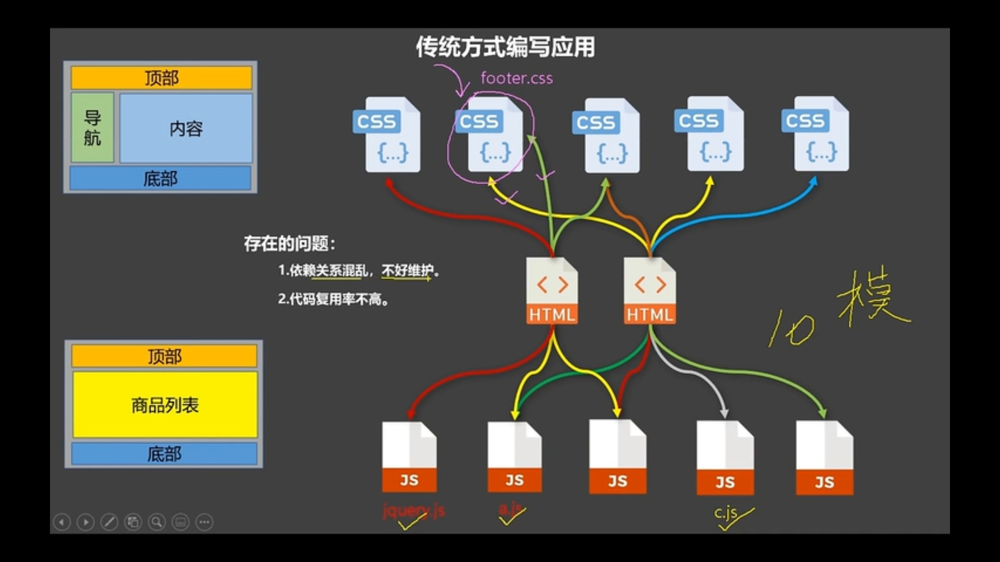
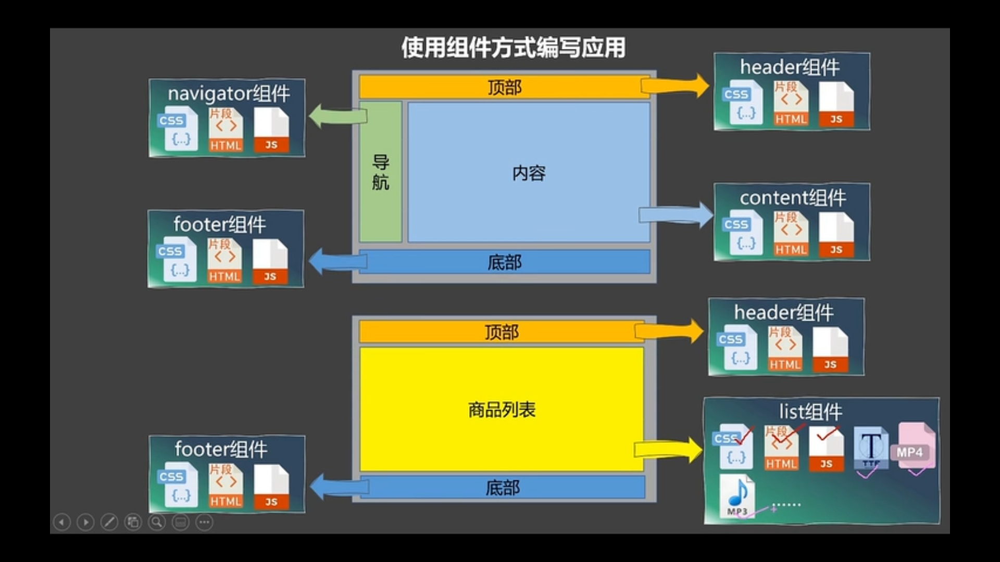

## 生命週期/生命週期鉤子/生命週期回調函式

- 提供不同時機調用函數的時機
- 生命週期的 this 是指 Vue 實例 或元件

### 創建流程

- new Vue()
- Init Event & LifeCycle
  - 初始化生命週期、事件，但數據代理還未開始
- `beforeCreate`
  - 無法透過 vm 訪問到 data 跟 methods，數據監測、數據代理前
- Init injections & reactivity
  - 初始化數據監測、數據代理
- `created`
  - 此時可以透過 vm 訪問到 data 跟 methods

=== 編譯模板生成虛擬 DOM（記憶體)

- Has el option?
  - -> Yes: continue
  - -> No: when vm.$mount(el) is called, or stop
- Has template options?
  - -> Yes: compile template into render funtion
  - -> No: compile el's outer HTML as template
    === 頁面還不能顯示解析好的內容

### 掛載流程

- `beforeMount`
  - 頁面呈現的是未經 Vue 編譯的 DOM
  - 所有對 DOM 的操作最終都不奏效

- `Create` 
  - vm.$Set and replace `el` with it
  - 將記憶體中的虛擬 DOM 轉為真實 DOM 插入頁面

- `mounted` 常用
  - 頁面中呈現的是經過 Vue 編譯的 DOM
  - 對 DOM 的操作均有效(盡量避免)
  - 至此初始化過程結束，一般在此進行：啟動定時器，發送 ajax 網路請求，訂閱消息，綁定自定義事件等初始化操作

### 資料更新流程
- `beforeUpdate`
  - 此時資料是新的，但頁面是舊的（頁面跟資料還未同步）
  - Virtual DOM re-render and patch
- `updated`
  - 資料是新的，頁面也是新的（兩者同步）

### 銷毀流程

- when vm.$destroy() is called
- `beforeDestroy` 常用
  - 不會在這邊操作資料，方法會執行，資料會改變，但不觸發更新流程重新渲染畫面
  - 此時 vm 中所有的 data methods 指令等等都處於可用狀態，馬上要執行銷毀過程。一般都在此階段：銷毀定時器、取消訂閱消息、解除綁定自定義事件等
- teardown watchers, child components and event listeners
- `destroyed`

  - 銷毀後自定義事件失效但 DOM 原生事件有效

## 元件

- 是實現應用中局部功能程式碼和資源的集合
- 解決依賴關係混亂不好維護的問題
- 程式碼複用率不高

  

  

### 模組化跟元件化

- 模組：一個 JavaScript 檔案，複用程式碼
- 元件：特定功能的 HTML/CSS/JS 集合，複用程式碼
- 模組化：應用程式的邏輯都拆成模組
- 元件化：應用程式的功能都拆成元件
- 頁面元件: 一個檔案中包含多個元件
- 元件: 一個檔案只有一個元件

### 定義元件(創建)

- Vue.extend(option)，其中 options 和 new Vue(options)相似
- 差別在不用寫 el，元件被 vm 管理(未來可以被很多地方引用，非特定容器 DOM 元素)
- data 需要寫成函式，避免被複用的時候資料存在 ref 引用關係
- 若 data 寫成物件形式，引用的資料會彼此影響(沒有閉包)

### 註冊元件

- 局部註冊: 在 new Vue 時傳入 components 選項
- 全域註冊: Vue.component('元件名', 元件) e.g.Vue.component('school', school)

### 使用元件(使用元件標籤)

- <school></school>
- 元件名稱多個單字時，模板寫 kebab-case: my-school
- 不能撞名既有 html 元素名
- 定義元件時可以用 name 配置開發者工具顯示的名稱，沒有的話就會抓父層註冊的名稱(不好維護)
- const school = Vue.extend(options) 可簡寫成 const school = options
- VueCLI 模板可以寫 camel-case: mySchool，還有自閉合標籤 <my-school/>非 VueCLI 無法

```html
<body>
  <div>
    <!-- step3. 使用元件 -->
    <my-school />
    <my-school />
  </div>
</body>

<script>
  // or step 2-2: 全域註冊
  Vue.component('school', school)

  // step2-1: 註冊元件
  new Vue({
    el: '#root',
    components: {
      // 方法1
      'my-school':s
      // 方法2
      MySchool: 2
    }
  })

  // step1: 定義元件
  const s = Vue.extend({
    name: 'SCHOOL',
    template: `
    <div>
      <h2>{{ schoolName }}</h2>
      <h2>{{ address }}</h2>
    </div>
    `,
    data () {
      return {
        schoolName:'King',
        address: 'Cool street 2F'
      }
    }
  })

  // const school = Vue.extend({
  //   data: {
  //     schoolName:'King',
  //     address: 'Cool street 2F'
  //   }
  // })
</script>
```

### 元件嵌套

- vm 下面有一個 APP 元件，APP 元件裡面嵌套不同元件，vm 控制各元件出現時機
- 元件中套元件，父子結構，子元件註冊在父層

### VueComponent

- 元件本身是一個 VueComponent 的構造函式，由 Vue.extend 產生，非自己定義
- 使用<school/> or <school></school>，Vue 都會 new VueComponent 創建一個實例
- 每次調用 Vue.extend 都會是一個獨立的 VueComponent(閉包)
- 元件配置中的 this：data/methods/watch/computed 裡面的 this 都是 VueComponent 實例(元件實例 vc)
- new Vue(options)的 this: data/methods/watch/computed 裡面的 this 都是 Vue 實例(vm)
- vm 可以寫 el 配置容器，vc 不行；vm 的 data 可以寫成物件跟函式形式，vc 只能寫函式形式

### 重要的內置關係

- VueComponent.prototype.**proto** === Vue.prototype
- 為什麼要有這個關係：讓 vc 元件實例可以訪問 Vue 圓形上的屬性方法

```js
function Demo() {
  this.a = 1
  this.b = 2
}

const d = new Demo()

console.log(Demo.prototype) // 構造函式顯示原型屬性
console.log(d.__proto__) // 實例隱式原型屬性
console.log(d.__proto__ === Demo.prototype) // true

// 透過顯示圓形屬性操作原型物件，追加x屬性值為99
Demo.prototype.x = 99
console.log(d.__prototype__.x) // 99
console.log(d.x) // 99
console.log(d) // Demo {a: 1, b: 2} 實例

// 元件可以透過原型鏈訪問到Vue的屬性，若沒有最後會看Object的
Vue.prototype.y = 100
console.log(d.__prototype__.y) // 100
```

### 資料夾檔案結構

- 元件檔名大寫駝峰 Student.vue

```html
<template>
  <!-- 元件結構 -->
  <div>...</div>
</template>

<script>
  //  元件資料跟方法邏輯
  export default {
    name: 'Student',
    data() {
      return {
        name: 'john'
        address: 'cool street 2F'
      }
    },
    methods: {
      showName(){
        console.log(this.name)
      }
    }
  }
</script>

<style>
  /*  元件樣式  */
</style>
```

- App.vue 必要元件

```html
<template>
  <!-- 元件結構 -->
  <Student />
</template>

<script>
  //  元件資料跟方法邏輯
  import Student from './Student'
  export default {
    name: 'App',
    components: {
      Student,
    },
  }
</script>

<style>
  /*  元件樣式  */
</style>
```

- 入口文件 src/main.js

```js
// 引入 APP import 瀏覽器不認識會需要VueCLI
import Vue from 'vue'
import App from './App.vue'
new Vue({
  el: '#app',
  render: (h) => h(App),
})
// 這邊無法解析template
```

- 容器 index.html

```html
<head> </head>

<body>
  <div id="app"></div>
</body>
```

## VueCli

### 基本操作

- 安裝: npm i -g @vue/cli
- 建立專案: vue create 專案名
- cd 進入專案資料夾
- 開啟 server: npm run serve

### 資料夾結構

- public/index.html: 主頁面
- src/assets: 靜態資源
- src/component: 元件
- src/App.vue: 彙整所有元件
- babel.config.js: ES6 -> ES5
- package.json:
  - serve 開發
  - build 瀏覽器打包
  - lint 語法檢查
- package-lock.json:
  - 鎖死當時下載的版本，避免更新到最新版
- vue.config.js:
  - 使用 vue inspect > output.js 可以查看 VueCLI 默認配置
  - 使用 vue.config.js 可以進行客製化設定

### npm run serve

- src/main.js: 引入精簡版 vue -> 引入 app -> 產出 vue 實例
- App.vue: 引入元件/放入容器

```html
<!-- 針對IE的一個特殊配置 讓IE以最高渲染級別渲染 -->
<meta http-equiv="x-ua-compatible" content="ie=edge" />
<!-- mobile的理想窗口 -->
<meta name="viewport" content="width=device-width, maximum-scale=1.0" />
<!-- 網頁標題 -->
<title><%= htmlWebpackPlugin.options.title %></title>
<!-- favicon -->
<link rel="icon" type="image/png" href="/static/favicon.ico" />
<!-- 瀏覽器不支持JS noscript會被渲染 -->
<noscript>sorry...</noscript>
<!-- container -->
<div id="app"></div>
```

### render 函式

- import Vue from vue 是 vue 模組裡的"module":"dist/vue.runtime.esm.js" 精簡版核心 VUe
- 不具有解析模板功能，無法使用 template，所以要搭配 render 函式接收到的 createElement 函式去指定內容
- 精簡版沒有解析模板功能，因為 webpack 打包後用不到(Vue 都解析成 JS 了)

## ref 屬性

- 註冊引用 HTML 元素或子元件（id 的替代者）
- 獲取真實 DOM 元素，ref 元件標籤獲取 vc
- 多個 ref 會是陣列，要選取對應的對象

```html
<!-- template​ -->
<!-- element  -->
​
<h1 ref="xxx">.....</h1>
​​
<!-- vc -->
<School ref="xxx"></School>​​
```

```js
// JS
this.$refs.xxx​​
```

### props 讓元件接收外部傳過來的資料

- props 的資料不可被修改，可以透過 data 作轉換
- 傳遞資料

```html
<!-- 冒號後裡的""是表達式，沒有冒號的是字串 -->
<Demo name="xxx" :age="ooo"></Demo>
```

- 接收資料

```js
data () {
  return {
    myName: this.name
  }
}

// 無限制寫法
props: ['name', 'age']

// 限制特定類型
props: {
  name: Number
}

// 限制類型跟必要性跟預設值
props: {
  name: {
    type: String,
    required: true
    default: '預設值名'
  }
}
```

## mixin 複用方法

### 局部混合

```js
// mixin.js
export const addCount {
  methods: {
    addCount() {
      console.log('add')
    }
  },
  mounted: {
    console.log('mounted')
  }
}

export const alertError {
  methods: {
    alertError() {
      alert('alert!!!')
    }
  },
}
```

- 引入 mixin

```js
import { addCount, alertError } from './../mixin'

export default {
  name: '',
  mixins: [addCount, alertError],
  data () {
    ...
  },
}
```

### 全域混合

```js
// main.js
import Vue from 'vue'
import App from './App.vue'

import { addCount, alertError } = './mixin'

Vue.mixin(addCount)
Vue.mixin(alertError)
```

- 元件內不用引入，可以直接呼叫方法

## plugin.js 外掛

- 包含 install 方法的一個物件
- install 的第一個參數是 Vue，第二個之後的參數是外掛使用者傳遞的資料
- 定義外掛

```js
obj.install = function (Vue, options) {}
```

```js

export const obj = {
  install (Vue, x, y, z) {
    console.log(Vue, x, y, z)
    // 1. 加入全域過濾器
    Vue.filter(....)
    // 2. 加入全域指令
    Vue.directive(....)
    // 3. 配置全域mixin
    Vue.mixin(....)
    // 4. 加入實例方法
    Vue.prototype.$myMethod = function () {...}
    Vue.prototype.$myProperty = xxxx
  }
}
```

- 引入並使用外掛

```js
// main.js
import Vue from 'vue'
import App from './App.vue'
import plugins from './plugins'

Vue.use(plugins)
```

## scoped style

- 局部限制防止樣式衝突
- lang 可選擇 css/less/stylus 等預處理器
- 若 npm i less-loader 會遇到 vue 支援 webpack4 還沒 5，所以 error
- `npm view webpack version` 可以看到所有版本
- `npm view less-loader version`
- `npm i less-loader@7`

```js
<style scoped lang='less'></style>
```

## Todolist 元件化流程

### 拆分靜態元件

- 元件要按照功能拆分，考慮結構樣式，命名不要跟 HTML 元素撞名(e.g. MyFooter.vue/ MyHeader.vue/ MyItem.vue / MyList.vue)
- MyList(v-for MyItem) / MyItem.vue / 先把寫死的資料改成 script 資料渲染出來的

### 實現動態元件

- 考慮好資料的存放位置，是一個元件在用，還是一些元件在用
- 資料的類型[], {}跟存儲名稱(在前端或後端都好辨識)
  - 一個元件在用：放在元件自身即可
  - 一些元件在用：放在共同的的父元件上（狀態提升）
- 實現互動：綁定事件操作
  - MyHeader 把輸入框 enter 後建立一個物件傳給 MyList
  - App 控制清單數量增減，把 APP 父層的方法當作參數傳給 MyList，傳給 MyItem，當 li 有變化就會回傳 id 執行父層方法做資料增減
  - li 不透過 v-modal 來做勾選 checked 的狀態顯示，因為單向資料流，不建議子層去修改 props 資料
  - MyFooter 已完成跟全部數量用 computed 屬性呈現，當沒有內容不顯示打勾，也不顯示這個區塊
  - MyFooter 下方打勾全選，全部都會打勾，可以用 v-modal 來獲取狀態傳給 APP 修改清單狀態
  - MyFooter 全部清除
  - 保存資料到本地端 localStorage，不要每一個 CRUD 都做本地存處的操作，而是用 watch 監測資料有改變時做更新，若物件屬性會變化記得開啟深度監測
  - 初始值一開始可以取看看 local 的，若沒有再拿資料裡面的預設值

```html
<!-- APP -->
<template>
  <div>
    <div class="todo-container">
      <div class="todo-wrap">
        <MyHeader :addTodo="addTodo" />
        <MyList
          :todos="todos"
          :checkTodo="checkTodo"
          :deleteTodo="deleteTodo"
        />
        <MyFooter
          :todos="todos"
          :checkAllTodo="checkAllTodo"
          :clearAllTodo="clearAllTodo"
        />
      </div>
    </div>
  </div>
</template>

<script>
  import MyHeader from './components/MyHeader'
  import MyList from './components/MyList'
  import MyFooter from './components/MyFooter'
  export default {
    name: 'App',
    components: {
      MyHeader,
      MyList,
      MyFooter
    },
    data(){
      return {
        todos: JSON.parse(localStorage.getItem('todos')) || [
          {id: '001', title: '抽菸', done: true},
          {id: '002', title: '喝酒', done: false},
          {id: '003', title: '開車', done: true}
        ]
      }
    },
    methods: {
      addTodo(todoObj){
        this.todos.unshift(data)
      },
      // 單個勾選或取消勾選
      checkTodo(id){
        this.todos.forEach( todo => {
          if(todo.id === id) todo.done = !todo.done
        })
      }
      // 刪除一個todo
      deleteTodo(id){
        this.todos = this.todos.filter(todo => todo.id !== id)
      }
      // 全部勾選或取消
      checkAllTodo(done){
        this.todos.forEach(todo => {
          todo.done = done
        })
      },
      // 清除所有事項
      clearAllTodo(){
        this.todos = this.todos.filter(todo=>{
          return !todo.done
        })
      }
    },
    watch: {
      todos(value){
        localStorage.setItem('todos', value)
      },
      deep: true
    }
  }
</script>
```

```html
<!-- MyHeader -->
<template>
  <div class="todo-header">
    <input
      v-modal="title"
      type="text"
      placeholder="請輸入代辦事項後enter"
      @keyup.enter="add()"
    />
  </div>
</template>

<script>
  import { nanoid } from 'nanoid'
  export default {
    name: 'MyHeader',
    props: ['addTodo'],
    data() {
      return {
        title: ''
      }
    }
    methods: {
      add(){
        // 檢驗輸入是否為空
        if(!this.title.trim()) return alert('輸入不能為空')
        // 將輸入變成一個todo obj
        const todoObj = {
          // 安裝 npm i nanoid
          id: nanoid(),
          title: this.title,
          done: false
        }
        this.addTodo(todoObj)
        // 輸入清空
        this.title=''
      },
    }
  }
</script>
```

```html
<!-- MyList -->
<template>
  <ul class="todo-main">
    <MyItem
      v-for="todoObj in todos"
      :key="todoObj.id"
      :todo="todoObj"
      :checkTodo="checkTodo"
      :deleteTodo="deleteTodo"
    />
  </ul>
</template>
<script>
  import MyItem from './MyItem'

  export default {
    name: 'MyList',
    components: { MyItem },
    props: ['todos', 'checkTodo', 'deleteTodo'],
  }
</script>
```

```html
<!-- MyItem -->
<template>
  <li>
    <label>
      <input
        type="checkbox"
        :checked="todo.done"
        @change="handleCheck(todo.id)"
      />
      <span>{{todo.title}}</span>
    </label>
    <button class="btn btn-danger" @click="handleDelete">刪除</button>
  </li>
</template>

<script>
  export default {
    name: 'MyItem',
    props: ['todos', 'checkTodo', 'deleteTodo'],
    methods: {
      handleCheck(id) {
        // 通知APP元件將對應todo done值取反
        // 子元件不建議直接針對父層props資料修改
        this.checkedTodo(id)
      },
      // 不使用delete 避免用到保留字
      handleDelete(id) {
        if (confirm('確定刪除嗎')) {
          this.checkTodo(id)
        }
      },
    },
  }
</script>
```

```html
<!-- footer -->
<template>
  <div class="todo-footer" v-show="total">
    <label>
      <input type="checkbox" v-modal="isAll" />
    </label>
    <span> 已完成{{doneTotal}} </span>
    <span> 全部{{total}} </span>
    <button class="btn btn-danger" @click="clearAll">清除已完成任務</button>
  </div>
</template>
<script>
  export default {
    name: 'Myfooter',
    props: ['todos', 'checkAllTodo', 'clearAllTodo'],
    methods:{
      clearAll(){
        this.todos
      }
    }
    computed: {
      total() {
        return this.todos.length
      },
      doneTotal() {
        return this.todos.reduce((pre, todo) => pre + (todo.done ? 1 : 0), 0)
      },
      isAll: {
        get(){
          return this.doneTotal= === this.total && this.total > 0
        },
        set(value){
          this.checkAllTodo(value)
        }
      },
      clearAll(){
        this.clearAllTodo()
      }
    }
  }
</script>
```

### 父傳子：props

- 父元件 ==> 子元件 props 資料
- 父元件 props 方法==> 子元件接收 props ==> 子元件觸發 props 方法 (不方便，還需要子層接收)

```html
<!-- 父 School -->
<School :getSchoolName="getSchoolName"></School>

<script>
  methods: {
    getSchoolName(name){
      console.log(name)
    }
  }
</script>
```

```html
<!-- 子 Student-->
<button @click="sendSchoolName"></button>

<script>
   ...
  data() {
     return {
       name: 'Sarah'
     }
   },
   methods: {
     sendSchoolName(name){
       this.getSchoolName(name)
     }
   }
</script>
```

### 使用 v-model 注意

- v-model 綁定的值不能是 props 傳過來的值，因為 props 不能修改
- props 傳過來的若是物件類型的值，修改物件屬性時不會報錯但不建議這樣做

## webStorage

- 儲存内容大小一般支持 5MB 左右（不同瀏覽器不一定一樣）
- 瀏覽器用 Window.sessionStorage 和 Window.localStorage 屬性來實作
- xxx: local 不會隨著分頁關閉而消失，使用者清空暫存跟呼叫相關 API 會消失
- xxx: session 隨著分頁關閉而消失
- 這邊的 session 是指前端瀏覽器的分頁，跟 server 的 session 無關

### xxxStorage.setItem('key', 'value')

- 會把 key 值跟對應 Value 存到 xxxStorage
- key 存在會更新 value
- 會把資料轉成字串.toString()再存
- 物件(陣列)需要先 JSON.stringify(obj)再存

### xxxStorage.getItem('key')

- 獲取 key 對應的 value
- 轉成字串的物件(陣列)需要轉回 JS 物件，JSON.parse(xxxStorage.getItem('key'))
- JSON.parse(null)的結果依然是 null
- xxxxxStorage.getItem(xxx)若 xxx 對應的 value 讀取不到，getItem 的回傳值是 null

### xxxStorage.removeItem('key')

- 刪除 key 對應的 value

### xxxStorage.clear()

- 刪除所有 key value pair

## 子傳父：元件的自定義事件

- 子元件 this.$emit(資料) ===> 父元件
- 子元件傳資料給父元件，就要在父元件中给<子元件>綁定自定義事件（事件的 callback 在父元件中）
- step1: 父元件綁定自定義事件

  - 方法 1: @事件名="父層方法名" 沒有 props 任何東西，只是 pointer

  ```html
  <!-- 父 -->
  <Student @atguigu="demo" />

  <script>
    data() {
      return {
        name: 'sarah'
      }
    }
    methods: {
      sendStudentName(){
        this.$emit('atguigu', this.name)
      }
    }
  </script>
  ```

  - 方法 2: mounted，裡面執行 this.$refs.xxx.$on('atguigu',callback)
  - 非同步把事件掛載到 ref 到的元素.$on('事件名稱', this.執行方法名)

  ```html
  <!-- 父 -->
  <Student ref="student" />

  <script>
    mounted(){
      this.$refs.student.$on('atguigu', this.demo)
      this.$refs.student.$once('atguigu', this.demo)
    },
    methods: {
      getStudentName(name, ...params){
        console.log(name)
      }
    }
  </script>
  ```

- step2: 子元件觸發自定義事件
  ```js
  <script>
  data () {
    name: 'sarah'
  },
  methods: {
    demo(name){
      this.$emit('atguigu', this.name, a, b, c)
    }
  }
  </script>
  ```
- 若希望自定義事件只觸發一次，可以使用 @自定義事件.once
- 在哪裏綁定，在哪裡解綁
- 解綁單個自定義事件在 methods 裡寫一個方法，執行 this.$off('atguigu')
- 解綁多個自定義事件在 methods 裡寫一個方法，執行 this.$off(['atguigu','abc'])
- 解綁所有自定義事件在 methods 裡寫一個方法，執行 this.$off()
- 解綁所有自定義事件在 methods 裡寫一個方法，執行 this.$destroy() 把當前 vc 銷毀，所以自定義事件都沒用了
- 元件上也可以綁定原生 DOM 事件需要使用 native 修飾符@click.native，
- 綁定自定義事件時，callback 需要寫在 methods 中，或用箭頭函式，否则 this 指向會有問題！

### 改寫

```html
<!-- APP -->
<template>
  <div>
    <div class="todo-container">
      <div class="todo-wrap">
        <!--  :addTodo to @addTodo -->
        <MyHeader @addTodo="addTodo" />
        <MyList
          :todos="todos"
          @checkTodo="checkTodo"
          @deleteTodo="deleteTodo"
        />
        <!--  :to @-->
        <MyFooter
          :todos="todos"
          @checkAllTodo="checkAllTodo"
          @clearAllTodo="clearAllTodo"
        />
      </div>
    </div>
  </div>
</template>

<script>
  import MyHeader from './components/MyHeader'
  import MyList from './components/MyList'
  import MyFooter from './components/MyFooter'
  export default {
    name: 'App',
    components: {
      MyHeader,
      MyList,
      MyFooter
    },
    data(){
      return {
        todos: JSON.parse(localStorage.getItem('todos')) || [
          {id: '001', title: '抽菸', done: true},
          {id: '002', title: '喝酒', done: false},
          {id: '003', title: '開車', done: true}
        ]
      }
    },
    methods: {
      addTodo(todoObj){
        this.todos.unshift(data)
      },
      // 單個勾選或取消勾選
      checkTodo(id){
        this.todos.forEach( todo => {
          if(todo.id === id) todo.done = !todo.done
        })
      }
      // 刪除一個todo
      deleteTodo(id){
        this.todos = this.todos.filter(todo => todo.id !== id)
      }
      // 全部勾選或取消
      checkAllTodo(done){
        this.todos.forEach(todo => {
          todo.done = done
        })
      },
      // 清除所有事項
      clearAllTodo(){
        this.todos = this.todos.filter(todo=>{
          return !todo.done
        })
      }
    },
    watch: {
      todos(value){
        localStorage.setItem('todos', value)
      },
      deep: true
    }
  }
</script>
```

```html
<!-- MyHeader -->
<template>
  <div class="todo-header">
    <input
      v-modal="title"
      type="text"
      placeholder="請輸入代辦事項後enter"
      @keyup.enter="add"
    />
  </div>
</template>

<script>
  import { nanoid } from 'nanoid'
  // no need props
  export default {
    name: 'MyHeader',
    data() {
      return {
        title: ''
      }
    }
    methods: {
      add(){
        if(!this.title.trim()) return alert('輸入不能為空')
        const todoObj = {
          id: nanoid(),
          title: this.title,
          done: false
        }
        // here
        this.$emit('addTodo', todoObj)
        this.title=''
      },
    }
  }
</script>
```

```html
<!-- footer -->
<template>
  <div class="todo-footer" v-show="total">
    <label>
      <input type="checkbox" v-modal="isAll" />
    </label>
    <span> 已完成{{doneTotal}} </span>
    <span> 全部{{total}} </span>
    <button class="btn btn-danger" @click="clearAll">清除已完成任務</button>
  </div>
</template>
<script>
  export default {
    name: 'Myfooter',
    props: ['todos'],
    methods:{
      clearAll(){
        this.todos
      }
    }
    computed: {
      total() {
        return this.todos.length
      },
      doneTotal() {
        return this.todos.reduce((pre, todo) => pre + (todo.done ? 1 : 0), 0)
      },
      isAll: {
        get(){
          return this.doneTotal= === this.total && this.total > 0
        },
        set(value){
          this.$emit('checkAllTodo', value)
        }
      },
      clearAll(){
        this.$emit('clearAllTodo')
      }
    }
  }
</script>
```

## 全域事件（GlobalEventBus）

- 讓任意元件傳遞資料：適合距離遠的上下關係或是兄弟
- 全域事件需要所有 vc 都可以看得見: 利用 Vue 的原型鏈(Vue.prototype)，vc 若找不到會往上一直找方法到物件
- 傳遞數據元件需要具備調用 $on $off $emit: 利用 beforeCreate（數據代理跟劫持都還沒有完成）綁定 this 即可

```js
// 概念嘗試
// 所有VC都是Vue Component構造函式生成的，放到VC原型上
// VueComponent.prototype.x = {a:1,b:2} => 會報錯
// 每次new Vue.extend出來的 VueComponent 都是一個全新元件

// main.js
const Demo = Vue.extend({}) // Vue.extend是Vue Component構造函式
const d = new Demo() // 創建一個Vue Component實例 一般是寫標籤時<Demo>創建

Vue.prototype.x = d // 原型鏈綁上Vue Component vc可以調用$on $off $emit

// 元件
methods: {
  sendSchoolName () {
    this.x.$emit('hello', 666)
  }
}

```

- 缺點：不能撞名，銷毀元件前需要先把$bus 銷毀，避免佔用記憶體

```js
// main.js
const vm = new Vue({
  el: '#app',
  render: (h) => h(App),
  beforeCreate() {
    // 安装全域事件總線 $bus 就是當前應用的vm
    Vue.prototype.$bus = this
  },
})
```

- 使用$EventBus接收資料讓元件 A 接收資料，在 A 元件中给$bus;綁定自定義事件，callback 放在 A 元件身上

```js
<script>
export default {
  methods(){
    demo(data){
      ......
    }
  }
  mounted() {
    this.$bus.$on('xxxx',this.demo)
  }
}
</script>
```

- 提供資料：this.$bus.$emit('xxxx',資料)
- 最好在 beforeDestroy 中，用$off 去解綁當前元件所用到的事件
- 原本透過 APP 傳到 item 的方法跟資料，改寫成$bus

```html
<!-- APP -->
<template>
  <div>
    <div class="todo-container">
      <div class="todo-wrap">
        <MyHeader @addTodo="addTodo" />
        <!-- no need pass methods -->
        <MyList :todos="todos" />
        <!--  :to @-->
        <MyFooter
          :todos="todos"
          @checkAllTodo="checkAllTodo"
          @clearAllTodo="clearAllTodo"
        />
      </div>
    </div>
  </div>
</template>

<script>
  import MyHeader from './components/MyHeader'
  import MyList from './components/MyList'
  import MyFooter from './components/MyFooter'
  export default {
    name: 'App',
    components: {
      MyHeader,
      MyList,
      MyFooter
    },
    data(){
      return {
        todos: JSON.parse(localStorage.getItem('todos')) || [
          {id: '001', title: '抽菸', done: true},
          {id: '002', title: '喝酒', done: false},
          {id: '003', title: '開車', done: true}
        ]
      }
    },
    mounted () {
      this.$bus.$on('checkTodo', this.checkTodo)
      this.$bus.$on('checkTodo', this.deleteTodo)
    },
    destroy () {
      this.$bus.$off('checkTodo', this.checkTodo)
      this.$bus.$off('checkTodo', this.deleteTodo)
    }
    methods: {
      addTodo(todoObj){
        this.todos.unshift(data)
      },
      // 單個勾選或取消勾選
      checkTodo(id){
        this.todos.forEach( todo => {
          if(todo.id === id) todo.done = !todo.done
        })
      }
      // 刪除一個todo
      deleteTodo(id){
        this.todos = this.todos.filter(todo => todo.id !== id)
      }
      // 全部勾選或取消
      checkAllTodo(done){
        this.todos.forEach(todo => {
          todo.done = done
        })
      },
      // 清除所有事項
      clearAllTodo(){
        this.todos = this.todos.filter(todo=>{
          return !todo.done
        })
      }
    },
    watch: {
      todos(value){
        localStorage.setItem('todos', value)
      },
      deep: true
    }
  }
</script>
```

```html
<!-- MyList -->
<template>
  <ul class="todo-main">
    <MyItem
      v-for="todoObj in todos"
      <!-- 刪除傳遞的方法 -->
      :key="todoObj.id"
      :todo="todoObj"
    />
  </ul>
</template>
<script>
  import MyItem from './MyItem'

  export default {
    name: 'MyList',
    components: { MyItem },
    props: ['todos'],
  }
</script>
```

```html
<!-- MyItem -->
<template>
  <li>
    <label>
      <input
        type="checkbox"
        :checked="todo.done"
        @change="handleCheck(todo.id)"
      />
      <span>{{todo.title}}</span>
    </label>
    <button class="btn btn-danger" @click="handleDelete">刪除</button>
  </li>
</template>

<script>
  export default {
    name: 'MyItem',
    props: ['todos'],
    methods: {
      handleCheck(id) {
        // 通知APP元件將對應todo done值取反
        // 子元件不建議直接針對父層props資料修改
        this.$bus.$emit('checkTodo', id)
      },
      // 不使用delete 避免用到保留字
      handleDelete(id) {
        if (confirm('確定刪除嗎')) {
          this.$bus.$emit('deleteTodo', id)
        }
      },
    },
  }
</script>
```

## 消息訂閱與發佈 pubsub:

- 任意元件傳遞資料的另一種方式
- 第三方函式庫的事件無法從開發者工具看到過程
- 安裝 pubsub：npm i pubsub-js
- 引入 import pubsub from 'pubsub-js'
- 訂閱者接收資料：訂閱的函式 this.pid = pubsub.subscribe('xxx',this.demo)
- 被訂閱者提供資料：pubsub.publish('xxx',data)
- beforeDestroy 裡面，用 pubSub.unsubscribe(pid)取消訂閱，類似刪除定時器的方式

```js
<script>
export default {
  methods: {
    demo(data){
    }
  },
  mounted() {
    this.pid = pubsub.subscribe('xxx',this.demo) // 訂閱
  }
}
</script>
```

- School 需要 Student 數據的元件，School 訂閱 Student

```html
<!-- 父 School-->
<Student ref="student" />

<script>
  import pubsub from 'pubsub-js'
  export default {
    mounted() {
      // msgName是發布的事件名稱 data在第二個參數，這邊的this如果用一般函式呼叫會是undefined
      // this.pubId = pubsub.subscribe('hello', function (msgName, data) {
      //   console.log('訂閱：有人發布hello 執行hello的callback', msgName, data)
      // })

      // 改成寫在methods
      this.pubId = pubsub.subscribe('hello', this.demo)
    },
    beforeDestroy() {
      pubsub.unsubscribe(pubId)
    },
    methods: {
      demo(msgName, data) {
        // 這邊this會是vc
        console.log(
          '訂閱：有人發布hello 執行hello的callback',
          msgName,
          data,
          this
        )
      },
      getStudentName(name, ...params) {
        console.log(name)
      },
    },
  }
</script>
```

```html
<!-- 子 Student-->
<button @click="sendSchoolName"></button>

<script>
  import pubsub from 'pubsub.js'
  export default {
    data() {
      return {
        name: 'Sarah',
      }
    },
    methods: {
      sendSchoolName(name) {
        pubsub.publish('hello', name)
      },
    },
  }
</script>
```

- TodoList 刪除功能改成 pubsub

```html
<!-- App -->
<script>
  import pubsub from 'pubsub.js'
    export default {
    mounted () {
      this.pubId = pubsub.subscript('deleteTodo', this.deleteTodo)
    },
    methods:{
      // need add a params, a is name b is data
      deleteTodo(_, id){
        this.todos = this.todos.filter( todo => todo.id !== id)
      }
    }

    beforeDestroy() {
      pubsub.unsubscribe(this.pubId)
    }
  }
</script>

<!-- Item -->
<script>
  import pubsub from 'pubsub.js'
  export default {
    name: 'MyItem',
    props: ['todos', 'checkTodo', 'deleteTodo'],
    methods: {
      handleCheck(id) {
        // 通知APP元件將對應todo done值取反
        // 子元件不建議直接針對父層props資料修改
        this.checkedTodo(id)
      },
      // 不使用delete 避免用到保留字
      handleDelete(_, id) {
        if (confirm('確定刪除嗎')) {
          this.publish('deleteTodo', id)
        }
      },
    },
  }
</script>
```

- 修改 TodoList
- 需要有編輯模式的 input，且發生修改資料的時機點是失去焦點時
- 編輯時把編輯按鈕隱藏，編輯完內容為空不給更新
- 編輯時讓對應的事項 focus()，用 ref 捕獲元素

## this.$nextTick({ callback })

- 在下一次 DOM 更新結束後執行 callback
- 改變數據後需要等 DOM 更新進行操作(ref)，要在 nextTick 內執行 callback，setTimout 也可以達到一樣效果

```html
<template>
  <li>
    <label>
      <input
        v-show="todo.isEdit"
        type="checkbox"
        :checked="todo.done"
        @change="handleClick(todo.id)"
      />
      <span>{{ todo.title }}</span>
      <input
        v-show="!todo.isEdit"
        type="text"
        value="todo.title"
        @blur="handleBlur($event, todo.id)"
        ref="inputTitle"
      />
    </label>
    <button class="btn btn-danger" @click="handleClick(todo.id)">刪除</button>
    <button
      v-show="!todo.isEdit"
      class="btn btn-edit"
      @click="handleEdit(todo.id)"
    >
      編輯
    </button>
  </li>
</template>

<script>
  import pubsub from 'pubsub.js'
  export default {
    name: 'MyItem',
    props: ['todo'],
    methods: {
      handleClick(id) {
        this.$bus.$emit('checkTodo', id)
      },
      handleDelete(id) {},
      handleEdit(todo) {
        // 當有屬性才會走這條 不能用(todo.isEdit判斷 有可能有這屬性 但值是false)
        if (todo.hasOwnProperty('isEdit')) {
          todo.isEdit = true
          // 沒有馬上觸發重新解析模板
        } else {
          // 用$set增加屬性才會響應
          this.$set(todo, 'isEdit', true)
        }
        // 等所有函式都執行完 dom更新後執行
        this.$nextTick(() => {
          this.$refs.inputTitle.focus()
        })
      },
      // 失去焦點 若沒有這個方法，會把todo.isEdit狀態存到localStorage，刷新後還是在編輯
      handleBlur(event, todo) {
        todo.isEdit = false
        if (!e.target.value.trim()) return alert('輸入不能為空')
        // 觸發事件，但也需要在APP設定綁定事件
        this.$bus.$emit('updateTodo', todo.id, event.target.value)
      },
    },
  }
</script>

<!-- APP -->
<script>
  export default {
    mounted() {
      this.$bus.$on('updateTodo', this.updateTodo)
    },
    beforeDestroy() {
      this.$bus.$off('updateTodo')
    },
    methods: {
      updateTodo(id, title) {
        this.todos.forEach((todo) => {
          if (todo.id === id) todo.title = title
        })
      },
    },
  }
</script>
```

## Vue 封裝的 animation 與 transition

- Vue 會在插入/更新/移除 DOM 元素時動態切換 class
- Vue 不跟動畫溝通，而是樣式名稱
- 使用<transition>包裹要過度的元素並配置 name 屬性，在元素裡面有多個動畫才能找到對應的動畫，不然都會找 v-開頭的動畫

### 動畫實現效果

- 準備好進入的樣式跟離開的樣式，keyframes 的邏輯，用 transition 標籤把動畫元素包起來
  - v-enter：進入的起點
  - v-enter-active：進入過程中
  - v-enter-to：進入的終點
  - v-leave：離開
  - v-leave-active：離開過程中
  - v-leave-to：離開的終點
- 想一進入頁面馬上播放，加上一個 appear 屬性， 即:appear="true"
- 用動畫只要使用 v-enter-active v-leave-active 就可以

```html
<!-- 簡單寫一個元件 點擊顯示動畫-->
<template>
  <div>
    <button @click="isShow = !isShow">顯示/隱藏</button>
    <transition name="hello" appear>
      <h1 v-show="isShow">Hi</h1>
    </transition>
  </div>
</template>

<script>
  export default {
    name: 'Test',
    data() {
      return {
        isShow: true,
      }
    },
  }
</script>

<style scoped>
  h1 {
    background-color: orange;
  }
  /* 上方name="hello對應下方hello 寫 v-enter-active 若有自定義name 寫 name-enter-active*/
  .hello-enter-active {
    /* show動畫名 對應下方的keyframes show */
    animation: show 1s linear;
  }
  .hello-leave-active {
    /* show動畫名 對應下方的keyframes show */
    animation: show 1s linear reverse;
  }
  @keyframes show {
    from {
      transform: translateX(-100%);
    }
    to {
      transform: translateX(0px);
    }
  }
</style>
```

- 在 APP 裡面使用

```html
<!-- APP -->
<template>
  <div>
    <Test />
  </div>
</template>

<script>
  import Test from './components/Test'

  export default {
    name: 'App',
    components: {
      Test,
    },
  }
</script>
```

### 過度實現效果

- 需要寫完整的過程 v-enter / v-enter-to / v-leave / v-leave-to
- v-enter-active v-leave-active 的 transition 可以選擇寫在樣式或元素中
- 例如：選擇 H1 或.hello-enter-active, .hello-leave-active 加上過度 transition: 0.5s linear

```html
<style scoped>
  h1 {
    background-color: orange;
    /* 選擇誰變化誰加上過度 */
    /* transform: translateX(0) */
  }
  /* 進入起點 離開終點 */
  .hello-enter,
  .hello-leave-to {
    transform: translateX(-100%);
  }
  .hello-enter-active,
  .hello-leave-active {
    /* 動畫的時間跟速度 也可以選擇寫在h1*/
    transition: 0.5s linear;
  }
  /* 進入終點 離開起點 */
  .hello-enter-to,
  .hello-leave {
    transform: translateX(0);
  }
</style>
```

### transition-group

- <transition>標籤只能用在單個元素
- 多個元素(list)需要 transition，使用<transition-group>，且每個元素都要指定 key 值，不然會報錯

```html
<template>
  <div>
    <button @click="isShow = !isShow">顯示/隱藏</button>
    <transition-group name="hello">
      <h1 v-show="isShow" key="1">Hi</h1>
      <h1 v-show="isShow" key="2">How are you</h1>
    </transition-group>
  </div>
</template>
```

- 實現互斥效果，只會有一個出現

```html
<template>
  <div>
    <button @click="isShow = !isShow">顯示/隱藏</button>
    <transition-group name="hello" appear>
      <h1 v-show="!isShow" key="1">Hi</h1>
      <h1 v-show="isShow" key="2">How are you</h1>
    </transition-group>
  </div>
</template>
```

### animate.css 函式庫

- `npm i animate.css` or `yarn add animate.css`
- import 'animate.css'

```html
<template>
  <div>
    <button @click="isShow = !isShow" appear>顯示/隱藏</button>
    <!-- 配置name 就可以開始寫進入離開動畫-->
    <transition-group
      appear
      name="animate__animated animate__bounce"
      enter-active-class="animate__swing"
      leave-active-class="animate__backOutUp"
    >
      <h1 v-show="!isShow" key="1">Hi</h1>
      <h1 v-show="isShow" key="2">How are you</h1>
    </transition-group>
  </div>
</template>
```

- Todo 新增刪除都加上過度效果用 transition 包裹 li

```html
<template>
  <transition name="todo" appear>
    <li>
      <label>
        <input type="checkbox" :checked="todo.done" @change="handleCheck(todo.id)"/>
        <span v-show="!todo.isEdit">{{ todo.title }}</span>
        <input
          type="text"
          v-show="todo.isEdit"
          :value="todo.title"
          @blur="handleBlur(todo, $event)"
          ref="inputTItle"
        >
        <button>
      </label>
    </li>
  </transition>
</template>

<style scoped>
  h1 {
    background-color: orange
  }
  /* 上方name="hello對應下方hello 寫 v-enter-active 若有自定義name 寫 name-enter-active*/
  .todo-enter-active {
    /* show動畫名 對應下方的keyframes show */
    animation: show 1s linear;
  }
  .todo-leave-active {
    /* show動畫名 對應下方的keyframes show */
    animation: show 1s linear reverse;
  }
  @keyframes show {
    from {
      transform: translateX(-100%);
    }
    to {
      transform: translateX(0px);
    }
  }
</style>
```

- 改成 List 加上 transition

```html
<!-- MyList -->
<template>
  <ul class="todo-main">
    <transition-group name="todo" appear>
      <MyItem
        v-for="todoObj in todos"
        :key="todoObj.id"
        :todo="todoObj"
        :checkTodo="checkTodo"
        :deleteTodo="deleteTodo"
      />
    </transition-group>
  </ul>
</template>
```

## Vue Cli 配置代理

- axios 和 fetch 都是對 xhr 的封裝，走 Promise 風格
- fetch 回傳的數據包兩層 Promise，兼容性問題(IE 不能用)
- axios，支持請求攔截器響應攔截器，體積小，Vue 官方推薦
- `npm i axios`
- `import axios from 'axios'`

```html
<template>
  <div>
    <button @click="getStudents">獲取學生資訊</button>
  </div>
</template>

<script>
  import axios from 'axios'
  export default {
    name: 'App',
    methods: {
      getStudents() {
        // 沒加前綴的請求 會遇到CORS
        axios.get('http://localhost:8080/students').then(
          (response) => {
            console.log('請求成功了', response.data)
          },
          (error) => {
            console.log('請求失敗了', error.message)
          }
        )
      },
      getCars() {
        // 加了代理伺服器的前綴
        axios.get('http://localhost:8080/demo/cars').then(
          (response) => {
            console.log('請求成功了', response.data)
          },
          (error) => {
            console.log('請求失敗了', error.message)
          }
        )
      },
    },
  }
</script>
```

### CORS 瀏覽器跨域限制

- 通訊協議 https http/主機名/port 都需要一樣
- 跨域時發的出去，服務器收了，回傳了，但是瀏覽器不給
- 解法 1: server 寫特殊的 headers 讓瀏覽器知道是可以跨域給的資料
- 解法 2: jsonp 借助前端寫 script src，後端也需要配合，且只能解決 get 請求
- 解法 3: 配置代理服務器 Proxy server，跟前端位置一樣 port(像是仲介)，因為同域所以避開 CORS 問題，兩個 server 傳輸不會遇到瀏覽器卡資料

  - nginx 反向代理服務器（較難）
  - vue-cli 開啟代理服務器 devServer.proxy
    配置方法 1:

  ```js
  module.exports = {
    pages: {
      index: {
        entry: 'src/main.js',
      },
    },
    lintOnSave: false,
    // 代理服務器要轉發的對象
    devServer: {
      proxy: 'http://localhost:5000',
    },
  }
  ```

  - 更新完配置要重新 npm run serve
  - 請求的內容若代理服務器 Proxy server 有的檔案(public 資料夾)就不會重新發請求
  - 配置簡單，但無法配置多個代理，或彈性控制是否走代理，優先匹配前端資源

  配置方法 2:

  ```js
  module.exports = {
    pages: {
      index: {
        entry: 'src/main.js',
      },
    },
    lintOnSave: false,
    // 代理服務器要轉發的對象
    devServer: {
      proxy: {
        // 請求前綴，對應到前綴就走代理，轉發給5000
        // 不是走代理，請求就不加api
        '/someword': {
          target: 'http://localhost:5000',
          // 代理伺服器發給5000的時候不會把前綴也帶過去 配置前面 改成空字串
          pathRewrite: ('^/someword': ''),
          // 用於支持websocket
          ws: true,
          // 控制請求的host值
          // 8080轉給代理服務器8080 轉給5000 false是如實回答自己的位置，true是對方是哪裡我就是哪裡
          changeOrigin: true,
        },
        // 配置多個代理伺服器
        '/demo': {
          target: 'http://localhost:5001',
          pathRewrite: ('^/demo': ''),
          ws: true,
          changeOrigin: true,
        },
      },
    },
  }
  ```

  - 匹配所有前綴路徑，可以配置多個代理跟靈活控制是否走代理

### github 案例

- 使用到 Bootstrap，bootstrap.css 裡面有用到其他資源(字體)，把 css 檔案放到 public
- `<link rel="stylesheet" href="<%= BASE_URL %>css/bootstrap.css"`
- 搜尋 github 使用者，一個搜尋框跟列表
- 用 eventbus 傳遞 fetch 資料

```html
<!-- Search -->
<template>
  <section class="jumbotron">
    <h3 class="jumbotron-heading">Search Github Users</h3>
    <div>
      <input
        v-model="keyword"
        type="text"
        placeholder="enter the name you search"
      />
      <button @click="getUsers">Search</button>
    </div>
  </section>
</template>

<script>
  export default {
    name: 'search',
    data() {
      return {
        keyword: '',
      }
    },
    methods: {
      getUsers() {
        axios.get(`https://api.github.com/search/users?q=${this.keyword}`).then(
          (response) => {
            this.$bus.$emit('getUsers', response.data.items)
            console.log('請求成功', response.data.items)
          },
          (error) => {
            this.$bus.$emit('error', error.message)
          }
        )
      },
    },
  }
</script>
```

```html
<!-- list -->
<template>
  <div class="row">
    <div class="card" v-for="user in users" :key="user.id">
      <a :href="user.html_url" target="_blank">
        
      </a>
      <p class="card-text">{{user.login}}</p>
    </div>
  </div>
</template>

<script>
  export default {
    name: 'List',
    data() {
      return {
        users: [],
      }
    },
    mounted() {
      this.$bus.$on('getUsers', this.getUsers)
    },
    methods: {
      getUsers(users) {
        console.log(users, '收到數據')
        this.users = users
      },
    },
  }
</script>
```

```js
// main.js

import Vue from 'vue'
import APP from './APP.vue'

new Vue({
  el: '$app',
  render: (h) => h(App),
  beforeCreate() {
    Vue.prototype.$bus = this
  },
})
```

- 完善流程：welcome > loading > users or error

```html
<!-- Search -->
<template>
  <section class="jumbotron">
    <h3 class="jumbotron-heading">Search Github Users</h3>
    <div>
      <input
        v-model="keyword"
        type="text"
        placeholder="enter the name you search"
      />
      <button @click="getUsers">Search</button>
    </div>
  </section>
</template>

<script>
  export default {
    name: 'search',
    data() {
      return {
        keyword: '',
      }
    },
    methods: {
      getUsers() {
        // 請求前更新List
        this.$bus.$emit('updateUsers', {
          isLoading: true,
          errMsg: '',
          users: [],
          isFirst: false,
        })
        axios.get(`https://api.github.com/search/users?q=${this.keyword}`).then(
          (response) => {
            this.$bus.$emit('updateListData', {
              isLoading: true,
              errMsg: '',
              users: response.data.items,
            })
            console.log('請求成功', response.data.items)
          },
          (error) => {
            console.log('請求失敗', error)
          }
        )
      },
    },
  }
</script>
```

```html
<!-- list -->
<template>
  <div class="row">
    <!-- list -->
    <div class="card" v-for="user in users" :key="user.id">
      <a :href="user.html_url" target="_blank">
        
      </a>
      <p class="card-text">{{user.login}}</p>
    </div>
    <h1 v-show="info.isFirst">WELCOME!!</h1>
    <h1 v-show="info.isLoading">Loading...</h1>
    <h1 v-show="info.errMsg">{{errMsg}}</h1>
  </div>
</template>

<script>
  export default {
    name: 'List',
    data() {
      return {
        info: {
          isFirst: true,
          isLoading: false,
          errMsg: '',
          users: [],
        },
      }
    },
    mounted() {
      this.$bus.$on('updateListData', this.getUsers)
    },
    beforeDestroy() {
      this.$bus.$off('updateListData')
    },
    methods: {
      getUsers(dataObj) {
        console.log(dataObj, '收到數據')
        this.info = {
          ...this.info,
          ...dataObj,
        }
      },
    },
  }
</script>
```

- 也可以試試看 pubsub

## vue-resource

- 是一個外掛，使用 xhr 技術，另一種發出請求的方式
- `import vueResource from 'vue-resource`
- `Vue.resource(vueResource)`
- 使用後，在 vm 裡面會看到$http，axios改成this.$http

```js
<script>
  export default {
    name: 'search',
    data() {
      return {
        keyword: '',
      }
    },
    methods: {
      getUsers() {
        // 請求前更新List
        this.$bus.$emit('updateUsers', {
          isLoading: true,
          errMsg: '',
          users: [],
          isFirst: false,
        })
        // 這裏
        this.$http.get(`https://api.github.com/search/users?q=${this.keyword}`).then(
          (response) => {
            this.$bus.$emit('updateListData', {
              isLoading: true,
              errMsg: '',
              users: response.data.items,
            })
            console.log('請求成功', response.data.items)
          },
          (error) => {
            console.log('請求失敗', error)
          }
        )
      },
    },
  }
</script>
```

## v-slot 預設插槽
- 父元件==>子元件 插入html結構
- 如果直接在元素裡面放不同內容，Vue 解析時不確定該放在 DOM 哪裡
- 下方的三個動態結構是等 APP 完成解析後才放入<slot>裡面，如果想控制動態內容樣式，可以放在 APP，一起帶進去或是只傳結構，樣式寫在元素裡面套用

```html
<!-- 父 APP -->
<template>
  <div class="container">
    <!-- 要使用插槽的元素 -->
    <Category title="美食">
      <!-- 需要外層傳入的動態結構 -->
      
    </Category>

    <Category title="遊戲">
      <!-- 需要外層傳入的動態結構 -->
      <ul>
        <li v-for="(game,index) in games" :key="index">{{game}}</li>
      </ul>
    </Category>

    <Category title="電影">
      <!-- 需要外層傳入的動態結構 -->
      <video
        controls
        src="http://clips.vorwaerts-gmbh.de/big_buck_bunny.mp4"
      ></video>
    </Category>
  </div>
</template>

<script>
  import Category from './components/Category'
  export default {
    name: 'App',
    components: { Category },
    data() {
      return {
        foods: ['披薩', '漢堡'],
        games: ['植物大戰殭屍', '紅色警戒', '空洞騎士', '王國'],
        films: ['教父', '晚安']
      }
    },
  }
</script>

<style scoped>
  .container {
    display: flex;
    justify-content: space-around;
  }
</style>
```

- 需要用 slot 標示元件中的位置

```html
<!-- Category元件 -->
<template>
  <div class="category">
    <h3>{{title}}分類</h3>
    <!-- 定義一個插槽等待填充 -->
    <slot>預設內容</slot>
  </div>
</template>

<script>
  export default {
    name: 'Category',
    props: ['title'],
  }
</script>

<style scoped>
  .category {
    background-color: skyblue;
    width: 200px;
    height: 300px;
  }
  h3 {
    text-align: center;
    background-color: orange;
  }
  video {
    width: 100%;
  }
  img {
    width: 100%;
  }
</style>
```

### 具名 slot
- 舊寫法: 實際的元素後面寫 `slot ="要放入的插槽名"` <ul slot="center"> </ul>
- 新寫法: 只能使用在`template結構` <template v-slot:footer ></template>

```html
<!-- APP -->
<template>
  <div class="container">
    <Category title="美食">
      <!-- 要放的插槽名 -->
      
      <!-- 要放的插槽名 -->
      <a slot="footer" href="https://google.com">google</a>
    </Category>

    <Category title="遊戲">
      <!-- 要放的插槽名 -->
      <ul slot="center">
        <li v-for="(game,index) in games" :key="index">{{game}}</li>
      </ul>
      <template v-slot:footer>
        <a  href="https://www.google.com">google</a>
        <a  href="https://www.yahoo.com">google</a>
      </template>
    </Category>

    <Category title="電影">
      <div slot="center">
        <video
          controls
          src="http://clips.vorwaerts-gmbh.de/big_buck_bunny.mp4"
        ></video>
      </div>
    </Category>
  </div>
</template>

<script>
  import Category from './components/Category'
  export default {
    name: 'App',
    components: { Category },
    data() {
      return {
        foods: ['披薩', '漢堡'],
        games: ['植物大戰殭屍', '紅色警戒', '空洞騎士', '王國'],
        films: ['教父', '晚安']
      }
    },
  }
</script>

<style scoped>
  .container {
    display: flex;
    justify-content: space-around;
  }
</style>
```

```html
<!-- Category元件 -->
<template>
  <div class="category">
    <h3>{{title}}分類</h3>
    <!-- 定義一個插槽等待填充 -->
    <slot name="center">預設center內容</slot>
    <slot name="footer">預設footer內容</slot>
  </div>
</template>

<script>
  export default {
    name: 'Category',
    props: ['title'],
  }
</script>

<style scoped>
  .category {
    background-color: skyblue;
    width: 200px;
    height: 300px;
  }
  h3 {
    text-align: center;
    background-color: orange;
  }
  video {
    width: 100%;
  }
  img {
    width: 100%;
  }
</style>
```

### scope slot
- 結構在外層APP(插槽的使用者決定結構)，資料在元件插槽本身
- 用<slot :games="games" :msg="hello">把資料傳到父層
- 舊寫法scope="data"
- 新寫法slot-scope="data"
```html
<!-- APP -->
<template>
  <div class="container">
    <!-- 有序 -->
    <Category title="遊戲">
      <!-- 要放的插槽名 -->
      <template scope="data">
        <ol slot="center">
          <li v-for="(game,index) in data.games" :key="index">{{game}}</li>
        </ol>
      </template>
    </Category>
    <!-- 無序 -->
    <Category title="遊戲">
      <template scope="{ games, msg} ">
      <!-- 要放的插槽名 -->
        <ul slot="center">
          <li v-for="(game,index) in games" :key="index">{{game}}</li>
        </ul>
        <h4>{{msg}}</h4>
      </template>
    </Category>
    <!-- h4 -->
    <Category title="遊戲">
      <!-- 要放的插槽名 -->
      <template slot-scope="{games}">
        <h4 slot="center" v-for="(game,index) in data.games" :key="index">{{game}}</h4>
      </template>
    </Category>

  </div>
</template>

<script>
  import Category from './components/Category'
  export default {
    name: 'App',
    components: { Category },
    data() {
      return {
        games: ['植物大戰殭屍', '紅色警戒', '空洞騎士', '王國'],
      }
    },
  }
</script>

<style scoped>
  .container {
    display: flex;
    justify-content: space-around;
  }
</style>
```


```html
<!-- Category元件 -->
<template>
  <div class="category">
    <h3>{{title}}分類</h3>
    <!-- 外層可以接收到內層數據 -->
    <slot :games="games" :msg="hello">預設center內容</slot>
  </div>
</template>

<script>
  export default {
    name: 'Category',
    props: ['title'],
  }
</script>

<style scoped>
  .category {
    background-color: skyblue;
    width: 200px;
    height: 300px;
  }
  h3 {
    text-align: center;
    background-color: orange;
  }
  video {
    width: 100%;
  }
  img {
    width: 100%;
  }
</style>
```
