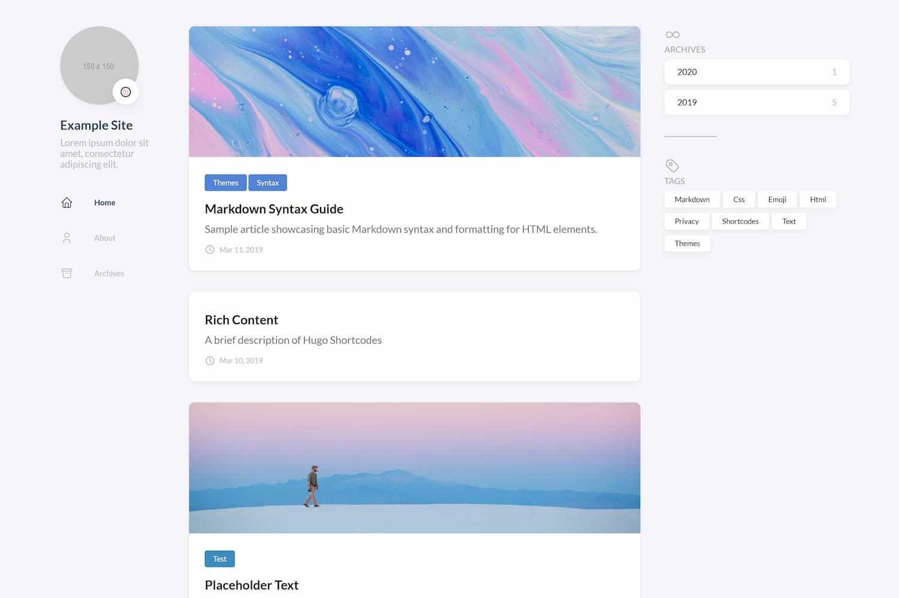

## Why 工程師要寫部落格
身為一個**專業的工程師**，你也許會需要
1. 一台筆電(o)
2. 持續學習(o)
3. 跟容量大的腦袋來備份知識(x  

Um...工程師的世界永遠有追不完的技術，  
自知腦容量沒有這麼大，記錄成部落格文字來比較可靠，而且  
> 寫成部落格也有機會跟別人交流，也許還會有高手可以切磋(! 

好像好處多多呢！  
然後也開始思考，過去半年來用MAC開發，但未來也許工作不一定分到MAC電腦  
要不要把之前沒在用的windows的電腦拿來寫code，演練一下上工後拿到的是Windows(希望不是ＱＱ)

## 用Windows來寫code
身為JavaScript開發者，電腦空空的我可能會需要

1. 安裝Git Bash(可使用 Linux 指令操作 Window 的檔案系統)
2. 設定git config --global user.name & user.email
3. 安裝VS Code 跟套件(Bracket Pair Colorizer已經內建好了不用再安裝)  
a. Emmet (自動跳出提示跟各種好用的縮寫)  
b. Live Server (可以直接用本地端瀏覽器看到結果) +DevTools方便debug  
c. EsLint (檢查語法，VSCode好像有內建但如果沒安裝的話可以補一下)  
d. vscode-icons (有賞心悅目的icon)
4. 安裝Node.js (未來開發時需要有個執行環境在本地跑)

ok! 來開始架站吧！

## 架站選擇 - Jeykyll, Hexo, Gatsby(不是那個抓頭髮的)
除了hugo外，其實還有很多人氣的框架 [Jeykyll (Ruby)](https://jekyllrb.com/ "Jeykyll (Ruby)") / [Hexo (JavaScript)](https://hexo.io/zh-tw/ "Hexo (JavaScript)") / [Gatsby (React)](https://www.gatsbyjs.com/ "Gatsby (React)")等  
[Hugo](https://gohugo.io/getting-started/installing/ "Hugo")用Go寫，號稱部屬最快的框架，也許未來有時間會想學學看這個google工程師團隊開發的語言  
而且時間就是金錢！就先選用這個

### 安裝Hugo
在Hugo install發現windows有個Chocolatey可以管理套件  
下載Chocolatey 用 `choco install hugo-extended -confirm` 就裝起來了  

依照官方說明建立這兩個資料夾  
You will use`C:\Hugo\Sites` as the starting point for your new project.  
You will use`C:\Hugo\bin` to store executable files.

到Hugo Releases找到符合電腦環境的安裝檔，解壓縮於bin資料夾
新增window PATH環境變數，新增`C:\Hugo\bin`，讓全域都可以執行hugo命令
可以到其他資料夾用hugo version or hugo help來檢查是否有新增成功

官方windows環境架設流程
<iframe width="640" height="360" src="https://www.youtube.com/embed/" title="YouTube video player" frameborder="0" allow="accelerometer; autoplay; clipboard-write; encrypted-media; gyroscope; picture-in-picture" allowfullscreen></iframe>

### 新增專案資料夾
以example.com為範例，這邊根據自己的網站名稱做修改  
cd到`C:\Hugo\Sites>`  
執行`hugo new site example.com`

到[Hugo Themes](https://themes.gohugo.io/)找喜歡的主題  
目前選用Jimmy大撰寫的樣式hugo-theme-stack  
也有詳細的[文件說明](https://docs.stack.jimmycai.com/getting-started.html#installation)如何安裝 
簡單來說就是
1. git clone主題檔案到theme資料夾
2. 因為一開始blog裡面沒有內容，把範例的exampleSite資料夾覆蓋專案資料夾，就有demo可以看  
3. 到 網站資料夾 執行 `hugo server`  
4. 查看 http://localhost:1313

哇真的出現了  

出現的瞬間真的好感人啊！等等...現在只有自己可以看到  
下一篇來介紹如何使用gitHub來部署我們的部落格吧  
但記得先來客製一下部落格標題跟說明文字唷

參考文章:  
[用指令安裝程式--Chocolatey](https://ithelp.ithome.com.tw/articles/10242201 "用指令安裝程式--Chocolatey")  
[[Day07] Let's Hugo!](https://ithelp.ithome.com.tw/m/articles/10269925 "[Day07] Let's Hugo!")

